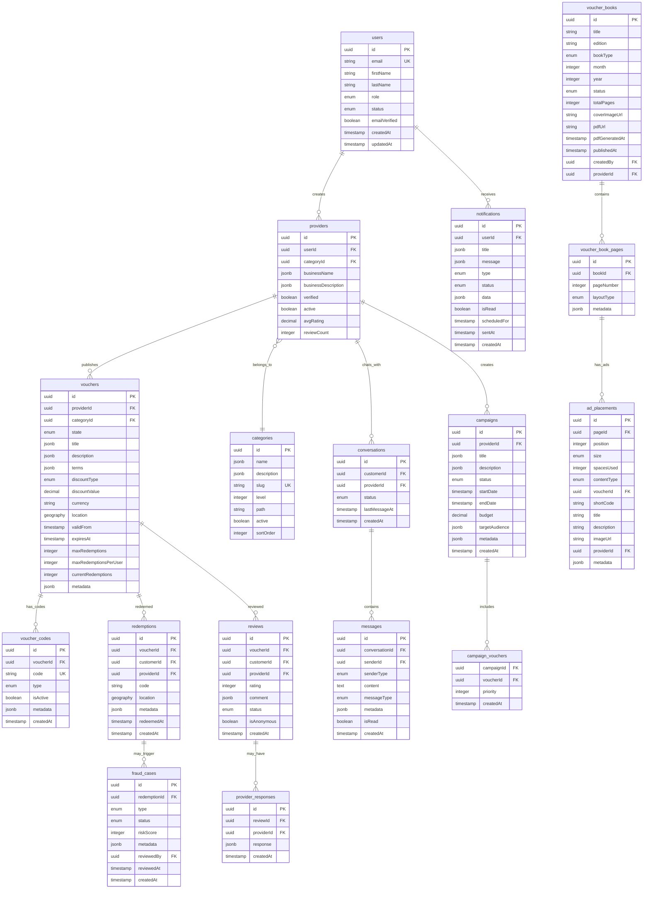
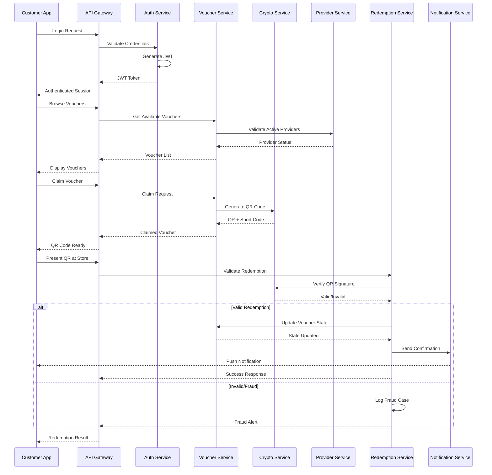
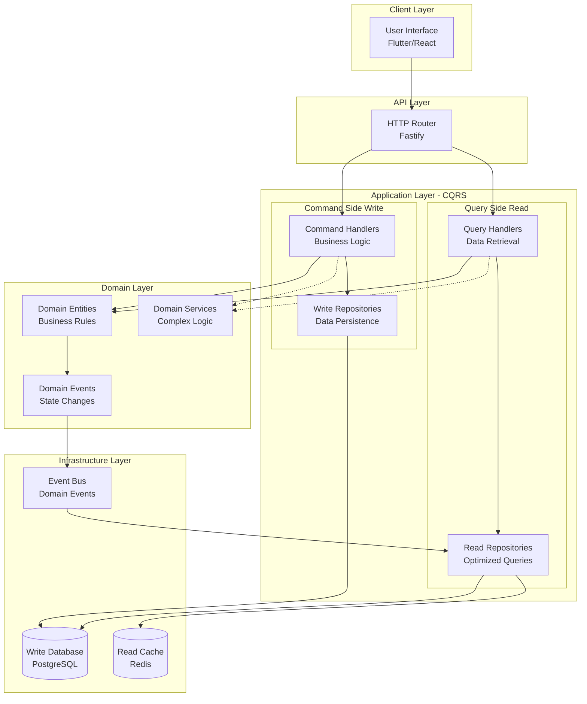
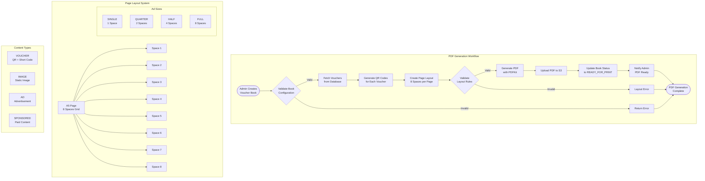
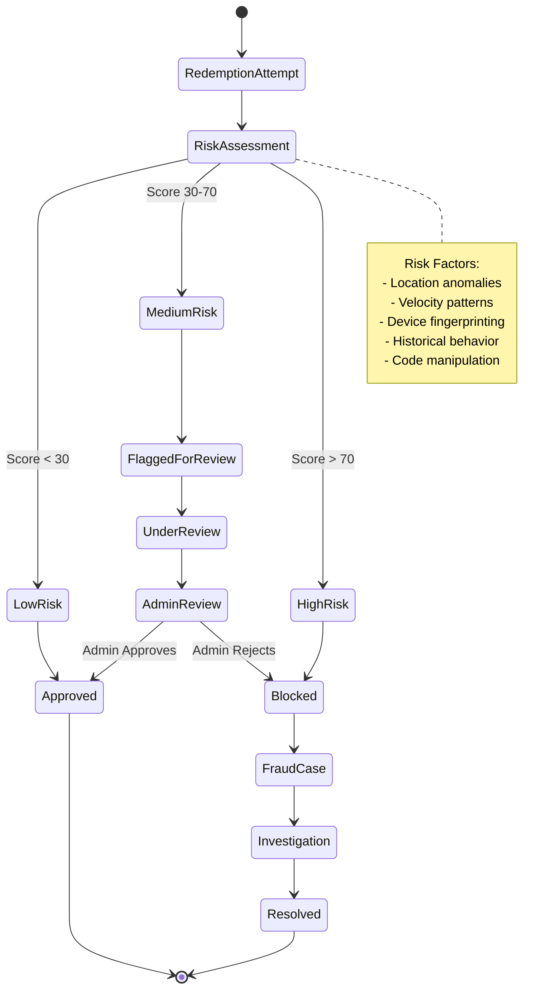
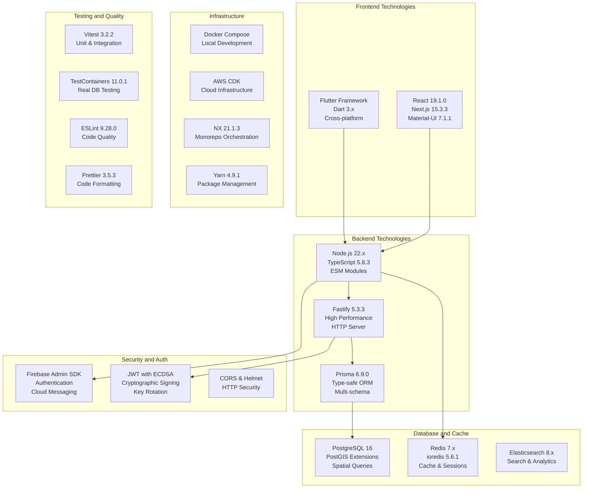

# Pika Platform Architecture - Complete System Overview

## High-Level System Architecture

```mermaid
graph TB
    %% External Users and Clients
    subgraph "Client Applications"
        Flutter[Flutter Mobile App<br/>iOS/Android/Web]
        ReactApp[React Dashboard<br/>Business Portal]
        WebApp[Next.js Web App<br/>Customer Portal]
    end

    %% API Gateway Layer
    subgraph "API Gateway Layer"
        Gateway[API Gateway<br/>Port 9000<br/>Fastify Router]
    end

    %% Core Services Layer
    subgraph "Microservices Architecture"
        subgraph "Core Business Services"
            UserSvc[User Service<br/>Port 5022<br/>Firebase Auth]
            VoucherSvc[Voucher Service<br/>Port 5025<br/>Lifecycle Mgmt]
            RedemptionSvc[Redemption Service<br/>Port 5026<br/>QR Validation]
            ProviderSvc[Provider Service<br/>Port 5027<br/>Business Mgmt]
            CategorySvc[Category Service<br/>Port 5020<br/>Hierarchical]
        end

        subgraph "Support Services"
            NotificationSvc[Notification Service<br/>Port 5023<br/>Firebase FCM]
            ReviewSvc[Review Service<br/>Port 5028<br/>Rating System]
            MessagingSvc[Messaging Service<br/>Port 5024<br/>Real-time Chat]
            CampaignSvc[Campaign Service<br/>Port 5030<br/>Marketing]
        end

        subgraph "Specialized Services"
            PDFSvc[PDF Generator<br/>Port 5029<br/>Voucher Books]
            CryptoSvc[Crypto Service<br/>JWT/QR Generation]
            AuthSvc[Auth Package<br/>Multi-provider]
        end
    end

    %% Infrastructure Layer
    subgraph "Infrastructure & Data"
        subgraph "Databases"
            PostgreSQL[(PostgreSQL<br/>PostGIS<br/>Multi-schema)]
            Redis[(Redis<br/>Cache & Sessions)]
        end

        subgraph "External Services"
            Firebase[Firebase<br/>Auth & FCM]
            Elasticsearch[(Elasticsearch<br/>Search Index)]
            S3[AWS S3<br/>File Storage]
        end

        subgraph "Development Tools"
            LocalStack[LocalStack<br/>AWS Emulation]
            TestContainers[TestContainers<br/>Integration Tests]
        end
    end

    %% Shared Libraries
    subgraph "Shared Packages"
        SharedLib["@pika/shared<br/>Common Utils"]
        TypesCore["@pika/types-core<br/>Type Definitions"]
        HTTP["@pika/http<br/>Fastify Utils"]
        DatabaseLib["@pika/database<br/>Prisma Client"]
        RedisLib["@pika/redis<br/>Cache Decorators"]
        SDK["@pika/sdk<br/>Auto-generated"]
        API["@pika/api<br/>OpenAPI Schemas"]
    end

    %% Connections
    Flutter --> Gateway
    ReactApp --> Gateway
    WebApp --> Gateway

    Gateway --> UserSvc
    Gateway --> VoucherSvc
    Gateway --> RedemptionSvc
    Gateway --> ProviderSvc
    Gateway --> CategorySvc
    Gateway --> NotificationSvc
    Gateway --> ReviewSvc
    Gateway --> MessagingSvc
    Gateway --> CampaignSvc
    Gateway --> PDFSvc

    %% Service to Infrastructure
    UserSvc --> PostgreSQL
    VoucherSvc --> PostgreSQL
    RedemptionSvc --> PostgreSQL
    ProviderSvc --> PostgreSQL
    CategorySvc --> PostgreSQL
    NotificationSvc --> PostgreSQL
    ReviewSvc --> PostgreSQL
    MessagingSvc --> PostgreSQL
    CampaignSvc --> PostgreSQL
    PDFSvc --> PostgreSQL

    %% Redis connections
    UserSvc --> Redis
    VoucherSvc --> Redis
    RedemptionSvc --> Redis
    ProviderSvc --> Redis
    CategorySvc --> Redis

    %% External service connections
    UserSvc --> Firebase
    NotificationSvc --> Firebase
    AuthSvc --> Firebase
    PDFSvc --> S3

    %% Shared library usage (dotted lines)
    UserSvc -.-> SharedLib
    VoucherSvc -.-> SharedLib
    RedemptionSvc -.-> SharedLib
    UserSvc -.-> DatabaseLib
    VoucherSvc -.-> DatabaseLib
    RedemptionSvc -.-> DatabaseLib

    %% Inter-service communication
    RedemptionSvc <--> VoucherSvc
    RedemptionSvc <--> ProviderSvc
    PDFSvc <--> VoucherSvc
    PDFSvc <--> CryptoSvc
    VoucherSvc --> CryptoSvc
```

## Database Schema Architecture

## Service Communication Flow

## CQRS Architecture Pattern

## Physical Voucher Book Generation Flow

## Fraud Detection System

## Technology Stack Overview

