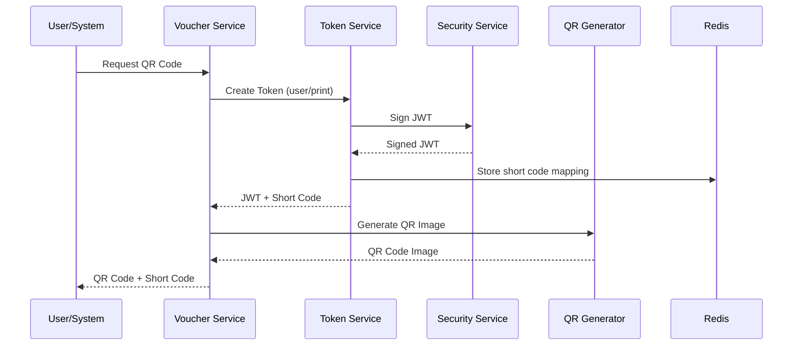
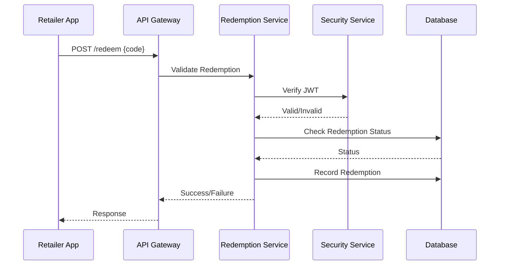
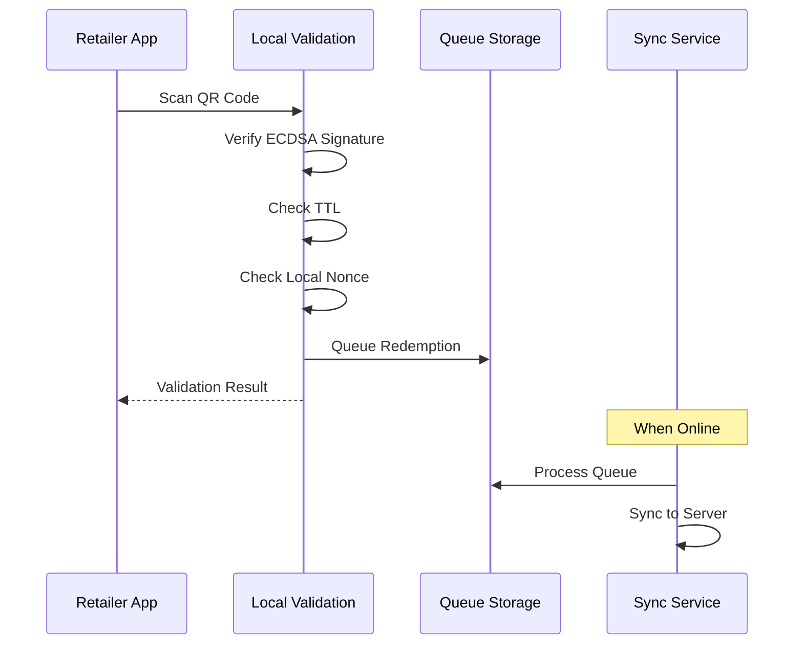

# QR Code & Security Infrastructure Architecture

## Overview

This document outlines the architecture for the QR Code and Security Infrastructure of the PIKA voucher platform. The system supports both app-generated and printed booklet vouchers with a unified QR code approach while maintaining distinct security characteristics for each channel.

## Core Requirements

### Business Requirements

1. **Dual Redemption Channels**: Support both mobile app and printed booklet vouchers
2. **Offline Capability**: Retailers must validate vouchers without internet connectivity
3. **Fraud Prevention**: Prevent voucher duplication and unauthorized redemptions
4. **Flexibility**: Support various voucher types (one-time use, multi-use, campaign-based)
5. **User Experience**: Fast scanning and validation (< 2 seconds)

### Technical Requirements

1. **QR Code Format**: JWT tokens with ECDSA signatures
2. **Fallback Mechanism**: Human-readable short codes
3. **Security**: Cryptographic validation, TTL management, replay prevention
4. **Integration**: Seamless integration with existing voucher and redemption services

## Architecture Components

### 1. Token Structure

#### App-Generated Tokens (User-Specific)

```json
{
  "jti": "550e8400-e29b-41d4-a716-446655440000", // JWT ID (nonce)
  "sub": "user:123e4567-e89b-12d3-a456-426614174000", // Subject (user)
  "vid": "vouch:987fcdeb-51a2-43f1-b2c3-d4e5f6789012", // Voucher ID
  "typ": "user", // Token type
  "iat": 1704067200, // Issued at
  "exp": 1704067500, // Expires (5 minutes)
  "iss": "pika-voucher-platform" // Issuer
}
```

#### Booklet Tokens (Anonymous)

```json
{
  "jti": "660f9500-f39c-52e5-b827-557766551111", // JWT ID
  "vid": "vouch:987fcdeb-51a2-43f1-b2c3-d4e5f6789012", // Voucher ID
  "typ": "print", // Token type
  "btc": "2024-01", // Batch (booklet edition)
  "iat": 1704067200, // Issued at
  "exp": 1706659200, // Expires (end of month)
  "iss": "pika-voucher-platform", // Issuer
  "lmt": 100 // Optional: redemption limit for this campaign
}
```

### 2. System Architecture

```
┌─────────────────────────────────────────────────────────────────────┐
│                         QR Code Infrastructure                        │
├─────────────────────────────────────────────────────────────────────┤
│                                                                       │
│  ┌─────────────────────┐         ┌─────────────────────┐           │
│  │   Security Service   │         │  QR Code Generator  │           │
│  │                      │         │                     │           │
│  │ - Key Management     │◄────────┤ - Generate QR Image │           │
│  │ - JWT Signing        │         │ - Encode JWT        │           │
│  │ - JWT Verification   │         │ - Format for Print  │           │
│  │ - ECDSA Operations   │         └──────────┬──────────┘           │
│  └──────────┬───────────┘                    │                      │
│             │                                 │                      │
│             ▼                                 ▼                      │
│  ┌─────────────────────┐         ┌─────────────────────┐           │
│  │  Token Service      │         │ Short Code Service  │           │
│  │                     │         │                     │           │
│  │ - Create User JWT   │         │ - Generate Codes    │           │
│  │ - Create Print JWT  │         │ - Validate Format   │           │
│  │ - Validate Claims   │         │ - Redis Mapping     │           │
│  │ - TTL Management    │         │ - Collision Check   │           │
│  └─────────────────────┘         └─────────────────────┘           │
│                                                                       │
│  ┌───────────────────────────────────────────────────────────────┐  │
│  │                    Offline Validation Module                   │  │
│  │  (Embedded in Retailer App)                                   │  │
│  │                                                                │  │
│  │  - Public Key Storage    - Nonce Tracking                     │  │
│  │  - ECDSA Verification    - Local Redemption Queue             │  │
│  │  - TTL Validation        - Sync Management                    │  │
│  └───────────────────────────────────────────────────────────────┘  │
└─────────────────────────────────────────────────────────────────────┘
```

### 3. Key Management

#### Encryption Keys

- **Algorithm**: ECDSA with P-256 curve (ES256)
- **Private Key**: Stored in AWS KMS or environment variable (encrypted)
- **Public Key**: Embedded in mobile apps for offline validation
- **Key Rotation**: Quarterly rotation with overlap period

#### Key Storage Structure

```typescript
interface KeyPair {
  id: string // Key identifier
  algorithm: 'ES256' // ECDSA with P-256
  privateKey: string // PEM format (stored securely)
  publicKey: string // PEM format (distributed to apps)
  createdAt: Date
  expiresAt: Date
  status: 'active' | 'rotating' | 'expired'
}
```

### 4. QR Code Generation Flow



### 5. Redemption Validation Flow

#### Online Validation



#### Offline Validation



### 6. Security Measures

#### Token Security

1. **Short TTL for App Tokens**: 5 minutes maximum
2. **Nonce Tracking**: Prevent replay attacks
3. **ECDSA Signatures**: Cryptographic integrity
4. **Secure Transport**: HTTPS only for online operations

#### Fraud Prevention

1. **One-Time Use Enforcement**:
   - App tokens: Tied to user account
   - Print tokens: Count-based limits
2. **Rate Limiting**: Maximum redemptions per minute
3. **Geo-fencing**: Optional location validation
4. **Audit Trail**: Complete redemption history

#### Data Protection

1. **Encryption at Rest**: Database encryption
2. **Encryption in Transit**: TLS 1.3
3. **Key Isolation**: Separate key storage
4. **Access Control**: Role-based permissions

### 7. Short Code System

#### Format Specification

- **Length**: 8 characters
- **Format**: XXXX-XXXX (with hyphen for readability)
- **Character Set**: Safe alphabet (no ambiguous characters)
  ```
  ABCDEFGHJKLMNPQRSTUVWXYZ23456789
  ```
- **Examples**: `SAVE-2K9P`, `DEAL-4M7N`

#### Generation Algorithm

```typescript
function generateShortCode(): string {
  const alphabet = 'ABCDEFGHJKLMNPQRSTUVWXYZ23456789'
  let code = ''

  // Generate 8 random characters
  for (let i = 0; i < 8; i++) {
    if (i === 4) code += '-' // Add hyphen after 4 chars
    code += alphabet[Math.floor(Math.random() * alphabet.length)]
  }

  return code
}
```

#### Storage Strategy

- **Primary Storage**: Redis for fast lookups
- **Backup**: PostgreSQL for persistence
- **TTL**: Match voucher expiration
- **Collision Handling**: Regenerate on collision

### 8. Implementation Packages

#### Package Structure

```
packages/
├── security/
│   ├── src/
│   │   ├── crypto/
│   │   │   ├── ecdsa.service.ts
│   │   │   ├── key-management.service.ts
│   │   │   └── jwt.service.ts
│   │   ├── interfaces/
│   │   │   ├── token.interface.ts
│   │   │   └── key.interface.ts
│   │   └── index.ts
│   └── package.json
│
├── qr-generator/
│   ├── src/
│   │   ├── services/
│   │   │   ├── qr-code.service.ts
│   │   │   ├── short-code.service.ts
│   │   │   └── token.service.ts
│   │   ├── utils/
│   │   │   └── qr-formatter.ts
│   │   └── index.ts
│   └── package.json
│
└── shared/
    └── src/
        └── qr/
            ├── constants.ts
            ├── errors.ts
            └── types.ts
```

### 9. Integration Points

#### Voucher Service Integration

```typescript
interface VoucherQRCodeRequest {
  voucherId: string
  userId?: string // Optional for print vouchers
  type: 'user' | 'print'
  expiresAt?: Date // Override default TTL
}

interface VoucherQRCodeResponse {
  qrCode: string // Base64 encoded image
  shortCode: string // Human-readable code
  token: string // JWT for debugging
  expiresAt: Date
}
```

#### Redemption Service Integration

```typescript
interface RedemptionRequest {
  code: string // JWT or short code
  retailerId: string
  location?: {
    lat: number
    lng: number
  }
}

interface RedemptionResponse {
  success: boolean
  voucherId: string
  userId?: string
  message: string
  discount: number
}
```

### 10. Performance Considerations

#### Optimization Strategies

1. **Caching**: Redis for token validation results
2. **Connection Pooling**: Reuse database connections
3. **Batch Operations**: Generate multiple QR codes in parallel
4. **CDN Distribution**: Serve QR images via CloudFront

#### Benchmarks

- **QR Generation**: < 100ms per code
- **JWT Signing**: < 10ms
- **Offline Validation**: < 50ms
- **Short Code Lookup**: < 5ms (Redis)

### 11. Error Handling

#### Error Categories

1. **Security Errors**
   - Invalid signature
   - Expired token
   - Replay attempt
2. **Business Logic Errors**
   - Voucher already redeemed
   - Redemption limit exceeded
   - Invalid voucher state
3. **System Errors**
   - Database connection failure
   - Redis unavailable
   - Key service errors

#### Error Response Format

```typescript
interface QRError {
  code: string
  message: string
  details?: any
  timestamp: Date
  correlationId: string
}
```

### 12. Monitoring & Metrics

#### Key Metrics

1. **Security Metrics**
   - Failed validation attempts
   - Replay attack attempts
   - Token expiration violations
2. **Performance Metrics**
   - QR generation time
   - Validation latency
   - Queue processing time
3. **Business Metrics**
   - Redemptions by type (app/print)
   - Peak redemption hours
   - Geographic distribution

#### Alerts

- High failure rate (> 5%)
- Unusually high redemption rate
- Key rotation failures
- Queue backup (offline sync)

### 13. Testing Strategy

#### Unit Tests

- JWT generation and validation
- ECDSA signing and verification
- Short code generation and collision handling
- TTL calculations

#### Integration Tests

- End-to-end QR generation flow
- Offline validation scenarios
- Queue synchronization
- Key rotation process

#### Security Tests

- Penetration testing for token manipulation
- Replay attack scenarios
- Rate limiting effectiveness
- Key compromise recovery

### 14. Migration & Rollout

#### Phase 1: Core Infrastructure

- Implement security service
- Set up key management
- Basic JWT generation

#### Phase 2: QR Generation

- QR code service
- Short code system
- Redis integration

#### Phase 3: Integration

- Voucher service integration
- Redemption service updates
- Mobile app SDK

#### Phase 4: Advanced Features

- Offline validation
- Queue synchronization
- Monitoring dashboard

### 15. Future Enhancements

1. **Dynamic QR Codes**: Real-time generation with unique parameters
2. **Biometric Binding**: Optional fingerprint/face ID for high-value vouchers
3. **Blockchain Integration**: Immutable redemption ledger
4. **AI Fraud Detection**: Pattern recognition for suspicious redemptions
5. **Multi-factor Redemption**: Combine QR + PIN for extra security

## Conclusion

This architecture provides a robust, secure, and scalable foundation for the PIKA voucher platform's QR code and security infrastructure. It balances security requirements with user experience while supporting both digital and print voucher distribution channels.
