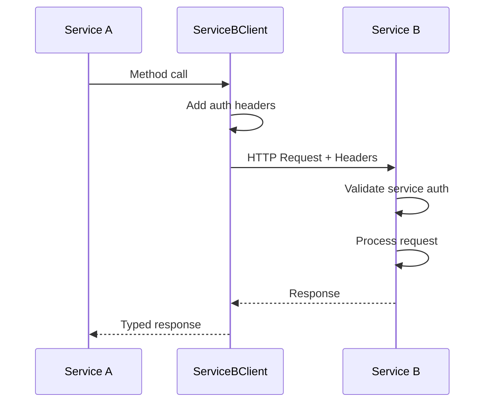

# Inter-Service Connectivity Architecture

## Overview

The Solo60 platform implements a synchronous HTTP-based communication pattern for service-to-service interactions. This architecture enables microservices to communicate securely and efficiently while maintaining clear boundaries and contracts between services.

## Core Components

### 1. Service Clients

Each service that needs to be accessed by other services has a dedicated client class in the `@solo60/shared` package:

```typescript
// Example: UserServiceClient
export class UserServiceClient extends BaseServiceClient {
  constructor(config?: ServiceClientConfig) {
    super('USER_API_URL', 'UserService', config)
  }

  async getUser(userId: string): Promise<UserResponse> {
    return this.get<UserResponse>(`/users/${userId}`)
  }
}
```

#### Available Service Clients:
- `UserServiceClient` - User management operations
- `PaymentServiceClient` - Payment processing
- `CommunicationServiceClient` - Email, SMS, and notifications
- `GymServiceClient` - Gym operations
- `SessionServiceClient` - Session management
- `AuthServiceClient` - Authentication operations

### 2. Base Service Client

All service clients inherit from `BaseServiceClient` which provides:

- **Automatic retry logic** with exponential backoff
- **Error transformation** to standardized error types
- **Service authentication** via API keys
- **Request/response logging** for debugging
- **Correlation ID propagation** for distributed tracing

```typescript
export abstract class BaseServiceClient {
  protected async request<T>(options: RequestOptions): Promise<T> {
    // Adds service authentication headers
    // Implements retry logic
    // Transforms errors to AppError
    // Logs requests and responses
  }
}
```

### 3. Internal API Endpoints

Services expose internal endpoints under the `/internal` prefix that are only accessible to other services:

```typescript
// Internal routes in each service
router.use('/internal', serviceAuthMiddleware, internalRoutes)

// Example internal endpoint
router.post('/internal/subscriptions/check-access', 
  validateRequest(checkAccessSchema),
  controller.checkAccess
)
```

### 4. Authentication Middleware

Internal endpoints use a different authentication mechanism than user-facing endpoints:

```typescript
export const serviceAuthMiddleware = (req, res, next) => {
  const apiKey = req.headers['x-api-key']
  const serviceName = req.headers['x-service-name']
  const serviceId = req.headers['x-service-id']
  
  if (apiKey !== SERVICE_API_KEY) {
    throw new UnauthorizedError('Invalid service authentication')
  }
  
  // Validate service identity
  req.serviceAuth = { serviceName, serviceId }
  next()
}
```

## Communication Flow

### 1. Service A → Service B Communication



### 2. Authentication Headers

Every inter-service request includes:

```http
x-api-key: <SERVICE_API_KEY>
x-service-name: <calling-service-name>
x-service-id: <unique-request-id>
x-correlation-id: <request-correlation-id>
```

### 3. Error Handling

Errors are automatically transformed at multiple levels:

1. **Service B** throws domain-specific error
2. **HTTP layer** converts to HTTP status code
3. **Service Client** transforms back to `AppError`
4. **Service A** handles the standardized error

## Request/Response Contracts

### 1. Schema Definition

Internal APIs use Zod schemas defined in `@solo60/api/internal`:

```typescript
// Request schema
export const checkSubscriptionAccessSchema = z.object({
  userId: z.string().uuid(),
  feature: z.string().optional(),
  requiredPlan: z.string().optional(),
})

// Response schema
export const checkSubscriptionAccessResponseSchema = z.object({
  hasAccess: z.boolean(),
  subscription: subscriptionDetailsSchema.optional(),
  reason: z.string().optional(),
})
```

### 2. Type Safety

TypeScript types are automatically inferred from schemas:

```typescript
export type CheckSubscriptionAccessRequest = z.infer<
  typeof checkSubscriptionAccessSchema
>
export type CheckSubscriptionAccessResponse = z.infer<
  typeof checkSubscriptionAccessResponseSchema
>
```

## Security Considerations

### 1. API Key Management

- Single shared API key for all service-to-service communication
- Stored in environment variable `SERVICE_API_KEY`
- Must be rotated regularly in production
- Different keys for different environments

### 2. Network Isolation

- Services should only be accessible within the internal network
- Public endpoints go through the API Gateway
- Internal endpoints are not exposed to the internet

### 3. Request Validation

- All requests are validated against Zod schemas
- Service identity is verified on each request
- Correlation IDs enable request tracing

## Implementation Patterns

### 1. Fire-and-Forget Operations

For non-critical operations that don't need to block:

```typescript
// In subscription service
async notifySubscriptionCreated(userId: string) {
  // Fire and forget - don't await
  this.communicationClient.sendNotification({
    userId,
    type: 'SUBSCRIPTION_CREATED',
    data: { /* ... */ }
  }).catch(error => {
    logger.error('Failed to send notification', error)
  })
}
```

### 2. Synchronous Operations

For critical operations that must complete:

```typescript
// In session service
async createSession(data: CreateSessionData) {
  // Verify subscription access first
  const access = await this.subscriptionClient.checkAccess({
    userId: data.userId,
    feature: 'session-booking'
  })
  
  if (!access.hasAccess) {
    throw new ForbiddenError(access.reason)
  }
  
  // Continue with session creation
}
```

### 3. Bulk Operations

For efficient batch processing:

```typescript
// Batch user fetching
async enrichSubscriptions(subscriptions: Subscription[]) {
  const userIds = [...new Set(subscriptions.map(s => s.userId))]
  const users = await this.userClient.getBulkUsers(userIds)
  
  return subscriptions.map(sub => ({
    ...sub,
    user: users.find(u => u.id === sub.userId)
  }))
}
```

## Testing Strategy

### 1. Integration Tests

Use the `InternalAPITestHelper` for testing internal endpoints:

```typescript
const internalClient = new InternalAPITestHelper(API_KEY).createClient(app)

const response = await internalClient
  .post('/internal/subscriptions/check-access')
  .send({ userId, feature: 'premium' })
  .expect(200)
```

### 2. Mock Service Clients

For unit tests, mock service clients:

```typescript
vi.mock('@solo60/shared', () => ({
  CommunicationServiceClient: vi.fn(() => ({
    sendEmail: vi.fn().mockResolvedValue({ messageId: '123' })
  }))
}))
```

## Best Practices

### 1. Idempotency

- All write operations should be idempotent
- Use unique request IDs to prevent duplicate processing
- Store processed request IDs with TTL

### 2. Timeouts

- Set reasonable timeouts on service clients (default: 30s)
- Implement circuit breakers for failing services
- Have fallback strategies for non-critical operations

### 3. Observability

- Log all inter-service requests with correlation IDs
- Track request duration and success rates
- Alert on elevated error rates or latency

### 4. Versioning

- Version internal APIs when making breaking changes
- Support multiple versions during migration periods
- Deprecate old versions with clear timelines

## Future Considerations

### 1. Asynchronous Communication

Consider adding message queues for:
- Long-running operations
- Event-driven workflows
- Better decoupling between services

### 2. Service Mesh

As the system grows, consider:
- Istio or Linkerd for service discovery
- Automatic mTLS between services
- Advanced traffic management

### 3. GraphQL Federation

For more flexible data fetching:
- Each service exposes a GraphQL subgraph
- API Gateway acts as the federation gateway
- Clients can request exactly what they need