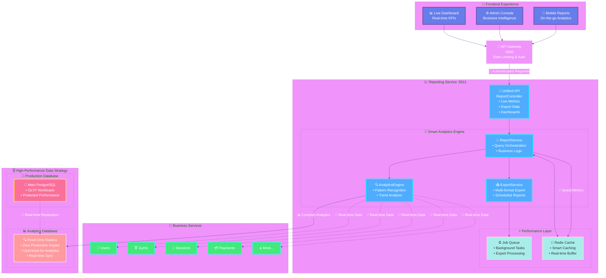
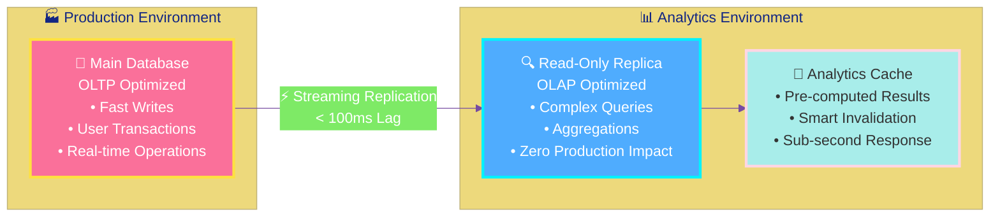
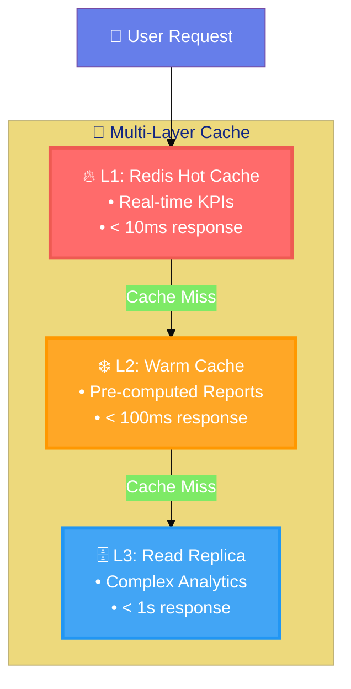

# 📊 Reporting Service Architecture

> **A beautiful, high-performance analytics platform for Solo60**

This document outlines the architecture for a new Reporting Service that integrates with the existing Solo60 microservices platform using modern design patterns and read-only database replicas for optimal performance.

## 🎯 Architecture Overview

The Reporting Service implements the **Observer Pattern**, **Strategy Pattern**, and **CQRS (Command Query Responsibility Segregation)** to provide real-time analytics with zero impact on production databases.

## 🎨 Simplified Architecture Diagram



## 🏗️ Architecture Patterns & Strategy

### 🎯 Design Patterns Applied

#### **CQRS (Command Query Responsibility Segregation)**

- **Commands**: Write operations go to main production database
- **Queries**: Read operations use dedicated read-only replica
- **Benefits**: Zero impact on production performance, optimized analytics queries

#### **Observer Pattern**

- Real-time data synchronization between services
- Event-driven analytics updates
- Automatic cache invalidation strategies

#### **Strategy Pattern**

- Pluggable export formats (CSV, PDF, Excel, JSON)
- Multiple caching strategies (Redis, Memory, Hybrid)
- Configurable aggregation algorithms

### 🚀 Read-Only Replica Strategy



### 💎 Core Components (Simplified)

#### **🎯 ReportController** (Single Unified API)

```typescript
// Clean, unified interface for all reporting needs
@Controller('/api/reports')
export class ReportController {
  @Get('/dashboard')     // 📊 Live dashboard metrics
  @Get('/analytics')     // 🔍 Business intelligence
  @Post('/export')       // 📤 Data export
  @Get('/kpis')          // ⚡ Real-time KPIs
}
```

#### **💎 ReportService** (Business Logic Orchestrator)

```typescript
// Orchestrates all reporting operations
export class ReportService {
  private analyticsEngine: AnalyticsEngine
  private cacheStrategy: CacheStrategy
  private exportStrategy: ExportStrategy

  async generateReport(query: ReportQuery): Promise<Report> {
    // Strategy pattern for different report types
    return this.analyticsEngine.process(query)
  }
}
```

#### **🔍 AnalyticsEngine** (Smart Query Processor)

```typescript
// Handles complex analytics with read-replica optimization
export class AnalyticsEngine {
  constructor(
    private readOnlyRepository: ReadOnlyRepository,
    private cacheService: CacheService,
  ) {}

  async processComplexQuery(query: AnalyticsQuery) {
    // Always hits read-only replica for zero production impact
    return this.readOnlyRepository.executeAnalytics(query)
  }
}
```

## 🚀 Performance & Business Intelligence

### ⚡ Smart Caching Strategy



### 📊 Business Intelligence Features

#### **Real-Time KPIs**

- 👥 **User Engagement**: Active users, session duration, retention rates
- 🏋️ **Gym Performance**: Utilization rates, revenue per gym, capacity metrics
- 💰 **Revenue Analytics**: MRR, churn, LTV, conversion funnels
- 📈 **Growth Metrics**: User acquisition, geographic expansion, feature adoption

#### **Predictive Analytics**

- 🔮 **Demand Forecasting**: Peak hours prediction, capacity planning
- 🎯 **User Behavior**: Churn prediction, upsell opportunities
- 📍 **Location Intelligence**: Optimal gym placement, market analysis

## 🛠️ Implementation Strategy

### 🏗️ Service Architecture Pattern

```typescript
// packages/services/reporting/src/server.ts
export async function createReportingServer(deps: ServiceDependencies) {
  const app = await createExpressServer({
    serviceName: 'reporting-service',
    port: REPORTING_SERVICE_PORT,

    // Read-only database connection for analytics
    readOnlyDatabase: deps.readOnlyPrisma,

    // High-performance caching
    cacheService: deps.cacheService,

    // Zero production impact guarantee
    isolationLevel: 'READ_ONLY_REPLICA',
  })

  return app
}
```

### 📈 Database Strategy

```sql
-- Optimized read-only replica configuration
-- packages/database/prisma/replica.prisma

generator client {
  provider = "prisma-client-js"
  output   = "./generated/replica-client"
}

datasource db {
  provider = "postgresql"
  url      = env("DATABASE_REPLICA_URL")  // Read-only replica
}

-- Materialized views for ultra-fast analytics
CREATE MATERIALIZED VIEW analytics.daily_kpis AS
SELECT
  date_trunc('day', created_at) as date,
  count(*) as daily_signups,
  sum(revenue) as daily_revenue
FROM users u
JOIN subscriptions s ON u.id = s.user_id
GROUP BY date_trunc('day', created_at);

-- Refresh every 5 minutes
CREATE OR REPLACE FUNCTION refresh_analytics()
RETURNS void AS $$
BEGIN
  REFRESH MATERIALIZED VIEW CONCURRENTLY analytics.daily_kpis;
END;
$$ LANGUAGE plpgsql;
```

## 🎯 Key Benefits

### ✨ **Zero Production Impact**

- All analytics queries hit read-only replica
- Production database performance protected
- Real-time replication with <100ms lag

### 🚀 **Sub-Second Response Times**

- Multi-layer intelligent caching
- Pre-computed materialized views
- Optimized analytics queries

### 📱 **Beautiful UX/UI**

- Real-time dashboard updates
- Mobile-responsive analytics
- Intuitive export functionality

### 🔒 **Enterprise Security**

- Role-based access control
- Data anonymization for GDPR
- Audit trails for compliance

### 📈 **Scalable Architecture**

- Horizontal scaling capability
- Microservice isolation
- Event-driven updates

## 🎨 Frontend Integration

```typescript
// Beautiful real-time dashboard
export const AnalyticsDashboard = () => {
  const { data: kpis } = useRealtimeKPIs()  // WebSocket connection
  const { data: trends } = useAnalyticsTrends()

  return (
    <DashboardGrid>
      <KPICard title="Active Users" value={kpis.activeUsers} trend="+12%" />
      <RevenueChart data={trends.revenue} />
      <GymUtilizationMap data={trends.gymUsage} />
      <ExportButton formats={['CSV', 'PDF', 'Excel']} />
    </DashboardGrid>
  )
}
```

This simplified, beautiful architecture provides enterprise-grade analytics with zero production impact while maintaining the clean architecture principles of your Solo60 platform! 🚀
