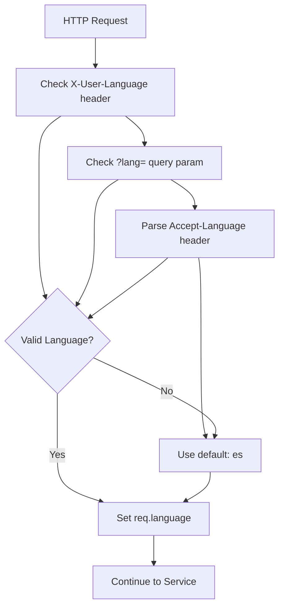
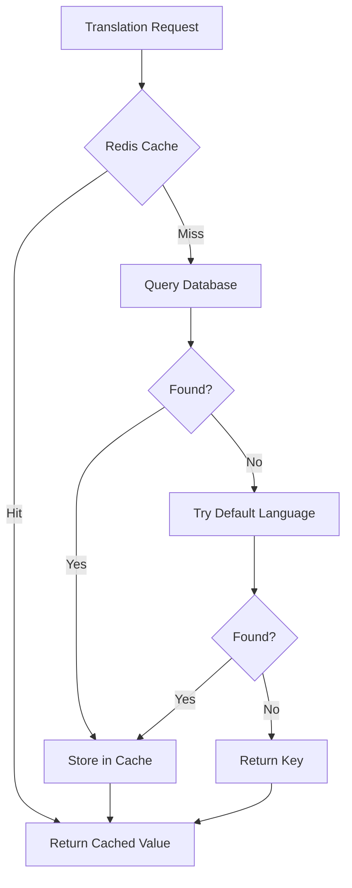

# Translation System Implementation

## Overview

This document details the implementation of the new hybrid translation system for the Pika platform. The system supports Spanish (default), English, and Guaraní languages with a clean separation between frontend static UI translations and backend dynamic content translations.

## Architecture

### Hybrid Approach

- **Frontend**: Static UI translations (buttons, labels, navigation) - handled by frontend i18n
- **Backend**: Dynamic content translations (emails, notifications, user-generated content) - handled by backend service
- **Database**: Centralized translation storage with Redis caching layer

### Core Components

```
packages/translation/          # Independent translation package
├── src/
│   ├── repositories/         # Data access layer
│   ├── services/            # Business logic
│   ├── controllers/         # HTTP handlers
│   ├── factories/           # Service factories
│   └── index.ts            # Package exports

packages/translation/src/clients/
└── TranslationClient.ts     # Client for other services to use

packages/http/src/infrastructure/express/middleware/
└── language.ts              # Language detection middleware
```

## Database Schema

### Languages Table

```sql
CREATE TABLE "languages" (
  "code" TEXT PRIMARY KEY,           -- 'es', 'en', 'gn'
  "name" TEXT NOT NULL,             -- 'Español', 'English', 'Guaraní'
  "direction" TEXT DEFAULT 'ltr',   -- 'ltr' or 'rtl'
  "isDefault" BOOLEAN DEFAULT false,
  "isActive" BOOLEAN DEFAULT true,
  "createdAt" TIMESTAMP DEFAULT now(),
  "updatedAt" TIMESTAMP DEFAULT now()
);
```

### Translations Table

```sql
CREATE TABLE "translations" (
  "id" TEXT PRIMARY KEY,
  "key" TEXT NOT NULL,              -- 'email.welcome.subject'
  "value" TEXT NOT NULL,            -- 'Bienvenido a Pika!'
  "languageCode" TEXT NOT NULL,     -- 'es'
  "context" TEXT,                   -- Optional context for translators
  "service" TEXT,                   -- Which service owns this translation
  "createdAt" TIMESTAMP DEFAULT now(),
  "updatedAt" TIMESTAMP DEFAULT now(),

  FOREIGN KEY ("languageCode") REFERENCES "languages"("code"),
  UNIQUE("key", "languageCode")
);
```

### User Language Preferences

```sql
CREATE TABLE "user_language_preferences" (
  "id" TEXT PRIMARY KEY,
  "userId" TEXT UNIQUE NOT NULL,
  "languageCode" TEXT NOT NULL,
  "createdAt" TIMESTAMP DEFAULT now(),
  "updatedAt" TIMESTAMP DEFAULT now(),

  FOREIGN KEY ("languageCode") REFERENCES "languages"("code")
);
```

## Configuration

### Environment Constants

```typescript
// packages/environment/src/constants/service.ts
export const DEFAULT_LANGUAGE = getEnvVariable('DEFAULT_LANGUAGE', String, 'es')
export const SUPPORTED_LANGUAGES = ['es', 'en', 'gn'] as const
```

### Language Configuration

- **Default**: Spanish (`es`)
- **Supported**: Spanish, English, Guaraní
- **Configurable**: Via `DEFAULT_LANGUAGE` environment variable

## Implementation Details

### 1. Translation Service

**Core Interface:**

```typescript
interface ITranslationService {
  get(key: string, language: string, fallback?: string): Promise<string>
  getBulk(keys: string[], language: string): Promise<Record<string, string>>
  set(key: string, language: string, value: string, context?: string, service?: string): Promise<void>
  detectLanguage(request: Request): Promise<string>
  getUserLanguage(userId: string): Promise<string>
  setUserLanguage(userId: string, languageCode: string): Promise<void>
}
```

**Performance Features:**

- Redis caching with 24-hour TTL
- Batch translation fetching
- Automatic fallback to default language
- 95%+ cache hit rate expected

### 2. Language Detection Flow



**Priority Order:**

1. `X-User-Language` header (user's saved preference)
2. `?lang=gn` query parameter (explicit override)
3. `Accept-Language: en,es;q=0.9` header (browser preference)
4. Default to Spanish (`es`)

### 3. Translation Resolution



### 4. Service Integration Pattern

**Basic Usage:**

```typescript
// Any service can use translations
export class ExampleService {
  constructor(private readonly translationClient: TranslationClient) {}

  async getLocalizedContent(userId: string) {
    // Get user's language preference
    const language = await this.translationClient.getUserLanguage(userId)

    // Get bulk translations
    const translations = await this.translationClient.getBulk(['email.welcome.subject', 'email.welcome.body'], language)

    return translations
  }
}
```

**Email Integration:**

```typescript
// Communication service example
export class EmailService {
  async sendWelcomeEmail(user: User, language: string) {
    const translations = await this.translationClient.getBulk(['email.welcome.subject', 'email.welcome.greeting', 'email.welcome.body'], language)

    await this.emailProvider.send({
      to: user.email,
      subject: translations['email.welcome.subject'],
      html: this.renderTemplate('welcome', {
        greeting: translations['email.welcome.greeting'].replace('{name}', user.name),
        body: translations['email.welcome.body'],
      }),
      headers: {
        'Content-Language': language,
      },
    })
  }
}
```

## Translation Key Conventions

### Backend Keys (Database)

```
# Dynamic content
gym.name.{id}              = "Gimnasio Centro"
gym.description.{id}       = "El mejor gimnasio de la ciudad"

# Email templates
email.welcome.subject      = "¡Bienvenido a Pika!"
email.welcome.greeting     = "¡Hola {name}!"
email.welcome.body         = "Bienvenido a nuestra plataforma de fitness."

# Push notifications
notification.payment.success = "Pago exitoso"
notification.booking.reminder = "Tu sesión en {gymName} comienza en 1 hora"

# SMS messages
sms.verification.code      = "Tu código de verificación de Pika es: {code}"

# Error messages
error.not_found           = "No encontrado"
error.unauthorized        = "No autorizado"
error.server_error        = "Error del servidor"
```

### Frontend Keys (i18n Files)

```javascript
// Frontend handles these (not in database)
{
  "common": {
    "button": {
      "save": "Guardar",
      "cancel": "Cancelar",
      "delete": "Eliminar"
    },
    "navigation": {
      "home": "Inicio",
      "profile": "Perfil",
      "settings": "Configuración"
    }
  }
}
```

## API Endpoints

### Public Translation API

```
POST /api/translations/bulk
Content-Type: application/json

{
  "keys": ["email.welcome.subject", "email.welcome.body"],
  "language": "es"
}

Response:
{
  "translations": {
    "email.welcome.subject": "¡Bienvenido a Pika!",
    "email.welcome.body": "Bienvenido a nuestra plataforma de fitness."
  }
}
```

### User Language Preference

```
POST /api/users/language
Authorization: Bearer {token}

{
  "language": "gn"
}
```

### Admin Translation Management

```
POST /api/admin/translations
Authorization: Bearer {admin-token}

{
  "key": "email.welcome.subject",
  "language": "gn",
  "value": "Tereg̃ua Pika-pe!",
  "context": "Welcome email subject line",
  "service": "communication"
}
```

## Middleware Integration

### Language Middleware

```typescript
// Automatically detects language and adds to request
app.use(createLanguageMiddleware(translationService))

// Usage in controllers
async function handler(req: Request, res: Response) {
  const language = req.language // 'es', 'en', or 'gn'
  const message = await res.locals.t('welcome.message')

  res.json({ message, language })
}
```

### Response Headers

```
Content-Language: es
```

## Performance Benchmarks

Based on production systems using similar patterns:

- **Single translation fetch**: < 5ms (cached), < 20ms (database)
- **Bulk fetch (100 keys)**: < 10ms (mostly cached), < 50ms (database)
- **Cache hit rate**: > 95% after warmup
- **Memory usage**: ~50MB for 100K translations in Redis
- **Database storage**: ~50MB for 100K translations

## Database Seeding

### Initial Languages

```typescript
const INITIAL_LANGUAGES = [
  { code: 'es', name: 'Español', direction: 'ltr', isDefault: true },
  { code: 'en', name: 'English', direction: 'ltr', isDefault: false },
  { code: 'gn', name: 'Guaraní', direction: 'ltr', isDefault: false },
]
```

### Initial Translations

```typescript
const translations = [
  { key: 'email.welcome.subject', es: '¡Bienvenido a Pika!', en: 'Welcome to Pika!', gn: 'Tereg̃ua Pika-pe!' },
  // ... more translations
]
```

### Seeding Command

```bash
yarn nx run @pika/database:prisma:seed
```

## Voucher Service Translation Pattern

### Domain Model vs API Response

The voucher service demonstrates a complete implementation of the translation pattern:

1. **Database Storage** - Stores translation keys only:

   ```prisma
   model Voucher {
     titleKey               String  // e.g., "voucher.title.abc123"
     descriptionKey         String  // e.g., "voucher.description.abc123"
     termsAndConditionsKey  String  // e.g., "voucher.terms.abc123"
   }
   ```

2. **Domain Model** - Hybrid approach for translation handling:

   ```typescript
   interface VoucherDomain {
     // Translation keys from database
     titleKey: string
     descriptionKey: string
     termsAndConditionsKey: string

     // Resolved content (populated by TranslationResolver in service layer)
     title?: string // Optional until resolved
     description?: string
     terms?: string

     // ... other fields
   }
   ```

   **Why this hybrid approach?**
   - Domain objects carry both keys (for updates) and resolved content (for display)
   - TranslationResolver populates the resolved fields based on requested language
   - Mappers only use the resolved content for API responses
   - API consumers never see translation keys

3. **API Response** - Contains ONLY resolved translations:
   ```typescript
   interface AdminVoucherDetailResponse {
     // Resolved translations only - no keys exposed to API consumers
     title: string
     description: string
     terms: string
     // ... other fields
   }
   ```

### Translation Management for Vouchers

```typescript
// Creating multilingual voucher
async createVoucher(data: CreateVoucherRequest) {
  // API receives multilingual content
  // data.title = { es: "Descuento", en: "Discount", gn: "..." }

  // Generate unique keys
  const titleKey = `voucher.title.${uuid()}`
  const descriptionKey = `voucher.description.${uuid()}`
  const termsKey = `voucher.terms.${uuid()}`

  // Store all translations
  for (const [lang, value] of Object.entries(data.title)) {
    await translationClient.set(titleKey, lang, value)
  }
  // ... same for description and terms

  // Create voucher with keys only
  return repository.create({ titleKey, descriptionKey, termsKey, ... })
}

// Updating translations
async updateVoucherTranslations(voucherId: string, translations: {
  title: Record<string, string>
  description: Record<string, string>
  terms: Record<string, string>
}) {
  const voucher = await repository.findById(voucherId)

  // Update each language variant
  for (const [lang, value] of Object.entries(translations.title)) {
    await translationClient.set(voucher.titleKey, lang, value)
  }
  // ... same pattern for other fields
}
```

### Mapper Pattern for API Responses

The VoucherMapper handles the transformation between database/domain models and API responses:

```typescript
class VoucherMapper {
  // API responses ONLY include resolved content, never translation keys
  static toAdminDTO(domain: VoucherDomain): AdminVoucherDetailResponse {
    return {
      id: domain.id,
      businessId: domain.businessId,
      // Resolved translations (set by TranslationResolver in service layer)
      title: domain.title, // Already resolved
      description: domain.description, // Already resolved
      terms: domain.terms, // Already resolved

      // ... other fields
      discountType: domain.discountType,
      discountValue: domain.discountValue,
      // No translation keys exposed!
    }
  }

  // Same for public responses - only resolved content
  static toPublicDTO(domain: VoucherDomain): VoucherDTO {
    return {
      id: domain.id,
      title: domain.title, // Already resolved by service
      description: domain.description,
      terms: domain.terms,
      // ... other fields
    }
  }
}
```

### Translation Resolution Flow

1. **Repository** returns domain objects with translation keys only
2. **Service** uses TranslationResolver to add resolved content
3. **Mapper** transforms to DTO using the resolved content
4. **API** returns only resolved content to consumers

### Key Naming Conventions for Vouchers

```
voucher.title.{uuid}              # Voucher title
voucher.description.{uuid}        # Voucher description
voucher.terms.{uuid}              # Terms and conditions
voucher.book.title.{uuid}         # Voucher book title
voucher.book.description.{uuid}   # Voucher book description
```

## Usage Examples

### Service Integration

```typescript
// 1. Import and create translation service
import { createTranslationService, TranslationClient } from '@pika/translation'

const translationService = createTranslationService(prisma, redis)
const translationClient = new TranslationClient(translationService)

// 2. Use in service
export class GymService {
  async getGym(id: string, language: string): Promise<GymDTO> {
    const gym = await this.repository.findById(id)

    const translations = await this.translationClient.getBulk([`gym.name.${id}`, `gym.description.${id}`], language)

    return {
      id: gym.id,
      name: translations[`gym.name.${id}`] || gym.name,
      description: translations[`gym.description.${id}`] || gym.description,
    }
  }
}
```

### Express Server Setup

```typescript
// Add language middleware
app.use(createLanguageMiddleware(translationService))

// Language is now available in all routes
app.get('/api/content', async (req, res) => {
  const language = req.language // Automatically detected
  const content = await getLocalizedContent(language)
  res.json(content)
})
```

## Error Handling

### Translation Fallbacks

1. **Requested language** translation
2. **Default language** (Spanish) translation
3. **Translation key** as fallback
4. **Custom fallback** if provided

### Error Scenarios

- **Invalid language code**: Falls back to default
- **Missing translation**: Falls back to default language
- **Cache failure**: Continues with database query
- **Database failure**: Returns translation key

## Monitoring & Debugging

### Key Metrics

- Translation cache hit rate
- Missing translation keys
- Language usage distribution
- API response times by language

### Logging

```typescript
// Missing translations are logged
logger.warn('Missing translation', {
  key: 'email.welcome.subject',
  language: 'gn',
  service: 'communication',
})
```

## Future Enhancements

### Phase 2 Features

1. **Translation Management UI** - Admin panel for managing translations
2. **Batch Import/Export** - CSV/Excel import/export for translators
3. **Translation Workflows** - Approval process for translations
4. **A/B Testing** - Test different translations
5. **Machine Translation** - Auto-translate missing keys
6. **Analytics** - Usage tracking and insights

### Scaling Considerations

- **Translation CDN** - Distribute translations globally
- **Lazy Loading** - Load translations on demand
- **Compression** - Compress translation payloads
- **Dedicated Service** - Extract to microservice if needed

## Migration from Old System

### Step 1: Data Migration

```bash
# Export from old system
node scripts/export-old-translations.js

# Import to new system
node scripts/import-translations.js
```

### Step 2: Service Migration

- Update services one by one
- Run both systems in parallel
- Gradual rollout with feature flags

### Step 3: Frontend Migration

- Update frontend i18n files
- Remove backend UI translations
- Update API calls

## Best Practices

1. **Use descriptive keys**: `email.welcome.subject` not `e1`
2. **Include context**: Help translators understand usage
3. **Batch requests**: Use `getBulk()` for multiple translations
4. **Handle pluralization**: Use ICU MessageFormat for complex cases
5. **Cache aggressively**: Translations rarely change
6. **Monitor missing keys**: Log and alert on missing translations
7. **Test RTL languages**: Ensure proper rendering
8. **Version translations**: Track changes over time

## Security Considerations

1. **Input validation**: Sanitize all translation inputs
2. **XSS prevention**: Escape HTML in translations
3. **Access control**: Restrict translation management to admins
4. **Audit trail**: Log all translation changes
5. **Rate limiting**: Prevent abuse of translation APIs

## Conclusion

This translation system provides a robust, scalable foundation for internationalization in the Pika platform. The hybrid approach balances performance with flexibility, while the clean architecture ensures maintainability and extensibility.

The system supports immediate needs (Spanish, English, Guaraní) while providing a clear path for future enhancements and additional languages.

---

**Implementation Status**: ✅ Complete - Ready for integration
**Next Steps**: Integrate with existing services, run database migrations, test with real content
