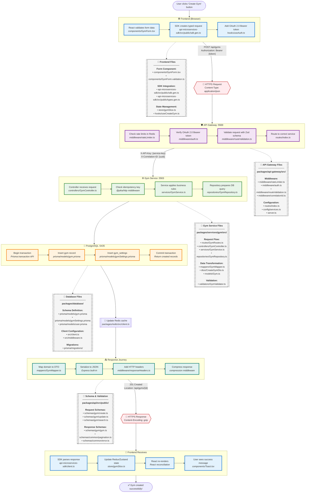
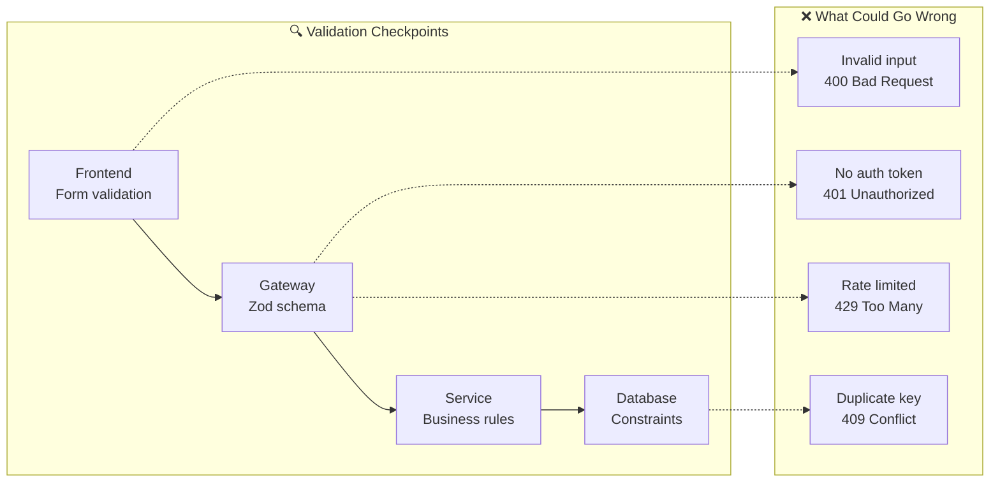

# Simple Request Flow - A Request's Journey

## The Journey of a Request Through Pika



## File Structure Reference

### 🌐 **Frontend Layer**

```
📁 Frontend Files
├── components/
│   └── GymForm.tsx                 # React form component
├── hooks/
│   └── useCreateGym.ts            # Custom hook for gym creation
└── api-microservices-sdk/
    └── src/public/
        ├── sdk.gen.ts             # Generated SDK client
        └── types.gen.ts           # Generated TypeScript types
```

### 🛡️ **API Gateway Layer**

```
📁 packages/api-gateway/
├── src/
│   ├── middleware/
│   │   ├── rateLimiter.ts         # Redis-based rate limiting
│   │   ├── auth.ts                # JWT validation middleware
│   │   └── routeValidation.ts     # Zod schema validation
│   ├── routes/
│   │   └── index.ts               # Service routing configuration
│   └── server.ts                  # Gateway server setup
```

### ⚙️ **Service Layer**

```
📁 packages/services/gym/
├── src/
│   ├── controllers/
│   │   └── GymController.ts       # HTTP request handlers
│   ├── services/
│   │   └── GymService.ts          # Business logic implementation
│   ├── repositories/
│   │   └── GymRepository.ts       # Data access layer
│   ├── mappers/
│   │   └── GymMapper.ts           # DTO ↔ Domain transformations
│   └── routes/
│       └── GymRoutes.ts           # Route definitions
```

### 📋 **Schema & Validation**

```
📁 packages/api/
└── src/public/
    └── schemas/
        └── gym/
            ├── gym.ts             # Gym entity schema
            ├── create.ts          # Create gym request schema
            └── update.ts          # Update gym request schema
```

### 🔧 **Shared Middleware**

```
📁 packages/http/
└── src/infrastructure/express/
    └── middleware/
        ├── idempotency.ts         # Prevent duplicate processing
        ├── cache.ts               # HTTP caching decorator
        └── errorHandler.ts        # Global error handling
```

### 💾 **Data Layer**

```
📁 packages/database/
├── src/
│   └── client.ts                  # Prisma client instance
└── prisma/
    ├── schema.prisma              # Compiled schema (DO NOT EDIT)
    ├── base.prisma                # Base configuration
    ├── enums.prisma               # Enum definitions
    └── models/
        └── gym.prisma             # Gym model definition

📁 packages/redis/
└── src/
    └── client.ts                  # Redis client configuration
```

## Step-by-Step Journey

### 🎯 **"I am a request, and this is my story..."**

#### 1. **Birth in the Browser** 🌐

```
- I'm born when a user clicks "Create Gym"
- React validates the form data
- The TypeScript SDK wraps me with proper types
- I get an OAuth 2.0 Bearer token as my passport
```

#### 2. **Network Travel** 📡

```
- I travel through HTTPS, encrypted and secure
- CDN might cache my friends (GET requests)
- Load balancer directs me to a healthy server
```

#### 3. **Gateway Security Check** 🛡️

```
- Rate limiter checks if I'm spamming (Redis counter)
- My OAuth 2.0 Bearer token is verified
- Zod validates my structure matches the schema
- Router sends me to the Gym Service
```

#### 4. **Service Processing** ⚙️

```
- Controller greets me at port 5503
- Idempotency check ensures I'm not a duplicate
- Service layer applies business rules
- Repository translates me to SQL
```

#### 5. **Database Storage** 💾

```
- Transaction begins (all or nothing!)
- My data is inserted into tables
- Related records are created
- Transaction commits successfully
```

#### 6. **Cache Update** 🚀

```
- Redis cache is invalidated
- Hot data might be pre-cached
- Events are published to queues
```

#### 7. **Response Transformation** 📤

```
- Domain objects become DTOs
- Private fields are hidden
- JSON serialization happens
- Compression reduces my size
```

#### 8. **Journey Home** 🏠

```
- I travel back through the gateway
- CORS headers are added
- I arrive at the frontend SDK
- Redux/Zustand updates the state
- React re-renders the UI
- User sees "Gym created!" ✅
```

## Key Checkpoints & Validations



## Timing Breakdown

```mermaid
gantt
    title Request Lifecycle Timeline (Target: <500ms total)
    dateFormat X
    axisFormat %Lms

    section Frontend
    Form Validation     :0, 10
    SDK Processing      :10, 20

    section Network
    Request Travel      :20, 30

    section Gateway
    Rate Limit Check    :30, 35
    OAuth Token Verify  :35, 45
    Schema Validation   :45, 55

    section Service
    Business Logic      :55, 155

    section Database
    Query Execution     :155, 255

    section Response
    Transformation      :255, 275
    Network Return      :275, 285
    Frontend Update     :285, 300
```



## Quick Reference Card

### 🚀 **Request Essentials**

- **Always includes**: OAuth 2.0 Bearer token, Content-Type, X-Request-ID
- **Validated at**: Frontend → Gateway → Service → Database
- **Cached at**: CDN (GET) → Redis → Browser State
- **Logged at**: Every layer with correlation ID

### 🛡️ **Security Layers**

1. HTTPS encryption
2. OAuth 2.0 Bearer token authentication
3. Rate limiting
4. Input validation (Zod schemas)
5. SQL injection protection (Prisma)

### ⚡ **Performance Tricks**

- Idempotency prevents duplicate processing
- Redis caching reduces database hits
- Connection pooling reuses DB connections
- Compression reduces payload size
- CDN serves static content

### 🔧 **Error Recovery**

- Frontend: Retry with exponential backoff
- Gateway: Circuit breaker for failing services
- Service: Transaction rollback on errors
- Response: Proper error codes and messages

## The End Result

**When everything works perfectly:**

1. ✅ User action completed
2. ✅ Data safely stored
3. ✅ UI updated instantly
4. ✅ All systems in sync
5. ✅ Happy user!

**Total journey time: ~300ms** 🚀
