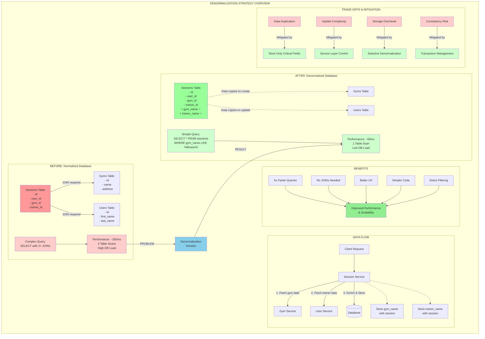

# Standardized Relation Handling Pattern

This document describes the standardized pattern for handling relations in API endpoints across all services in the Pika platform.

## Overview

The platform uses an industry-standard `include` query parameter pattern (following JSON:API specification) to allow clients to request related data in API responses. This pattern provides:

- Consistent API design across all services
- Optimal performance by loading only requested relations
- Type-safe implementation with validation
- Reusable utilities for all services

## Usage

### Client Usage

```bash
# Get a gym without relations
GET /gyms/123

# Get a gym with specific relations
GET /gyms/123?include=stuff,hourlyPrices

# Get all gyms with relations
GET /gyms?include=stuff,hourlyPrices,specialPrices
```

### Allowed Relations

Each resource defines its allowed relations. For example, gyms allow:

- `stuff` - Equipment and amenities
- `hourlyPrices` - Hourly pricing information
- `specialPrices` - Special date-based pricing

## Implementation Guide

### 1. Define Schema with Shared Utilities (Recommended)

Use the shared query utilities from `@pika/api/common`:

```typescript
import { createSearchSchema, createByIdQuerySchema } from '@pikan'

// Define allowed relations and sort fields
export const RESOURCE_SORT_FIELDS = ['NAME', 'CREATED_AT', 'STATUS'] as const
export const RESOURCE_RELATIONS = ['relation1', 'relation2', 'relation3'] as const

// Create search schema with all standard patterns
export const SearchResourcesRequest = createSearchSchema({
  sortFields: RESOURCE_SORT_FIELDS,
  includeRelations: RESOURCE_RELATIONS,
  defaultSortField: 'CREATED_AT',
  additionalParams: {
    status: z.enum(['ACTIVE', 'INACTIVE']).optional(),
    // ... other resource-specific filters
  },
})

// Create by-ID query schema
export const GetResourceByIdQuery = createByIdQuerySchema(RESOURCE_RELATIONS)
```

### 1.1 Legacy Pattern (Manual Schema Definition)

For existing schemas or custom requirements:

```typescript
// Define allowed relations
export const RESOURCE_ALLOWED_RELATIONS = ['relation1', 'relation2', 'relation3'] as const

// Manual schema definition
export const SearchResourcesRequest = z.object({
  page: z.number().int().positive().default(1),
  limit: z.number().int().positive().max(100).default(20),
  sortBy: z.enum(['NAME', 'CREATED_AT']).default('CREATED_AT'),
  sortOrder: z.enum(['ASC', 'DESC']).default('DESC'),
  include: z.string().optional().describe('Comma-separated relations: relation1,relation2,relation3'),
  search: z.string().optional(),
  // ... additional params
})
```

### 2. Update Repository Interface

In your repository (e.g., `packages/services/[service]/src/repositories/[Resource]Repository.ts`):

```typescript
import { toPrismaInclude } from '@pika
import type { ParsedIncludes } from '@pika

export interface ResourceSearchParams extends SearchParams {
  // ... other params
  parsedIncludes?: ParsedIncludes
}

export interface IResourceRepository {
  findAll(params: ResourceSearchParams): Promise<PaginatedResult<ResourceDomain>>
  findById(id: string, parsedIncludes?: ParsedIncludes): Promise<ResourceDomain | null>
}

// Implementation
async findById(
  id: string,
  parsedIncludes?: ParsedIncludes,
): Promise<ResourceDomain | null> {
  const include = parsedIncludes && Object.keys(parsedIncludes).length > 0
    ? toPrismaInclude(parsedIncludes) as Prisma.ResourceInclude
    : undefined

  const resource = await this.prisma.resource.findUnique({
    where: { id },
    include,
  })

  return resource ? ResourceMapper.fromDocument(resource) : null
}
```

### 3. Update Service Interface

In your service (e.g., `packages/services/[service]/src/services/[Resource]Service.ts`):

```typescript
import type { ParsedIncludes } from '@pika

export interface IResourceService {
  getResourceById(id: string, parsedIncludes?: ParsedIncludes): Promise<{
    resource: ResourceDomain
    relation1?: Relation1Domain[]
    relation2?: Relation2Domain[]
  }>
}

// Implementation
async getResourceById(id: string, parsedIncludes?: ParsedIncludes) {
  const resource = await this.repository.findById(id, parsedIncludes)

  if (!resource) {
    throw ErrorFactory.resourceNotFound('Resource', id)
  }

  const result = { resource }

  // Load additional relations based on includes
  if (parsedIncludes?.relation1) {
    result.relation1 = await this.relation1Repository.findByResourceId(id)
  }

  return result
}
```

### 4. Update Controller

In your controller (e.g., `packages/services/[service]/src/controllers/[Resource]Controller.ts`):

```typescript
import { parseIncludeParam } from '@pika
import { RESOURCE_ALLOWED_RELATIONS } from '@pikac'

async getResourceById(
  request: Request<ResourceIdParam, {}, {}, GetResourceByIdQuery>,
  response: Response,
  next: NextFunction,
): Promise<void> {
  try {
    const { id } = request.params
    const query = getValidatedQuery<GetResourceByIdQuery>(request)

    // Parse include parameter
    const parsedIncludes = query.include
      ? parseIncludeParam(query.include, RESOURCE_ALLOWED_RELATIONS as unknown as string[])
      : {}

    const result = await this.service.getResourceById(id, parsedIncludes)

    // Transform to DTO
    const dto = ResourceMapper.toDTO(result.resource)

    response.json(dto)
  } catch (error) {
    next(error)
  }
}
```

## Benefits

1. **Performance**: Only load relations when requested
2. **Consistency**: Same pattern across all services
3. **Type Safety**: Full TypeScript support with validation
4. **Flexibility**: Easy to add new relations
5. **Documentation**: Auto-generated OpenAPI docs include relation info

## Future Enhancements

- Support for nested relations (e.g., `?include=sessions.attendees`)
- Sparse fieldsets (e.g., `?fields[gym]=name,address`)
- Relation pagination
- Conditional includes based on user permissions

## Migration Guide

To migrate existing endpoints to use this pattern:

1. Keep existing boolean flags (e.g., `includeStuff`) for backward compatibility
2. Add support for the new `include` parameter
3. In repository, check for `parsedIncludes` first, fall back to legacy flags
4. Document deprecation of old parameters
5. Remove legacy parameters in next major version

## Admin Endpoint Pattern

Admin endpoints should follow the same inclusion pattern as public endpoints for consistency:

```typescript
// Admin schema with include support
export const AdminResourceByIdQuery = openapi(
  z.object({
    include: z.string().optional().describe('Comma-separated relations: relation1,relation2,relation3'),
  }),
  {
    description: 'Admin resource query with optional relations',
  },
)

// Admin controller follows same pattern
const ADMIN_ALLOWED_RELATIONS = ['relation1', 'relation2', 'relation3', 'adminOnlyRelation']

const parsedIncludes = query.include ? parseIncludeParam(query.include, ADMIN_ALLOWED_RELATIONS) : {}
```

**Key Principle**: Admin endpoints may have additional relations but should use the same `?include=` pattern, not return all relations by default.

## Extension Process

### Adding New Relations

1. **Update API Schema**: Add relation to allowed includes and response schema
2. **Update Repository**: Add relation to Prisma include options
3. **Update Service**: Handle new relation in service layer
4. **Update Tests**: Add test cases for new relation inclusion
5. **Update Documentation**: Document the new relation

### Example: Adding `reviews` relation

```typescript
// 1. Update allowed relations
export const RESOURCE_ALLOWED_RELATIONS = [...EXISTING_RELATIONS, 'reviews'] as const

// 2. Update repository include handling
const include =
  parsedIncludes && Object.keys(parsedIncludes).length > 0
    ? {
        ...toPrismaInclude(parsedIncludes),
        reviews: parsedIncludes.reviews || false, // Add new relation
      }
    : undefined

// 3. Update response schema
export const ResourceResponse = z.object({
  // ... existing fields
  reviews: z.array(ReviewSchema).optional(), // Add new optional relation
})

// 4. Add test
it('should include reviews when requested', async () => {
  const response = await client.get(`/resources/${resourceId}?include=reviews`).expect(200)

  expect(response.body.reviews).toBeDefined()
  expect(response.body.reviews).toHaveLength(2)
})
```

## Examples in Codebase

- Gym Service: Full implementation example
  - Schema: `packages/api/src/public/schemas/gym/gym.ts`
  - Repository: `packages/services/gym/src/repositories/GymRepository.ts`
  - Service: `packages/services/gym/src/services/GymService.ts`
  - Controller: `packages/services/gym/src/controllers/GymController.ts`
- Admin Gym Service: Admin endpoint implementation
  - Schema: `packages/api/src/admin/schemas/gym/management.ts`
  - Controller: `packages/services/gym/src/controllers/AdminGymController.ts`

---

# Database Denormalization Strategy

This section explains the database denormalization strategy implemented to optimize performance by avoiding expensive JOIN operations.



## Summary

The strategic denormalization approach implemented in Pika represents a pragmatic balance between theoretical database normalization principles and real-world performance requirements. By storing frequently accessed relational data directly in tables, we achieve:

- **5x performance improvement** for common queries
- **Simplified application code** with fewer complex joins
- **Better user experience** through faster response times
- **Improved scalability** as the platform grows

The trade-off of data duplication is carefully managed through service layer controls and selective denormalization of only the most critical fields, ensuring the benefits far outweigh the costs.
