# Backend Feature Development Workflow

## Developer's Journey: Creating a New Backend Feature

```mermaid
flowchart TB
    Start([Developer receives feature request]) --> Analyze

    %% Analysis Phase
    subgraph Analyze["📋 1. Analysis & Planning"]
        A1[Read feature requirements]
        A2[Identify affected services]
        A3[Design API endpoints<br/><i>REST conventions</i>]

        A1 --> A2 --> A3
    end

    %% API Contract Definition (Contract-First Development)
    subgraph ApiContract["📝 2. Define API Contract"]
        AC1[Create OpenAPI schemas<br/><i>packages/api/src/public/schemas/</i>]
        AC2[Define request DTOs<br/><i>create.ts, update.ts, search.ts</i>]
        AC3[Define response DTOs<br/><i>entity.ts, pagination.ts</i>]
        AC4[Add validation rules<br/><i>Zod schemas with constraints</i>]
        AC5[Generate API types<br/><i>yarn generate:api</i>]

        AC1 --> AC2 --> AC3 --> AC4 --> AC5
    end

    Analyze --> ApiContract

    %% SDK Generation & Update
    subgraph SdkGeneration["📦 3. SDK Generation"]
        SG1[Run SDK generation<br/><i>yarn generate:sdk</i>]
        SG2[Verify generated types<br/><i>Check api-microservices-sdk/</i>]
        SG3[Test SDK compilation<br/><i>yarn build in SDK folder</i>]
        SG4[Update SDK version<br/><i>Bump package.json version</i>]

        SG1 --> SG2 --> SG3 --> SG4
    end

    ApiContract --> SdkGeneration

    %% SDK Repository Management
    subgraph SdkRepo["🚀 4. SDK Repository"]
        SR1[Create feature branch<br/><i>git checkout -b feature/new-endpoints</i>]
        SR2[Commit SDK changes<br/><i>git commit -m feat: add new endpoints</i>]
        SR3[Push to SDK repo<br/><i>git push origin feature/new-endpoints</i>]
        SR4[Create pull request<br/><i>For review and merge</i>]

        SR1 --> SR2 --> SR3 --> SR4
    end

    SdkGeneration --> SdkRepo

    %% Split into two parallel tracks
    SdkRepo --> BackendTrack
    SdkRepo --> FrontendTrack

    %% Backend Implementation Track
    subgraph BackendTrack["🔧 5A. Backend Implementation"]
        direction TB

        %% Service Decision
        BT1{New service<br/>needed?}

        %% New Service Creation
        subgraph NewService["🆕 New Service Creation"]
            NS1[Create service structure<br/><i>packages/services/new-service/</i>]
            NS2[Setup package.json<br/><i>workspace dependencies</i>]
            NS3[Configure nx.json<br/><i>Add build target</i>]
            NS4[Create server.ts and app.ts<br/><i>Follow gym service pattern</i>]

            NS1 --> NS2 --> NS3 --> NS4
        end

        %% Database Schema
        subgraph Database["💾 Database Schema"]
            D1[Create Prisma model<br/><i>packages/database/prisma/models/</i>]
            D2[Define relationships<br/><i>@relation directives</i>]
            D3[Add to schema imports<br/><i>base.prisma</i>]
            D4[Generate and migrate<br/><i>yarn db:generate and yarn db:migrate</i>]

            D1 --> D2 --> D3 --> D4
        end

        %% Core Implementation
        subgraph Implementation["⚙️ Core Implementation"]
            I1[Create domain model<br/><i>src/models/Entity.ts</i>]
            I2[Implement repository<br/><i>src/repositories/EntityRepository.ts</i>]
            I3[Build service layer<br/><i>src/services/EntityService.ts</i>]
            I4[Create controller<br/><i>src/controllers/EntityController.ts</i>]

            I1 --> I2 --> I3 --> I4
        end

        %% Mapper Implementation
        subgraph Mappers["🔄 Data Transformation"]
            M1[Create mapper class<br/><i>src/mappers/EntityMapper.ts</i>]
            M2[Implement fromDocument<br/><i>DB to Domain</i>]
            M3[Implement toDTO<br/><i>Domain to API</i>]
            M4[Add to controller<br/><i>Transform all responses</i>]

            M1 --> M2 --> M3 --> M4
        end

        %% Routes Configuration
        subgraph Routes["🛣️ Route Setup"]
            R1[Create route file<br/><i>src/routes/EntityRoutes.ts</i>]
            R2[Define endpoints<br/><i>GET, POST, PUT, DELETE</i>]
            R3[Add validation middleware<br/><i>validateRequest with schema</i>]
            R4[Register in app.ts<br/><i>app.use with entities routes</i>]

            R1 --> R2 --> R3 --> R4
        end

        %% Testing
        subgraph Testing["🧪 Backend Testing"]
            T1[Create test fixtures<br/><i>tests/fixtures/entity.ts</i>]
            T2[Write integration tests<br/><i>tests/integration/entity.test.ts</i>]
            T3[Test error scenarios<br/><i>404, 409, 400 responses</i>]
            T4[Run test suite<br/><i>yarn test</i>]

            T1 --> T2 --> T3 --> T4
        end

        %% Gateway Integration
        subgraph Gateway["🛡️ Gateway Integration"]
            G1[Update gateway routes<br/><i>packages/api-gateway/src/routes/</i>]
            G2[Configure service mapping<br/><i>Add service URL and port</i>]
        G2a[Update OpenAPI generator<br/><i>packages/api/src/scripts/generate-all-apis.ts</i>]
            G3[Add auth rules<br/><i>Public vs protected endpoints</i>]
            G4[Test via gateway<br/><i>Port 5500</i>]

            G1 --> G2 --> G2a --> G3 --> G4
        end

        BT1 -->|Yes| NewService
        BT1 -->|No| Database
        NewService --> Database
        Database --> Implementation
        Implementation --> Mappers
        Mappers --> Routes
        Routes --> Testing
        Testing --> Gateway
        Gateway --> BackendComplete
    end

    %% Frontend Implementation Track
    subgraph FrontendTrack["🌐 5B. Frontend Integration"]
        direction TB

        %% SDK Integration
        subgraph SdkIntegration["📱 SDK Integration"]
            F1[Update SDK dependency<br/><i>npm install api-microservices-sdk@latest</i>]
            F2[Import new types<br/><i>Import generated interfaces</i>]
            F3[Update API client<br/><i>Use new SDK methods</i>]
            F4[Test SDK integration<br/><i>Verify types and methods</i>]

            F1 --> F2 --> F3 --> F4
        end

        %% Component Development
        subgraph Components["🎨 Component Development"]
            C1[Create form components<br/><i>Form validation with new types</i>]
            C2[Build data display<br/><i>Tables, cards, lists</i>]
            C3[Add loading states<br/><i>Skeletons and spinners</i>]
            C4[Implement error handling<br/><i>Error boundaries and messages</i>]

            C1 --> C2 --> C3 --> C4
        end

        %% State Management
        subgraph StateManagement["📊 State Management"]
            S1[Create state slices<br/><i>Redux/Zustand stores</i>]
            S2[Add API calls<br/><i>Async thunks or mutations</i>]
            S3[Handle optimistic updates<br/><i>Immediate UI feedback</i>]
            S4[Implement caching<br/><i>React Query or SWR</i>]

            S1 --> S2 --> S3 --> S4
        end

        %% Frontend Testing
        subgraph FrontendTesting["🧪 Frontend Testing"]
            FT1[Unit test components<br/><i>Testing Library</i>]
            FT2[Integration tests<br/><i>API mocking</i>]
            FT3[E2E test flows<br/><i>Playwright or Cypress</i>]
            FT4[Visual regression<br/><i>Screenshot testing</i>]

            FT1 --> FT2 --> FT3 --> FT4
        end

        SdkIntegration --> Components
        Components --> StateManagement
        StateManagement --> FrontendTesting
        FrontendTesting --> FrontendComplete
    end

    %% Final Steps
    subgraph Final["✅ 6. Final Integration"]
        Final1[Backend validation<br/><i>yarn lint:fix, yarn typecheck</i>]
        Final2[Frontend validation<br/><i>npm run lint, npm run type-check</i>]
        Final3[End-to-end testing<br/><i>Full stack integration</i>]
        Final4[Documentation update<br/><i>API docs and README</i>]

        Final1 --> Final2 --> Final3 --> Final4
    end

    BackendComplete --> Final
    FrontendComplete --> Final
    Final --> End([Feature Complete! 🎉])

    %% Completion nodes
    BackendComplete([Backend Ready! ✅])
    FrontendComplete([Frontend Ready! ✅])

    %% Styling
    classDef planning fill:#e3f2fd,stroke:#1976d2,stroke-width:3px
    classDef contract fill:#f3e5f5,stroke:#7b1fa2,stroke-width:3px
    classDef sdk fill:#fff3e0,stroke:#f57c00,stroke-width:3px
    classDef backend fill:#e8f5e9,stroke:#388e3c,stroke-width:3px
    classDef frontend fill:#e0f2f1,stroke:#00796b,stroke-width:3px
    classDef final fill:#ffebee,stroke:#c62828,stroke-width:3px
    classDef decision fill:#fce4ec,stroke:#ad1457,stroke-width:2px
    classDef complete fill:#e8f5e8,stroke:#2e7d32,stroke-width:3px

    class A1,A2,A3,A4 planning
    class AC1,AC2,AC3,AC4,AC5 contract
    class SG1,SG2,SG3,SG4,SR1,SR2,SR3,SR4 sdk
    class NS1,NS2,NS3,NS4,D1,D2,D3,D4,I1,I2,I3,I4,M1,M2,M3,M4,R1,R2,R3,R4,T1,T2,T3,T4,G1,G2,G2a,G3,G4 backend
    class F1,F2,F3,F4,C1,C2,C3,C4,S1,S2,S3,S4,FT1,FT2,FT3,FT4 frontend
    class Final1,Final2,Final3,Final4 final
    class BT1 decision
    class BackendComplete,FrontendComplete complete
```



## Quick Reference Implementation

### 🏗️ Repository Pattern

```typescript
export interface IEntityRepository {
  findAll(params: SearchParams): Promise<PaginatedResult<Entity>>
  findById(id: string): Promise<Entity | null>
  create(data: CreateInput): Promise<Entity>
  update(id: string, data: UpdateInput): Promise<Entity>
  delete(id: string): Promise<void>
}
```

### 🎯 Service Pattern

```typescript
export class EntityService {
  constructor(
    private readonly repository: IEntityRepository,
    private readonly cache: ICacheService,
  ) {}

  async getAll(params: SearchParams): Promise<PaginatedResult<Entity>> {
    // Business logic here
  }
}
```

### 🎮 Controller Pattern

```typescript
export class EntityController {
  constructor(private readonly service: IEntityService) {
    this.getAll = this.getAll.bind(this)
  }

  async getAll(request: Request<{}, {}, {}, APIQuerySchema>, response: Response, next: NextFunction): Promise<void> {
    try {
      const result = await this.service.getAll(params)
      const dtoResult = {
        data: result.data.map(EntityMapper.toDTO),
        pagination: result.pagination,
      }
      response.json(dtoResult)
    } catch (error) {
      next(error)
    }
  }
}
```

### 🔄 Mapper Pattern

```typescript
export class EntityMapper {
  static fromDocument(doc: PrismaEntity): EntityDomain {
    return {
      id: doc.id,
      // Transform fields
    }
  }

  static toDTO(domain: EntityDomain): EntityDTO {
    return {
      id: domain.id,
      // Transform to API format
    }
  }
}
```

## File Structure for New Feature

```
packages/services/[service-name]/
├── src/
│   ├── controllers/
│   │   └── EntityController.ts
│   ├── services/
│   │   └── EntityService.ts
│   ├── repositories/
│   │   └── EntityRepository.ts
│   ├── mappers/
│   │   └── EntityMapper.ts
│   ├── routes/
│   │   └── EntityRoutes.ts
│   ├── models/
│   │   └── Entity.ts
│   ├── types/
│   │   └── index.ts
│   ├── app.ts
│   ├── server.ts
│   └── index.ts
├── tests/
│   ├── fixtures/
│   │   └── entity.ts
│   └── integration/
│       └── entity.test.ts
├── package.json
└── tsconfig.json
```

## Common Commands During Development

```bash
# 1. After creating schemas
yarn generate:api

# 2. After creating database models
yarn db:generate
yarn db:migrate

# 3. During development
yarn nx run @pika/[service]:local
# Or run all services:
yarn local

# 4. After implementation
yarn lint:fix
yarn typecheck
yarn test

# 5. Generate SDK for frontend
yarn generate:sdk

# 6. If services are already running
yarn kill  # Kill all backend services
```

## Architecture Rules to Remember

### ✅ DO

- Follow Clean Architecture: Controller → Service → Repository
- Use mappers for ALL data transformations
- Type Request objects properly with API schemas
- Implement proper error handling with ErrorFactory
- Use dependency injection pattern
- Add integration tests for all endpoints
- Use `.js` extension in TypeScript imports
- Use OAuth 2.0 Bearer tokens for authentication
- Follow the standardized include pattern for relations
- Use shared query utilities from `@pikan`

### ❌ DON'T

- Put database queries in controllers
- Import API types in service/repository layers
- Use type assertions or `unknown` casts
- Create files unless necessary
- Skip mapper implementations
- Forget to bind controller methods
- Use `.ts` extension in imports
- Modify `schema.prisma` directly (edit source files instead)
- Use legacy JWT patterns (use OAuth 2.0)

## Import Guidelines

```typescript
// External packages
import { type Request, type Response } from 'express'

// Cross-package imports
import { ErrorFactory, logger } from '@pika
import { schemas } from '@pika

// Service-specific imports
import { EntityService } from './services/EntityService.js'
import { EntityRepository } from './repositories/EntityRepository.js'
```

## Error Handling Pattern

```typescript
try {
  // Your code
} catch (error) {
  if (error instanceof Prisma.PrismaClientKnownRequestError) {
    if (error.code === 'P2002') {
      throw ErrorFactory.conflict('Entity already exists')
    }
  }
  throw ErrorFactory.fromError(error)
}
```

## Validation Middleware

```typescript
router.post(
  '/',
  validateRequest({
    body: schemas.createEntitySchema,
  }),
  controller.create,
)
```

## Testing Pattern

```typescript
describe('Entity API', () => {
  let app: Express
  let testDb: TestDatabase

  beforeAll(async () => {
    testDb = await createTestDatabase()
    app = await createEntityServer({
      prisma: testDb.prisma,
      cacheService: new MemoryCacheService(),
    })
  })

  it('should create entity', async () => {
    const response = await supertest(app.server).post('/entities').set('Authorization', `Bearer ${token}`).send(validData).expect(201)
  })
})
```

## Completion Checklist

- [ ] API schemas defined in `packages/api`
- [ ] Database schema created and migrated
- [ ] Repository implements all CRUD operations
- [ ] Service layer handles business logic
- [ ] Controller properly typed with Request generics
- [ ] Mappers transform between layers
- [ ] Routes configured with validation
- [ ] Integration tests pass
- [ ] Gateway routes updated
- [ ] SDK generated successfully
- [ ] Linting and type checking pass
- [ ] OAuth 2.0 authentication configured
- [ ] Service-to-service communication tested
- [ ] Include parameter for relations implemented
- [ ] Admin endpoints created if needed
