# VoucherBook Platform - Comprehensive Flow Documentation

## Platform Overview

VoucherBook is a multi-sided marketplace connecting businesses and customers through digital discount vouchers. The platform consists of multiple applications serving different user types with role-based access control.

---

## System Architecture and User Roles

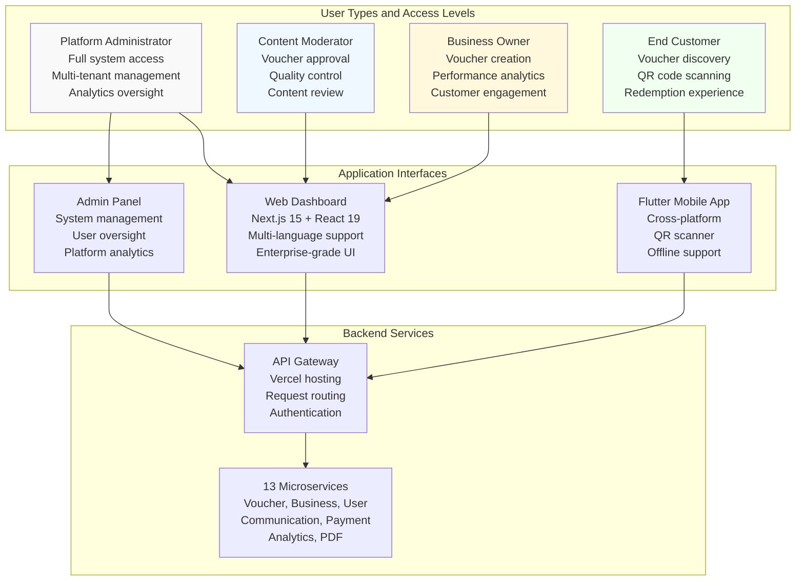
```mermaid
graph TB
    subgraph "User Types and Access Levels"
        Admin[Platform Administrator<br/>Full system access<br/>Multi-tenant management<br/>Analytics oversight]
        Moderator[Content Moderator<br/>Voucher approval<br/>Quality control<br/>Content review]
        Business[Business Owner<br/>Voucher creation<br/>Performance analytics<br/>Customer engagement]
        Customer[End Customer<br/>Voucher discovery<br/>QR code scanning<br/>Redemption experience]
    end

    subgraph "Application Interfaces"
        Dashboard[Web Dashboard<br/>Next.js 15 + React 19<br/>Multi-language support<br/>Enterprise-grade UI]
        FlutterApp[Flutter Mobile App<br/>Cross-platform<br/>QR scanner<br/>Offline support]
        AdminPanel[Admin Panel<br/>System management<br/>User oversight<br/>Platform analytics]
    end

    subgraph "Backend Services"
        APIGateway[API Gateway<br/>Vercel hosting<br/>Request routing<br/>Authentication]
        Services[13 Microservices<br/>Voucher, Business, User<br/>Communication, Payment<br/>Analytics, PDF]
    end

    Admin --> Dashboard
    Admin --> AdminPanel
    Moderator --> Dashboard
    Business --> Dashboard
    Customer --> FlutterApp

    Dashboard --> APIGateway
    FlutterApp --> APIGateway
    AdminPanel --> APIGateway
    APIGateway --> Services

    style Admin fill:#f9f9f9
    style Moderator fill:#f0f8ff
    style Business fill:#fff8dc
    style Customer fill:#f0fff0
```

---

## 1. Voucher Creation Ecosystem

### 1.1 Business Owner Voucher Creation Process

```mermaid
flowchart TD
    subgraph "Authentication and Setup"
        Login[Business Login<br/>JWT Authentication<br/>Role verification]
        Dashboard[Access Web Dashboard<br/>TypeScript + Next.js<br/>Multi-language interface]
        Permissions[Check Permissions<br/>Business registration status<br/>Active subscription]
    end

    subgraph "Voucher Creation Wizard"
        CreateNew[Start New Voucher<br/>Template selection<br/>Category assignment]
        BasicInfo[Basic Information<br/>Title in multiple languages<br/>Description and terms<br/>Business location]
        DiscountConfig[Discount Configuration<br/>Percentage or fixed amount<br/>Minimum purchase requirements<br/>Usage limitations]
        MediaUpload[Media Management<br/>Upload business images<br/>Logo integration<br/>Preview generation]
        Scheduling[Time Management<br/>Valid from date<br/>Expiration settings<br/>Maximum redemptions]
        Review[Final Review<br/>Preview all languages<br/>Terms verification<br/>Cost calculation]
    end

    subgraph "System Processing"
        Validation[Backend Validation<br/>Business rule checks<br/>Content moderation<br/>Fraud prevention]
        CodeGeneration[Code Generation<br/>QR code creation<br/>Short code assignment<br/>Static campaign codes]
        StateManagement[State Assignment<br/>DRAFT status<br/>Ready for publishing<br/>Approval workflow]
    end

    Login --> Dashboard
    Dashboard --> Permissions
    Permissions --> CreateNew
    CreateNew --> BasicInfo
    BasicInfo --> DiscountConfig
    DiscountConfig --> MediaUpload
    MediaUpload --> Scheduling
    Scheduling --> Review
    Review --> Validation
    Validation --> CodeGeneration
    CodeGeneration --> StateManagement

    StateManagement --> Published[Voucher Published<br/>Customer visible<br/>Analytics tracking<br/>Performance monitoring]

    style Login fill:#e8f4f8
    style Published fill:#e8f5e9
```

### 1.2 Admin and Moderator Oversight Process

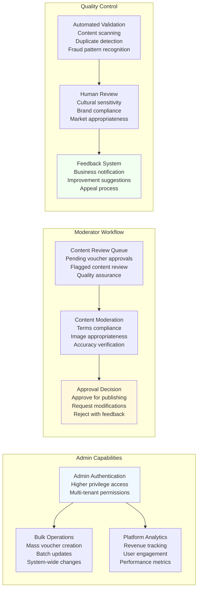
```mermaid
flowchart LR
    subgraph "Admin Capabilities"
        AdminLogin[Admin Authentication<br/>Higher privilege access<br/>Multi-tenant permissions]
        BulkOperations[Bulk Operations<br/>Mass voucher creation<br/>Batch updates<br/>System-wide changes]
        SystemAnalytics[Platform Analytics<br/>Revenue tracking<br/>User engagement<br/>Performance metrics]
    end

    subgraph "Moderator Workflow"
        ModeratorQueue[Content Review Queue<br/>Pending voucher approvals<br/>Flagged content review<br/>Quality assurance]
        ContentReview[Content Moderation<br/>Terms compliance<br/>Image appropriateness<br/>Accuracy verification]
        ApprovalDecision[Approval Decision<br/>Approve for publishing<br/>Request modifications<br/>Reject with feedback]
    end

    subgraph "Quality Control"
        AutomatedChecks[Automated Validation<br/>Content scanning<br/>Duplicate detection<br/>Fraud pattern recognition]
        ManualReview[Human Review<br/>Cultural sensitivity<br/>Brand compliance<br/>Market appropriateness]
        FeedbackLoop[Feedback System<br/>Business notification<br/>Improvement suggestions<br/>Appeal process]
    end

    AdminLogin --> BulkOperations
    AdminLogin --> SystemAnalytics
    ModeratorQueue --> ContentReview
    ContentReview --> ApprovalDecision
    AutomatedChecks --> ManualReview
    ManualReview --> FeedbackLoop

    style AdminLogin fill:#f0f8ff
    style ApprovalDecision fill:#fff8dc
    style FeedbackLoop fill:#f0fff0
```

---

## 2. Customer Discovery and Engagement Journey

### 2.1 Multi-Channel Discovery Process

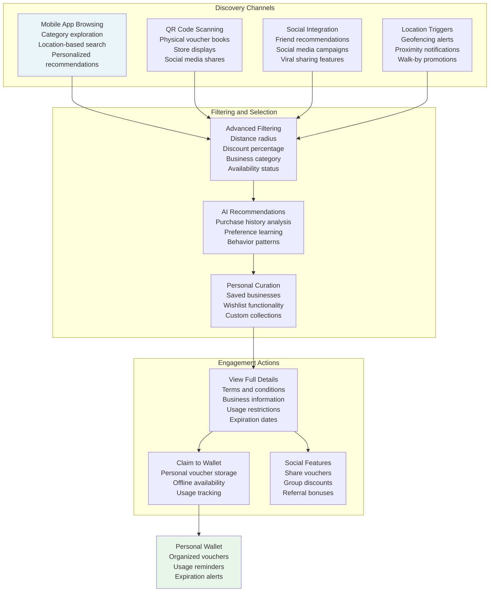
```mermaid
flowchart TB
    subgraph "Discovery Channels"
        AppBrowsing[Mobile App Browsing<br/>Category exploration<br/>Location-based search<br/>Personalized recommendations]
        QRScanning[QR Code Scanning<br/>Physical voucher books<br/>Store displays<br/>Social media shares]
        SocialSharing[Social Integration<br/>Friend recommendations<br/>Social media campaigns<br/>Viral sharing features]
        LocationTriggers[Location Triggers<br/>Geofencing alerts<br/>Proximity notifications<br/>Walk-by promotions]
    end

    subgraph "Filtering and Selection"
        SearchFilters[Advanced Filtering<br/>Distance radius<br/>Discount percentage<br/>Business category<br/>Availability status]
        Recommendations[AI Recommendations<br/>Purchase history analysis<br/>Preference learning<br/>Behavior patterns]
        Favorites[Personal Curation<br/>Saved businesses<br/>Wishlist functionality<br/>Custom collections]
    end

    subgraph "Engagement Actions"
        ViewDetails[View Full Details<br/>Terms and conditions<br/>Business information<br/>Usage restrictions<br/>Expiration dates]
        ClaimToWallet[Claim to Wallet<br/>Personal voucher storage<br/>Offline availability<br/>Usage tracking]
        ShareWithFriends[Social Features<br/>Share vouchers<br/>Group discounts<br/>Referral bonuses]
    end

    AppBrowsing --> SearchFilters
    QRScanning --> SearchFilters
    SocialSharing --> SearchFilters
    LocationTriggers --> SearchFilters

    SearchFilters --> Recommendations
    Recommendations --> Favorites
    Favorites --> ViewDetails
    ViewDetails --> ClaimToWallet
    ViewDetails --> ShareWithFriends

    ClaimToWallet --> WalletManagement[Personal Wallet<br/>Organized vouchers<br/>Usage reminders<br/>Expiration alerts]

    style AppBrowsing fill:#e8f4f8
    style WalletManagement fill:#e8f5e9
```

### 2.2 QR Code Interaction Ecosystem

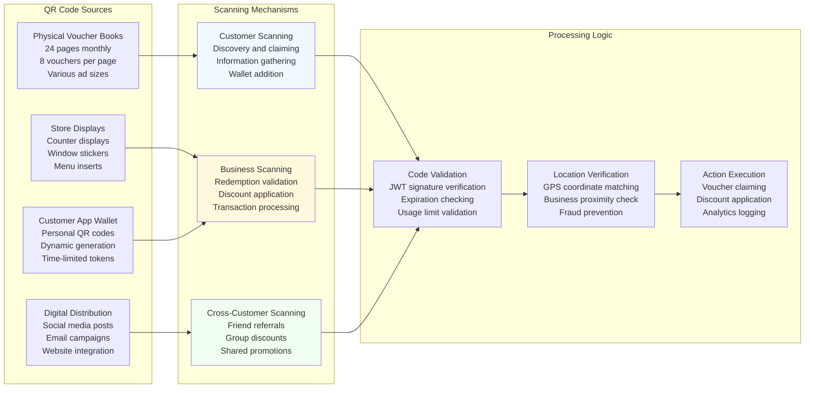
```mermaid
flowchart LR
    subgraph "QR Code Sources"
        PrintedBooks[Physical Voucher Books<br/>24 pages monthly<br/>8 vouchers per page<br/>Various ad sizes]
        StorePoster[Store Displays<br/>Counter displays<br/>Window stickers<br/>Menu inserts]
        DigitalShares[Digital Distribution<br/>Social media posts<br/>Email campaigns<br/>Website integration]
        MobileWallet[Customer App Wallet<br/>Personal QR codes<br/>Dynamic generation<br/>Time-limited tokens]
    end

    subgraph "Scanning Mechanisms"
        CustomerScan[Customer Scanning<br/>Discovery and claiming<br/>Information gathering<br/>Wallet addition]
        BusinessScan[Business Scanning<br/>Redemption validation<br/>Discount application<br/>Transaction processing]
        CrossScan[Cross-Customer Scanning<br/>Friend referrals<br/>Group discounts<br/>Shared promotions]
    end

    subgraph "Processing Logic"
        CodeValidation[Code Validation<br/>JWT signature verification<br/>Expiration checking<br/>Usage limit validation]
        LocationVerification[Location Verification<br/>GPS coordinate matching<br/>Business proximity check<br/>Fraud prevention]
        ActionExecution[Action Execution<br/>Voucher claiming<br/>Discount application<br/>Analytics logging]
    end

    PrintedBooks --> CustomerScan
    StorePoster --> BusinessScan
    DigitalShares --> CrossScan
    MobileWallet --> BusinessScan

    CustomerScan --> CodeValidation
    BusinessScan --> CodeValidation
    CrossScan --> CodeValidation

    CodeValidation --> LocationVerification
    LocationVerification --> ActionExecution

    style CustomerScan fill:#f0f8ff
    style BusinessScan fill:#fff8dc
    style CrossScan fill:#f0fff0
```

---

## 3. Redemption and Transaction Processing

### 3.1 Complete Redemption Flow

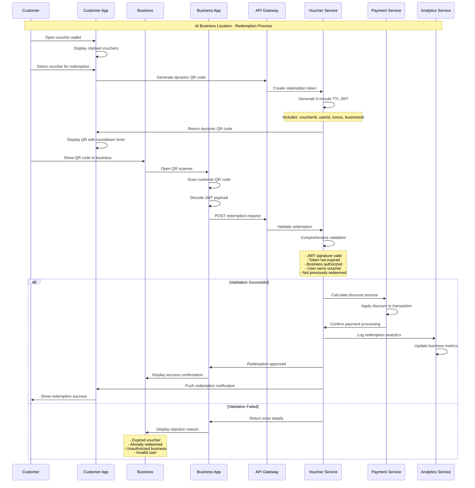
```mermaid
sequenceDiagram
    participant C as Customer
    participant CA as Customer App
    participant B as Business
    participant BA as Business App
    participant API as API Gateway
    participant VS as Voucher Service
    participant PS as Payment Service
    participant AS as Analytics Service

    Note over C,AS: At Business Location - Redemption Process

    C->>CA: Open voucher wallet
    CA->>CA: Display claimed vouchers
    C->>CA: Select voucher for redemption

    CA->>API: Generate dynamic QR code
    API->>VS: Create redemption token
    VS->>VS: Generate 5-minute TTL JWT
    Note over VS: Includes: voucherId, userId, nonce, businessId
    VS->>CA: Return dynamic QR code

    CA->>CA: Display QR with countdown timer
    C->>B: Show QR code to business

    B->>BA: Open QR scanner
    BA->>BA: Scan customer QR code
    BA->>BA: Decode JWT payload

    BA->>API: POST redemption request
    API->>VS: Validate redemption

    VS->>VS: Comprehensive validation
    Note over VS: - JWT signature valid<br/>- Token not expired<br/>- Business authorized<br/>- User owns voucher<br/>- Not previously redeemed

    alt Validation Successful
        VS->>PS: Calculate discount amount
        PS->>PS: Apply discount to transaction
        PS->>VS: Confirm payment processing

        VS->>AS: Log redemption analytics
        AS->>AS: Update business metrics

        VS->>BA: Redemption approved
        BA->>B: Display success confirmation

        VS->>CA: Push redemption notification
        CA->>C: Show redemption success

    else Validation Failed
        VS->>BA: Return error details
        BA->>B: Display rejection reason
        Note over B: - Expired voucher<br/>- Already redeemed<br/>- Unauthorized business<br/>- Invalid user
    end
```

### 3.2 Offline and Sync Processing

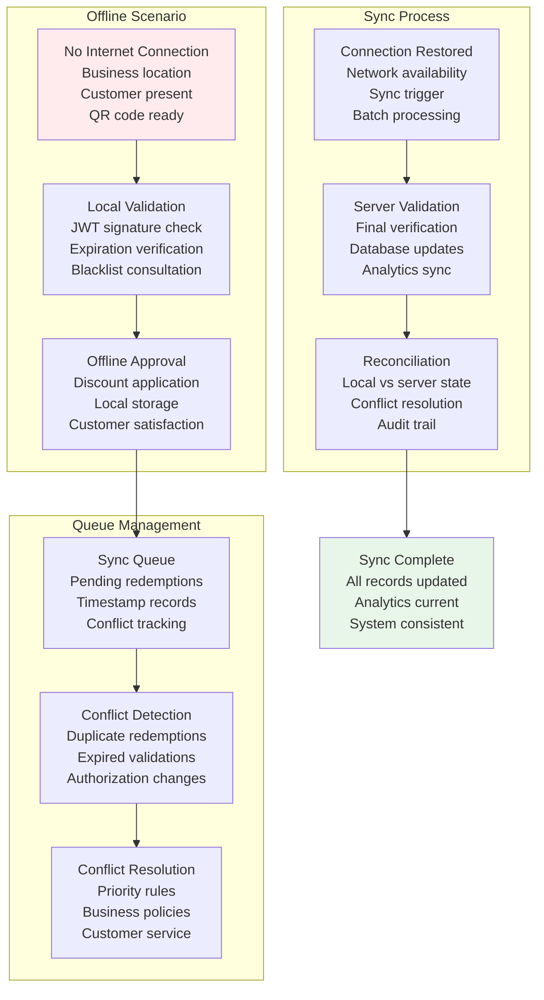
```mermaid
flowchart TB
    subgraph "Offline Scenario"
        NoConnection[No Internet Connection<br/>Business location<br/>Customer present<br/>QR code ready]
        LocalValidation[Local Validation<br/>JWT signature check<br/>Expiration verification<br/>Blacklist consultation]
        OfflineApproval[Offline Approval<br/>Discount application<br/>Local storage<br/>Customer satisfaction]
    end

    subgraph "Queue Management"
        SyncQueue[Sync Queue<br/>Pending redemptions<br/>Timestamp records<br/>Conflict tracking]
        ConflictDetection[Conflict Detection<br/>Duplicate redemptions<br/>Expired validations<br/>Authorization changes]
        Resolution[Conflict Resolution<br/>Priority rules<br/>Business policies<br/>Customer service]
    end

    subgraph "Sync Process"
        ConnectionRestore[Connection Restored<br/>Network availability<br/>Sync trigger<br/>Batch processing]
        ServerValidation[Server Validation<br/>Final verification<br/>Database updates<br/>Analytics sync]
        Reconciliation[Reconciliation<br/>Local vs server state<br/>Conflict resolution<br/>Audit trail]
    end

    NoConnection --> LocalValidation
    LocalValidation --> OfflineApproval
    OfflineApproval --> SyncQueue
    SyncQueue --> ConflictDetection
    ConflictDetection --> Resolution

    ConnectionRestore --> ServerValidation
    ServerValidation --> Reconciliation
    Reconciliation --> SyncComplete[Sync Complete<br/>All records updated<br/>Analytics current<br/>System consistent]

    style NoConnection fill:#ffebee
    style SyncComplete fill:#e8f5e9
```

---

## 4. Physical Voucher Book Creation and Distribution

### 4.1 Monthly Book Production Cycle

```mermaid
flowchart LR
    subgraph "Content Collection"
        MonthlyTrigger[Monthly Production Cycle<br/>30 days before distribution<br/>Content deadline<br/>Business participation]
        VoucherGathering[Voucher Collection<br/>Active voucher filtering<br/>Business verification<br/>Content validation]
        CategoryBalance[Category Balancing<br/>Diverse offering<br/>Geographic distribution<br/>Value optimization]
    end

    subgraph "Design and Layout"
        PagePlanning[Page Layout Planning<br/>24 total pages<br/>8 advertisement spaces per page<br/>Size optimization]
        SizeAllocation[Advertisement Sizing<br/>Full page - 8 spaces<br/>Half page - 4 spaces<br/>Quarter page - 2 spaces<br/>Single space - 1 space]
        DesignIntegration[Design Integration<br/>Business branding<br/>QR code placement<br/>Static code assignment]
    end

    subgraph "Production Process"
        PDFGeneration[PDF Generation<br/>Print-ready format<br/>High-resolution images<br/>QR code optimization]
        QualityControl[Quality Assurance<br/>Design review<br/>Code functionality<br/>Print testing]
        PrintDistribution[Mass Printing<br/>Distribution planning<br/>Location targeting<br/>Tracking system]
    end

    MonthlyTrigger --> VoucherGathering
    VoucherGathering --> CategoryBalance
    CategoryBalance --> PagePlanning
    PagePlanning --> SizeAllocation
    SizeAllocation --> DesignIntegration
    DesignIntegration --> PDFGeneration
    PDFGeneration --> QualityControl
    QualityControl --> PrintDistribution

    PrintDistribution --> StreetDistribution[Street Distribution<br/>High foot traffic areas<br/>Public transportation<br/>Shopping centers<br/>University campuses]

    style MonthlyTrigger fill:#e8f4f8
    style StreetDistribution fill:#e8f5e9
```

### 4.2 Physical-Digital Integration Bridge

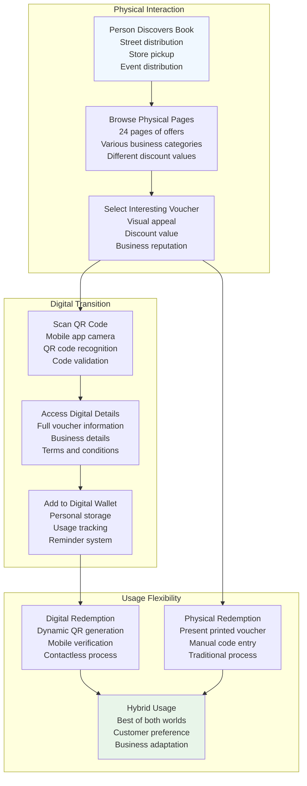
```mermaid
flowchart TB
    subgraph "Physical Interaction"
        PersonFindsBook[Person Discovers Book<br/>Street distribution<br/>Store pickup<br/>Event distribution]
        BrowsePages[Browse Physical Pages<br/>24 pages of offers<br/>Various business categories<br/>Different discount values]
        SelectVoucher[Select Interesting Voucher<br/>Visual appeal<br/>Discount value<br/>Business reputation]
    end

    subgraph "Digital Transition"
        ScanQRCode[Scan QR Code<br/>Mobile app camera<br/>QR code recognition<br/>Code validation]
        DigitalDetails[Access Digital Details<br/>Full voucher information<br/>Business details<br/>Terms and conditions]
        WalletIntegration[Add to Digital Wallet<br/>Personal storage<br/>Usage tracking<br/>Reminder system]
    end

    subgraph "Usage Flexibility"
        DigitalRedemption[Digital Redemption<br/>Dynamic QR generation<br/>Mobile verification<br/>Contactless process]
        PhysicalRedemption[Physical Redemption<br/>Present printed voucher<br/>Manual code entry<br/>Traditional process]
        HybridApproach[Hybrid Usage<br/>Best of both worlds<br/>Customer preference<br/>Business adaptation]
    end

    PersonFindsBook --> BrowsePages
    BrowsePages --> SelectVoucher
    SelectVoucher --> ScanQRCode
    ScanQRCode --> DigitalDetails
    DigitalDetails --> WalletIntegration

    WalletIntegration --> DigitalRedemption
    SelectVoucher --> PhysicalRedemption
    DigitalRedemption --> HybridApproach
    PhysicalRedemption --> HybridApproach

    style PersonFindsBook fill:#f0f8ff
    style HybridApproach fill:#e8f5e9
```

---

## 5. Analytics and Business Intelligence

### 5.1 Multi-Level Analytics Ecosystem

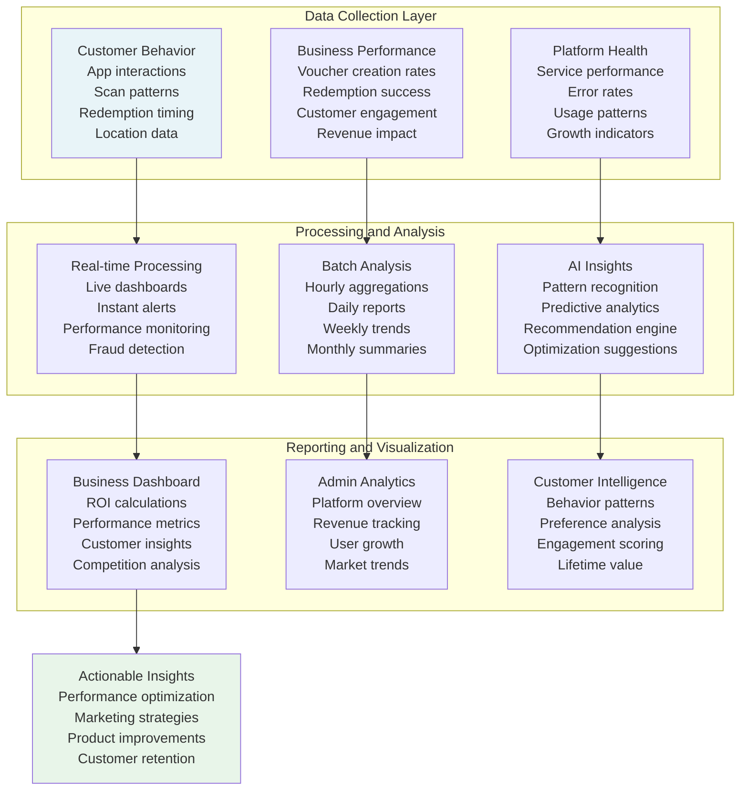
```mermaid
flowchart TB
    subgraph "Data Collection Layer"
        CustomerActions[Customer Behavior<br/>App interactions<br/>Scan patterns<br/>Redemption timing<br/>Location data]
        BusinessMetrics[Business Performance<br/>Voucher creation rates<br/>Redemption success<br/>Customer engagement<br/>Revenue impact]
        SystemMetrics[Platform Health<br/>Service performance<br/>Error rates<br/>Usage patterns<br/>Growth indicators]
    end

    subgraph "Processing and Analysis"
        RealTimeAnalytics[Real-time Processing<br/>Live dashboards<br/>Instant alerts<br/>Performance monitoring<br/>Fraud detection]
        BatchProcessing[Batch Analysis<br/>Hourly aggregations<br/>Daily reports<br/>Weekly trends<br/>Monthly summaries]
        MachineLearning[AI Insights<br/>Pattern recognition<br/>Predictive analytics<br/>Recommendation engine<br/>Optimization suggestions]
    end

    subgraph "Reporting and Visualization"
        BusinessDashboard[Business Dashboard<br/>ROI calculations<br/>Performance metrics<br/>Customer insights<br/>Competition analysis]
        AdminReports[Admin Analytics<br/>Platform overview<br/>Revenue tracking<br/>User growth<br/>Market trends]
        CustomerInsights[Customer Intelligence<br/>Behavior patterns<br/>Preference analysis<br/>Engagement scoring<br/>Lifetime value]
    end

    CustomerActions --> RealTimeAnalytics
    BusinessMetrics --> BatchProcessing
    SystemMetrics --> MachineLearning

    RealTimeAnalytics --> BusinessDashboard
    BatchProcessing --> AdminReports
    MachineLearning --> CustomerInsights

    BusinessDashboard --> ActionItems[Actionable Insights<br/>Performance optimization<br/>Marketing strategies<br/>Product improvements<br/>Customer retention]

    style CustomerActions fill:#e8f4f8
    style ActionItems fill:#e8f5e9
```

### 5.2 Business ROI and Performance Tracking

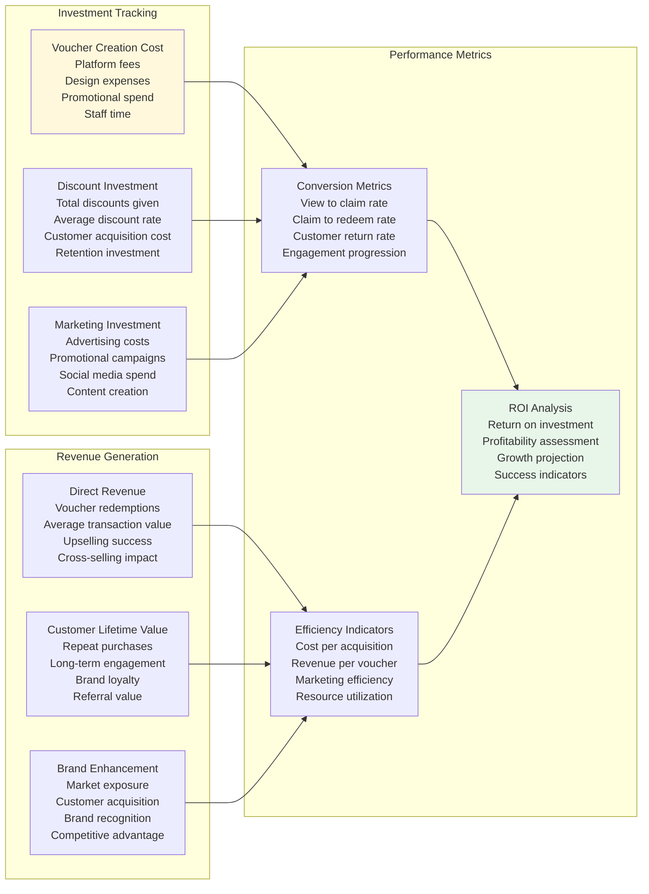
```mermaid
graph LR
    subgraph "Investment Tracking"
        VoucherCost[Voucher Creation Cost<br/>Platform fees<br/>Design expenses<br/>Promotional spend<br/>Staff time]
        DiscountValue[Discount Investment<br/>Total discounts given<br/>Average discount rate<br/>Customer acquisition cost<br/>Retention investment]
        MarketingSpend[Marketing Investment<br/>Advertising costs<br/>Promotional campaigns<br/>Social media spend<br/>Content creation]
    end

    subgraph "Revenue Generation"
        DirectRevenue[Direct Revenue<br/>Voucher redemptions<br/>Average transaction value<br/>Upselling success<br/>Cross-selling impact]
        CustomerLifetime[Customer Lifetime Value<br/>Repeat purchases<br/>Long-term engagement<br/>Brand loyalty<br/>Referral value]
        BrandValue[Brand Enhancement<br/>Market exposure<br/>Customer acquisition<br/>Brand recognition<br/>Competitive advantage]
    end

    subgraph "Performance Metrics"
        ConversionRates[Conversion Metrics<br/>View to claim rate<br/>Claim to redeem rate<br/>Customer return rate<br/>Engagement progression]
        EfficiencyMeasures[Efficiency Indicators<br/>Cost per acquisition<br/>Revenue per voucher<br/>Marketing efficiency<br/>Resource utilization]
        ROICalculation[ROI Analysis<br/>Return on investment<br/>Profitability assessment<br/>Growth projection<br/>Success indicators]
    end

    VoucherCost --> ConversionRates
    DiscountValue --> ConversionRates
    MarketingSpend --> ConversionRates

    DirectRevenue --> EfficiencyMeasures
    CustomerLifetime --> EfficiencyMeasures
    BrandValue --> EfficiencyMeasures

    ConversionRates --> ROICalculation
    EfficiencyMeasures --> ROICalculation

    style VoucherCost fill:#fff8dc
    style ROICalculation fill:#e8f5e9
```

---

## 6. Security and Fraud Prevention Framework

### 6.1 Multi-Layer Security Architecture

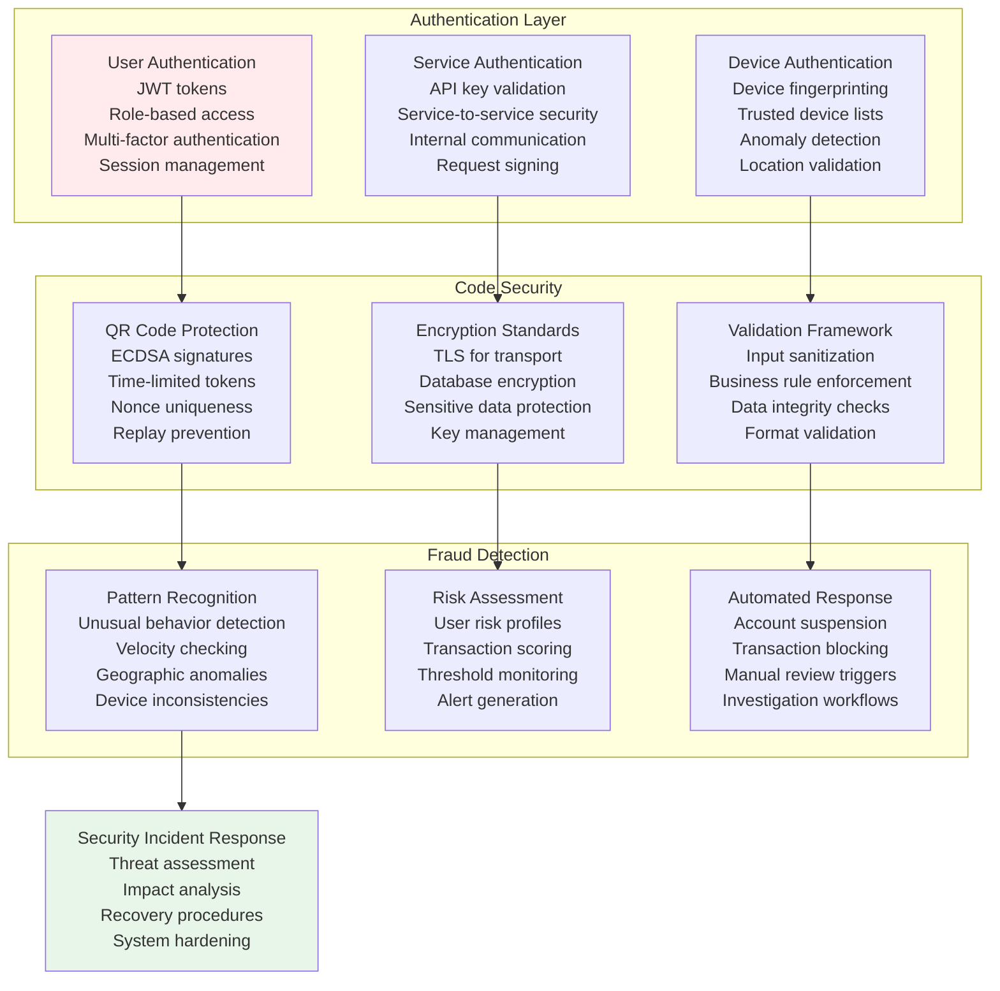
```mermaid
flowchart TB
    subgraph "Authentication Layer"
        UserAuth[User Authentication<br/>JWT tokens<br/>Role-based access<br/>Multi-factor authentication<br/>Session management]
        ServiceAuth[Service Authentication<br/>API key validation<br/>Service-to-service security<br/>Internal communication<br/>Request signing]
        DeviceAuth[Device Authentication<br/>Device fingerprinting<br/>Trusted device lists<br/>Anomaly detection<br/>Location validation]
    end

    subgraph "Code Security"
        QRSecurity[QR Code Protection<br/>ECDSA signatures<br/>Time-limited tokens<br/>Nonce uniqueness<br/>Replay prevention]
        EncryptionStandards[Encryption Standards<br/>TLS for transport<br/>Database encryption<br/>Sensitive data protection<br/>Key management]
        ValidationRules[Validation Framework<br/>Input sanitization<br/>Business rule enforcement<br/>Data integrity checks<br/>Format validation]
    end

    subgraph "Fraud Detection"
        PatternAnalysis[Pattern Recognition<br/>Unusual behavior detection<br/>Velocity checking<br/>Geographic anomalies<br/>Device inconsistencies]
        RiskScoring[Risk Assessment<br/>User risk profiles<br/>Transaction scoring<br/>Threshold monitoring<br/>Alert generation]
        ResponseMechanisms[Automated Response<br/>Account suspension<br/>Transaction blocking<br/>Manual review triggers<br/>Investigation workflows]
    end

    UserAuth --> QRSecurity
    ServiceAuth --> EncryptionStandards
    DeviceAuth --> ValidationRules

    QRSecurity --> PatternAnalysis
    EncryptionStandards --> RiskScoring
    ValidationRules --> ResponseMechanisms

    PatternAnalysis --> SecurityIncident[Security Incident Response<br/>Threat assessment<br/>Impact analysis<br/>Recovery procedures<br/>System hardening]

    style UserAuth fill:#ffebee
    style SecurityIncident fill:#e8f5e9
```

---

## 7. Complete Voucher Lifecycle Management

### 7.1 State Transition and Business Rules

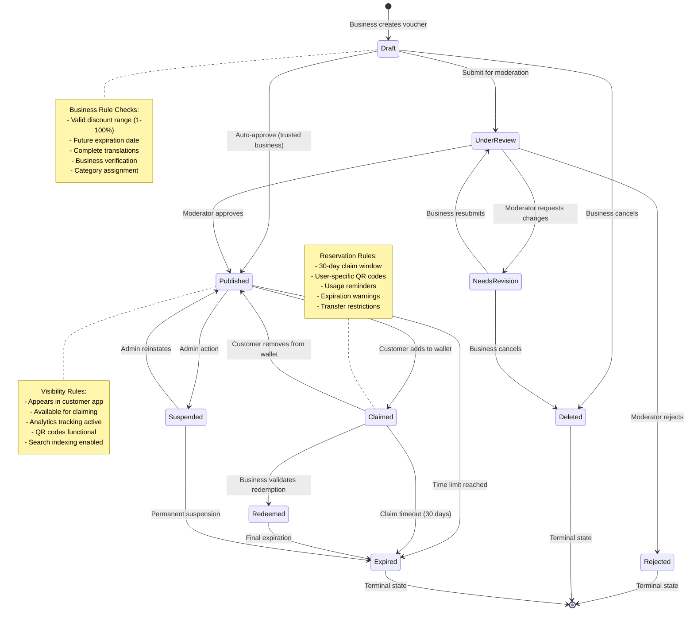
```mermaid
stateDiagram-v2
    [*] --> Draft: Business creates voucher

    Draft --> UnderReview: Submit for moderation
    Draft --> Published: Auto-approve (trusted business)
    Draft --> Deleted: Business cancels

    UnderReview --> Published: Moderator approves
    UnderReview --> NeedsRevision: Moderator requests changes
    UnderReview --> Rejected: Moderator rejects

    NeedsRevision --> UnderReview: Business resubmits
    NeedsRevision --> Deleted: Business cancels

    Published --> Claimed: Customer adds to wallet
    Published --> Expired: Time limit reached
    Published --> Suspended: Admin action

    Claimed --> Redeemed: Business validates redemption
    Claimed --> Published: Customer removes from wallet
    Claimed --> Expired: Claim timeout (30 days)

    Redeemed --> Expired: Final expiration

    Suspended --> Published: Admin reinstates
    Suspended --> Expired: Permanent suspension

    Rejected --> [*]: Terminal state
    Deleted --> [*]: Terminal state
    Expired --> [*]: Terminal state

    note right of Draft
        Business Rule Checks:
        - Valid discount range (1-100%)
        - Future expiration date
        - Complete translations
        - Business verification
        - Category assignment
    end note

    note right of Published
        Visibility Rules:
        - Appears in customer app
        - Available for claiming
        - Analytics tracking active
        - QR codes functional
        - Search indexing enabled
    end note

    note left of Claimed
        Reservation Rules:
        - 30-day claim window
        - User-specific QR codes
        - Usage reminders
        - Expiration warnings
        - Transfer restrictions
    end note
```

### 7.2 Automated Lifecycle Management

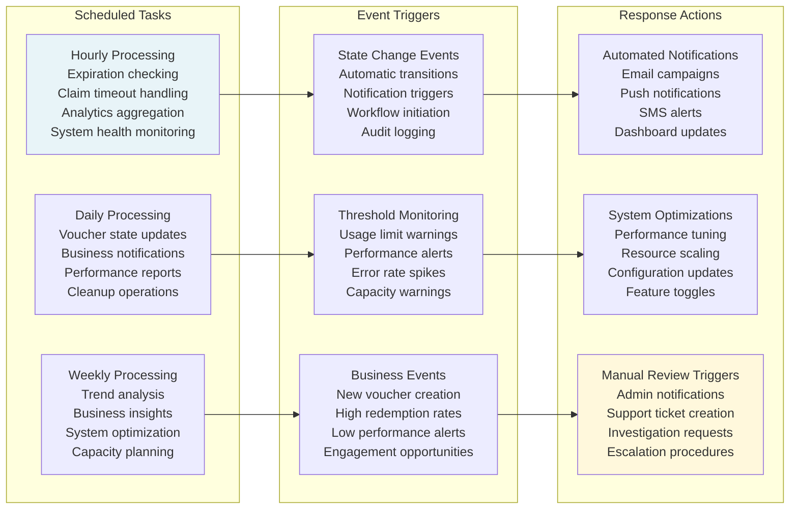
```mermaid
flowchart LR
    subgraph "Scheduled Tasks"
        HourlyJobs[Hourly Processing<br/>Expiration checking<br/>Claim timeout handling<br/>Analytics aggregation<br/>System health monitoring]
        DailyJobs[Daily Processing<br/>Voucher state updates<br/>Business notifications<br/>Performance reports<br/>Cleanup operations]
        WeeklyJobs[Weekly Processing<br/>Trend analysis<br/>Business insights<br/>System optimization<br/>Capacity planning]
    end

    subgraph "Event Triggers"
        StateChanges[State Change Events<br/>Automatic transitions<br/>Notification triggers<br/>Workflow initiation<br/>Audit logging]
        ThresholdAlerts[Threshold Monitoring<br/>Usage limit warnings<br/>Performance alerts<br/>Error rate spikes<br/>Capacity warnings]
        BusinessEvents[Business Events<br/>New voucher creation<br/>High redemption rates<br/>Low performance alerts<br/>Engagement opportunities]
    end

    subgraph "Response Actions"
        Notifications[Automated Notifications<br/>Email campaigns<br/>Push notifications<br/>SMS alerts<br/>Dashboard updates]
        SystemAdjustments[System Optimizations<br/>Performance tuning<br/>Resource scaling<br/>Configuration updates<br/>Feature toggles]
        ManualInterventions[Manual Review Triggers<br/>Admin notifications<br/>Support ticket creation<br/>Investigation requests<br/>Escalation procedures]
    end

    HourlyJobs --> StateChanges
    DailyJobs --> ThresholdAlerts
    WeeklyJobs --> BusinessEvents

    StateChanges --> Notifications
    ThresholdAlerts --> SystemAdjustments
    BusinessEvents --> ManualInterventions

    style HourlyJobs fill:#e8f4f8
    style ManualInterventions fill:#fff8dc
```

---

## 8. Cross-Platform Integration and Communication

### 8.1 Frontend Dashboard Multi-User Support

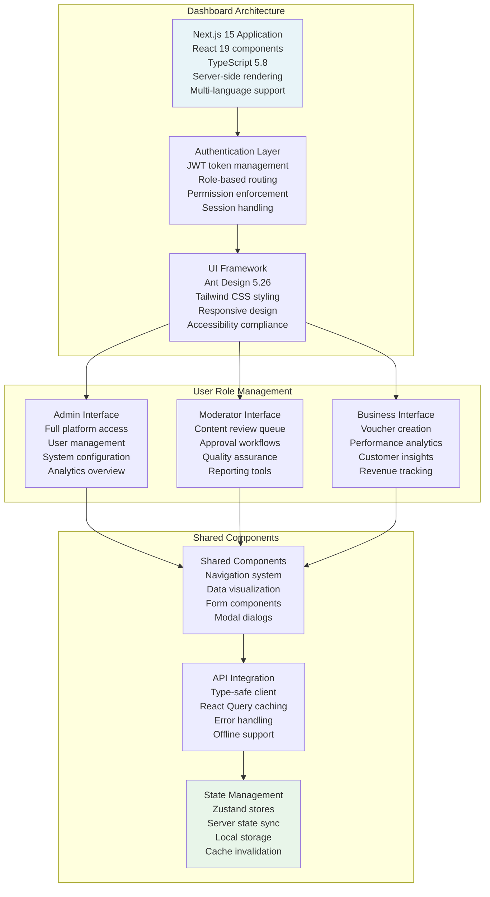
```mermaid
flowchart TB
    subgraph "Dashboard Architecture"
        NextJSApp[Next.js 15 Application<br/>React 19 components<br/>TypeScript 5.8<br/>Server-side rendering<br/>Multi-language support]

        AuthLayer[Authentication Layer<br/>JWT token management<br/>Role-based routing<br/>Permission enforcement<br/>Session handling]

        UIFramework[UI Framework<br/>Ant Design 5.26<br/>Tailwind CSS styling<br/>Responsive design<br/>Accessibility compliance]
    end

    subgraph "User Role Management"
        AdminInterface[Admin Interface<br/>Full platform access<br/>User management<br/>System configuration<br/>Analytics overview]

        ModeratorInterface[Moderator Interface<br/>Content review queue<br/>Approval workflows<br/>Quality assurance<br/>Reporting tools]

        BusinessInterface[Business Interface<br/>Voucher creation<br/>Performance analytics<br/>Customer insights<br/>Revenue tracking]
    end

    subgraph "Shared Components"
        CommonComponents[Shared Components<br/>Navigation system<br/>Data visualization<br/>Form components<br/>Modal dialogs]

        APIIntegration[API Integration<br/>Type-safe client<br/>React Query caching<br/>Error handling<br/>Offline support]

        StateManagement[State Management<br/>Zustand stores<br/>Server state sync<br/>Local storage<br/>Cache invalidation]
    end

    NextJSApp --> AuthLayer
    AuthLayer --> UIFramework

    UIFramework --> AdminInterface
    UIFramework --> ModeratorInterface
    UIFramework --> BusinessInterface

    AdminInterface --> CommonComponents
    ModeratorInterface --> CommonComponents
    BusinessInterface --> CommonComponents

    CommonComponents --> APIIntegration
    APIIntegration --> StateManagement

    style NextJSApp fill:#e8f4f8
    style StateManagement fill:#e8f5e9
```

### 8.2 Flutter App QR Scanning Capabilities

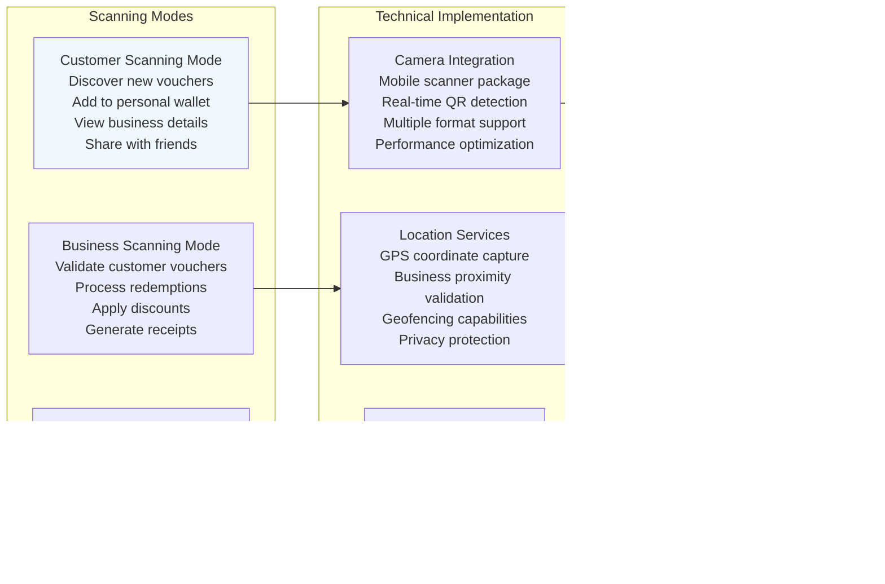
```mermaid
flowchart LR
    subgraph "Scanning Modes"
        CustomerScanning[Customer Scanning Mode<br/>Discover new vouchers<br/>Add to personal wallet<br/>View business details<br/>Share with friends]

        BusinessScanning[Business Scanning Mode<br/>Validate customer vouchers<br/>Process redemptions<br/>Apply discounts<br/>Generate receipts]

        CrossCustomerScanning[Cross-Customer Scanning<br/>Friend referral vouchers<br/>Group discount sharing<br/>Social promotion features<br/>Community benefits]
    end

    subgraph "Technical Implementation"
        CameraIntegration[Camera Integration<br/>Mobile scanner package<br/>Real-time QR detection<br/>Multiple format support<br/>Performance optimization]

        LocationServices[Location Services<br/>GPS coordinate capture<br/>Business proximity validation<br/>Geofencing capabilities<br/>Privacy protection]

        OfflineCapability[Offline Functionality<br/>Local QR validation<br/>Cached data access<br/>Queue management<br/>Sync when online]
    end

    subgraph "User Experience"
        IntuitiveScan[Intuitive Interface<br/>Clear scanning guides<br/>Instant feedback<br/>Error handling<br/>Success animations]

        MultipleScanModes[Multiple Scan Options<br/>Camera scanning<br/>Gallery image import<br/>Manual code entry<br/>NFC integration future]

        ScanHistory[Scan History<br/>Recent scans tracking<br/>Favorite vouchers<br/>Usage statistics<br/>Performance insights]
    end

    CustomerScanning --> CameraIntegration
    BusinessScanning --> LocationServices
    CrossCustomerScanning --> OfflineCapability

    CameraIntegration --> IntuitiveScan
    LocationServices --> MultipleScanModes
    OfflineCapability --> ScanHistory

    style CustomerScanning fill:#f0f8ff
    style ScanHistory fill:#e8f5e9
```

---

## 9. Performance and Scalability Architecture

### 9.1 System Performance Optimization

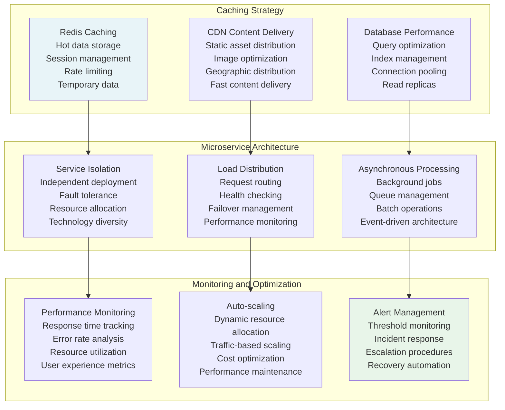
```mermaid
flowchart TB
    subgraph "Caching Strategy"
        RedisCache[Redis Caching<br/>Hot data storage<br/>Session management<br/>Rate limiting<br/>Temporary data]

        CDNDelivery[CDN Content Delivery<br/>Static asset distribution<br/>Image optimization<br/>Geographic distribution<br/>Fast content delivery]

        DatabaseOptimization[Database Performance<br/>Query optimization<br/>Index management<br/>Connection pooling<br/>Read replicas]
    end

    subgraph "Microservice Architecture"
        ServiceIsolation[Service Isolation<br/>Independent deployment<br/>Fault tolerance<br/>Resource allocation<br/>Technology diversity]

        LoadBalancing[Load Distribution<br/>Request routing<br/>Health checking<br/>Failover management<br/>Performance monitoring]

        AsyncProcessing[Asynchronous Processing<br/>Background jobs<br/>Queue management<br/>Batch operations<br/>Event-driven architecture]
    end

    subgraph "Monitoring and Optimization"
        RealTimeMonitoring[Performance Monitoring<br/>Response time tracking<br/>Error rate analysis<br/>Resource utilization<br/>User experience metrics]

        AutoScaling[Auto-scaling<br/>Dynamic resource allocation<br/>Traffic-based scaling<br/>Cost optimization<br/>Performance maintenance]

        AlertSystem[Alert Management<br/>Threshold monitoring<br/>Incident response<br/>Escalation procedures<br/>Recovery automation]
    end

    RedisCache --> ServiceIsolation
    CDNDelivery --> LoadBalancing
    DatabaseOptimization --> AsyncProcessing

    ServiceIsolation --> RealTimeMonitoring
    LoadBalancing --> AutoScaling
    AsyncProcessing --> AlertSystem

    style RedisCache fill:#e8f4f8
    style AlertSystem fill:#e8f5e9
```

---

## Summary of Key Flows

### Business Value Proposition

1. **For Businesses**: Create, manage, and track promotional vouchers with comprehensive analytics and ROI measurement
2. **For Customers**: Discover, save, and redeem discounts through multiple channels with seamless user experience
3. **For Platform**: Multi-sided marketplace with robust security, scalability, and revenue generation

### Technical Excellence

- **Multi-tenant Architecture**: Supporting admin, moderator, and business roles
- **Cross-platform Compatibility**: Web dashboard and Flutter mobile applications
- **Comprehensive Security**: Multi-layer fraud prevention and data protection
- **Performance Optimization**: Caching, CDN delivery, and microservice architecture
- **Offline Capabilities**: Queue management and sync mechanisms for unreliable connections

### Operational Efficiency

- **Automated Workflows**: Lifecycle management and business rule enforcement
- **Real-time Analytics**: Performance monitoring and business intelligence
- **Quality Assurance**: Content moderation and approval processes
- **Scalable Infrastructure**: Auto-scaling and resource optimization

This comprehensive flow documentation captures the full ecosystem of the VoucherBook platform, demonstrating the sophisticated integration between multiple user types, applications, and business processes.
