# VoucherBook Platform - Comprehensive Voucher Flows Documentation

## 🎯 Executive Summary

This document comprehensively details all voucher-related flows in the VoucherBook platform, including creation, redemption, validation, and the complete lifecycle management. The platform supports both digital (app-based) and physical (printed voucher books) distribution channels with robust security, multi-language support, and advanced analytics.

## 📊 System Architecture Overview

### Core Components

1. **Voucher Service** (Port: 4006) - Core voucher management
2. **PDF Service** - Physical voucher book generation
3. **Business Service** - Business/provider management
4. **User Service** - Customer management
5. **Communication Service** - Notifications
6. **Category Service** - Voucher categorization

### Technology Stack

- **Backend**: Node.js, TypeScript, Express, PostgreSQL with PostGIS
- **Security**: JWT with ECDSA (ES256), bcrypt
- **Caching**: Redis for performance optimization
- **File Storage**: AWS S3 for images and PDFs
- **API Gateway**: Vercel for routing and load balancing

## 🔄 Complete Voucher Flows

## 1️⃣ VOUCHER CREATION FLOWS

### 1.1 Business Owner Direct Creation

**Actors**: Business Owner, Business Dashboard
**Prerequisites**: Business must be registered and verified

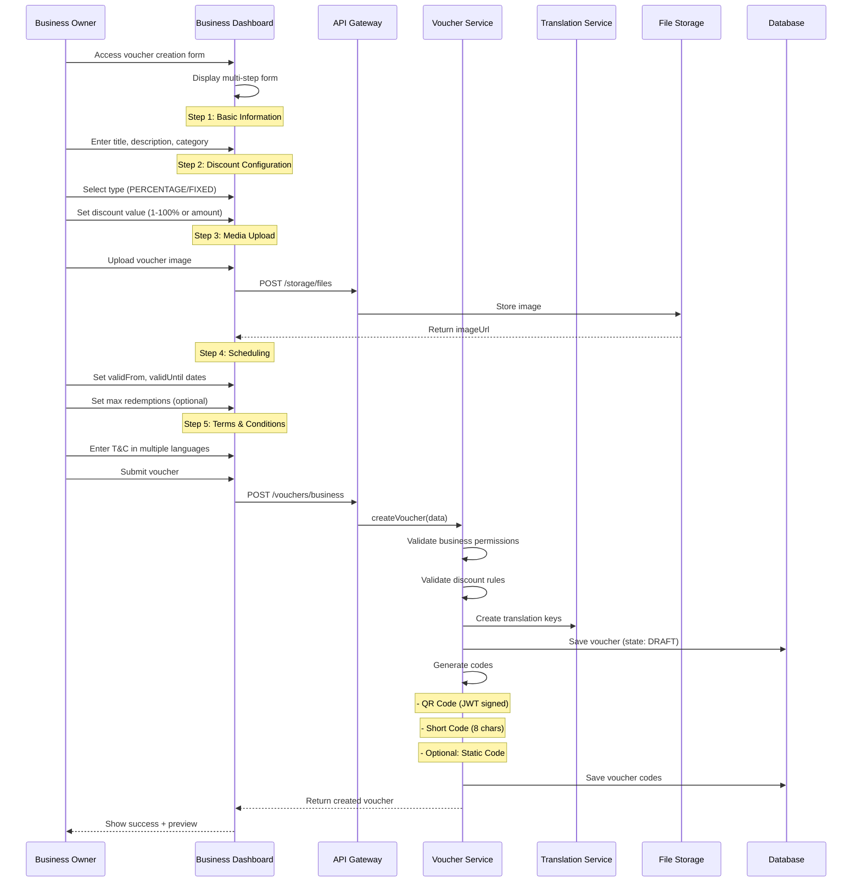
```mermaid
sequenceDiagram
    participant BO as Business Owner
    participant BD as Business Dashboard
    participant API as API Gateway
    participant VS as Voucher Service
    participant TS as Translation Service
    participant FS as File Storage
    participant DB as Database

    BO->>BD: Access voucher creation form
    BD->>BD: Display multi-step form

    Note over BD: Step 1: Basic Information
    BO->>BD: Enter title, description, category

    Note over BD: Step 2: Discount Configuration
    BO->>BD: Select type (PERCENTAGE/FIXED)
    BO->>BD: Set discount value (1-100% or amount)

    Note over BD: Step 3: Media Upload
    BO->>BD: Upload voucher image
    BD->>API: POST /storage/files
    API->>FS: Store image
    FS-->>BD: Return imageUrl

    Note over BD: Step 4: Scheduling
    BO->>BD: Set validFrom, validUntil dates
    BO->>BD: Set max redemptions (optional)

    Note over BD: Step 5: Terms & Conditions
    BO->>BD: Enter T&C in multiple languages

    BO->>BD: Submit voucher
    BD->>API: POST /vouchers/business
    API->>VS: createVoucher(data)

    VS->>VS: Validate business permissions
    VS->>VS: Validate discount rules
    VS->>TS: Create translation keys
    VS->>DB: Save voucher (state: DRAFT)

    VS->>VS: Generate codes
    Note over VS: - QR Code (JWT signed)
    Note over VS: - Short Code (8 chars)
    Note over VS: - Optional: Static Code

    VS->>DB: Save voucher codes
    VS-->>BD: Return created voucher
    BD-->>BO: Show success + preview
```

### 1.2 Admin Creation (Platform Admin)

**Actors**: Platform Admin
**Special Capabilities**: Can create vouchers for any business, bulk operations

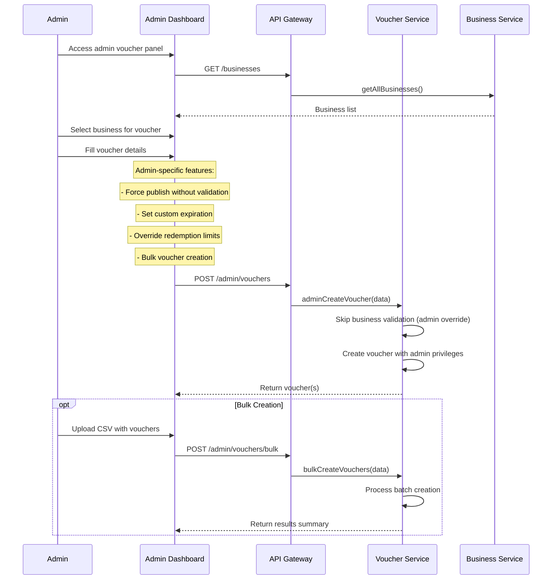
```mermaid
sequenceDiagram
    participant A as Admin
    participant AD as Admin Dashboard
    participant API as API Gateway
    participant VS as Voucher Service
    participant BS as Business Service

    A->>AD: Access admin voucher panel
    AD->>API: GET /businesses
    API->>BS: getAllBusinesses()
    BS-->>AD: Business list

    A->>AD: Select business for voucher
    A->>AD: Fill voucher details

    Note over AD: Admin-specific features:
    Note over AD: - Force publish without validation
    Note over AD: - Set custom expiration
    Note over AD: - Override redemption limits
    Note over AD: - Bulk voucher creation

    AD->>API: POST /admin/vouchers
    API->>VS: adminCreateVoucher(data)
    VS->>VS: Skip business validation (admin override)
    VS->>VS: Create voucher with admin privileges
    VS-->>AD: Return voucher(s)

    opt Bulk Creation
        A->>AD: Upload CSV with vouchers
        AD->>API: POST /admin/vouchers/bulk
        API->>VS: bulkCreateVouchers(data)
        VS->>VS: Process batch creation
        VS-->>AD: Return results summary
    end
```

### 1.3 Physical Voucher Book Creation

**Actors**: Admin, Print Manager
**Output**: PDF for printing physical voucher books

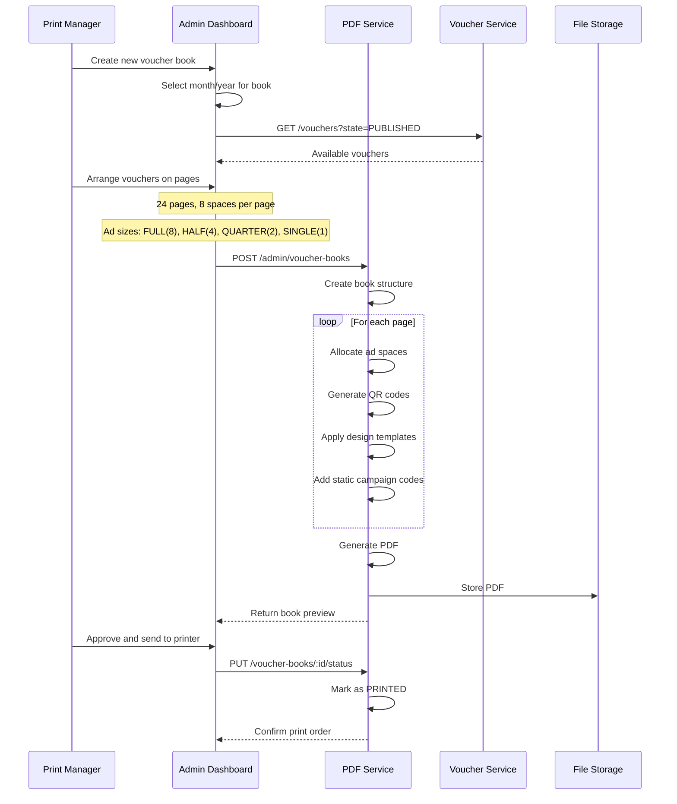
```mermaid
sequenceDiagram
    participant PM as Print Manager
    participant AD as Admin Dashboard
    participant PS as PDF Service
    participant VS as Voucher Service
    participant FS as File Storage

    PM->>AD: Create new voucher book
    AD->>AD: Select month/year for book

    AD->>VS: GET /vouchers?state=PUBLISHED
    VS-->>AD: Available vouchers

    PM->>AD: Arrange vouchers on pages
    Note over AD: 24 pages, 8 spaces per page
    Note over AD: Ad sizes: FULL(8), HALF(4), QUARTER(2), SINGLE(1)

    AD->>PS: POST /admin/voucher-books
    PS->>PS: Create book structure

    loop For each page
        PS->>PS: Allocate ad spaces
        PS->>PS: Generate QR codes
        PS->>PS: Apply design templates
        PS->>PS: Add static campaign codes
    end

    PS->>PS: Generate PDF
    PS->>FS: Store PDF
    PS-->>AD: Return book preview

    PM->>AD: Approve and send to printer
    AD->>PS: PUT /voucher-books/:id/status
    PS->>PS: Mark as PRINTED
    PS-->>AD: Confirm print order
```

## 2️⃣ VOUCHER DISCOVERY & CLAIMING FLOWS

### 2.1 Customer App Discovery

**Actors**: Customer, Mobile App
**Purpose**: Browse and discover available vouchers

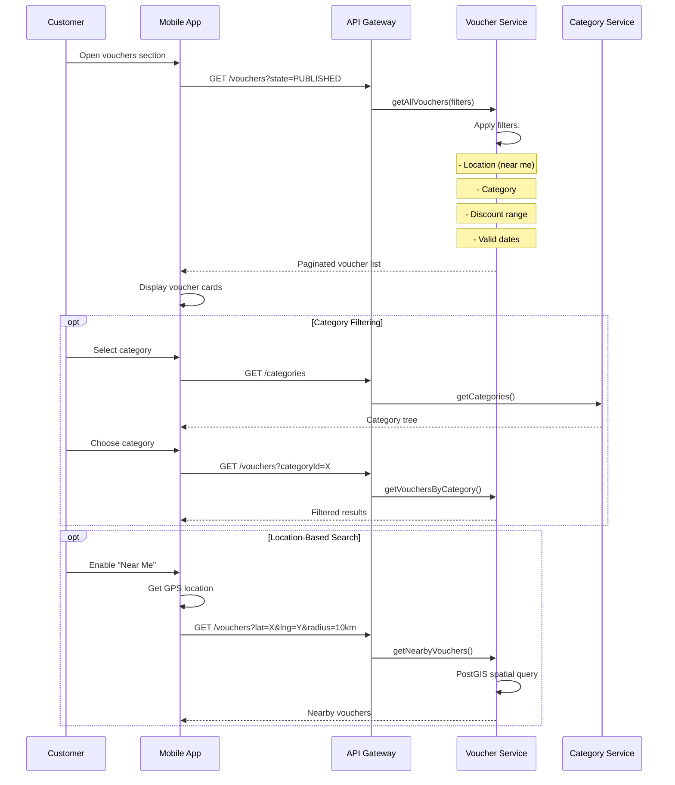
```mermaid
sequenceDiagram
    participant C as Customer
    participant MA as Mobile App
    participant API as API Gateway
    participant VS as Voucher Service
    participant CS as Category Service

    C->>MA: Open vouchers section
    MA->>API: GET /vouchers?state=PUBLISHED
    API->>VS: getAllVouchers(filters)

    VS->>VS: Apply filters:
    Note over VS: - Location (near me)
    Note over VS: - Category
    Note over VS: - Discount range
    Note over VS: - Valid dates

    VS-->>MA: Paginated voucher list
    MA->>MA: Display voucher cards

    opt Category Filtering
        C->>MA: Select category
        MA->>API: GET /categories
        API->>CS: getCategories()
        CS-->>MA: Category tree

        C->>MA: Choose category
        MA->>API: GET /vouchers?categoryId=X
        API->>VS: getVouchersByCategory()
        VS-->>MA: Filtered results
    end

    opt Location-Based Search
        C->>MA: Enable "Near Me"
        MA->>MA: Get GPS location
        MA->>API: GET /vouchers?lat=X&lng=Y&radius=10km
        API->>VS: getNearbyVouchers()
        VS->>VS: PostGIS spatial query
        VS-->>MA: Nearby vouchers
    end
```

### 2.2 Voucher Claiming Process

**Actors**: Customer
**Purpose**: Add voucher to personal wallet for later redemption

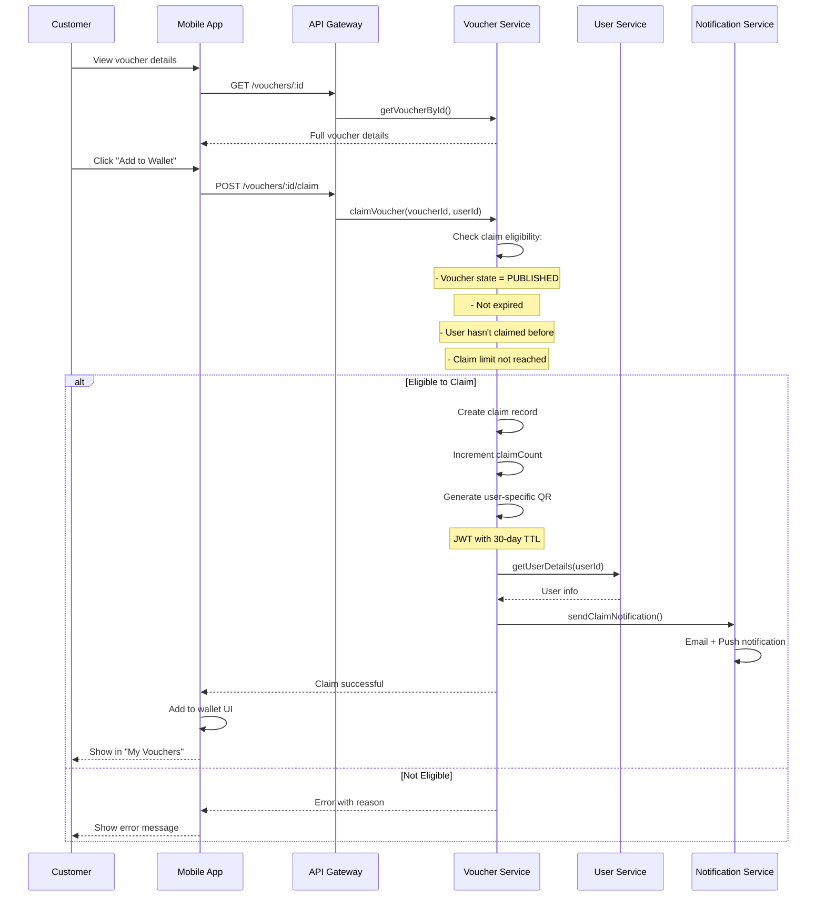
```mermaid
sequenceDiagram
    participant C as Customer
    participant MA as Mobile App
    participant API as API Gateway
    participant VS as Voucher Service
    participant US as User Service
    participant NS as Notification Service

    C->>MA: View voucher details
    MA->>API: GET /vouchers/:id
    API->>VS: getVoucherById()
    VS-->>MA: Full voucher details

    C->>MA: Click "Add to Wallet"
    MA->>API: POST /vouchers/:id/claim
    API->>VS: claimVoucher(voucherId, userId)

    VS->>VS: Check claim eligibility:
    Note over VS: - Voucher state = PUBLISHED
    Note over VS: - Not expired
    Note over VS: - User hasn't claimed before
    Note over VS: - Claim limit not reached

    alt Eligible to Claim
        VS->>VS: Create claim record
        VS->>VS: Increment claimCount
        VS->>VS: Generate user-specific QR
        Note over VS: JWT with 30-day TTL

        VS->>US: getUserDetails(userId)
        US-->>VS: User info

        VS->>NS: sendClaimNotification()
        NS->>NS: Email + Push notification

        VS-->>MA: Claim successful
        MA->>MA: Add to wallet UI
        MA-->>C: Show in "My Vouchers"

    else Not Eligible
        VS-->>MA: Error with reason
        MA-->>C: Show error message
    end
```

### 2.3 QR Code Scanning Discovery

**Actors**: Customer
**Source**: Physical voucher book, poster, flyer

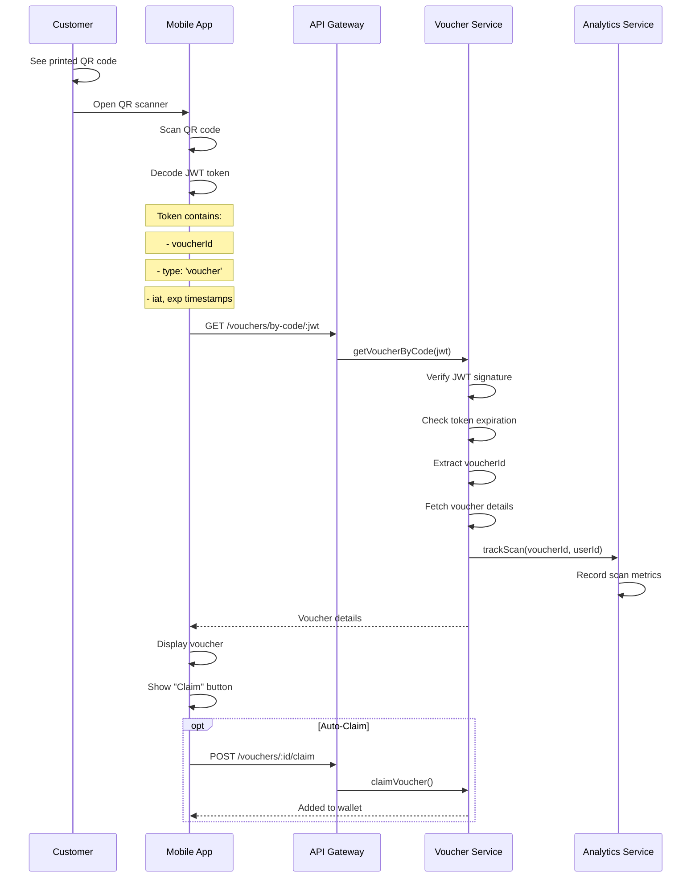
```mermaid
sequenceDiagram
    participant C as Customer
    participant MA as Mobile App
    participant API as API Gateway
    participant VS as Voucher Service
    participant AS as Analytics Service

    C->>C: See printed QR code
    C->>MA: Open QR scanner
    MA->>MA: Scan QR code
    MA->>MA: Decode JWT token

    Note over MA: Token contains:
    Note over MA: - voucherId
    Note over MA: - type: 'voucher'
    Note over MA: - iat, exp timestamps

    MA->>API: GET /vouchers/by-code/:jwt
    API->>VS: getVoucherByCode(jwt)

    VS->>VS: Verify JWT signature
    VS->>VS: Check token expiration
    VS->>VS: Extract voucherId
    VS->>VS: Fetch voucher details

    VS->>AS: trackScan(voucherId, userId)
    AS->>AS: Record scan metrics

    VS-->>MA: Voucher details
    MA->>MA: Display voucher
    MA->>MA: Show "Claim" button

    opt Auto-Claim
        MA->>API: POST /vouchers/:id/claim
        API->>VS: claimVoucher()
        VS-->>MA: Added to wallet
    end
```

## 3️⃣ VOUCHER REDEMPTION FLOWS

### 3.1 Digital Redemption (App-to-App)

**Actors**: Customer, Business Owner
**Method**: Customer shows QR, Business scans

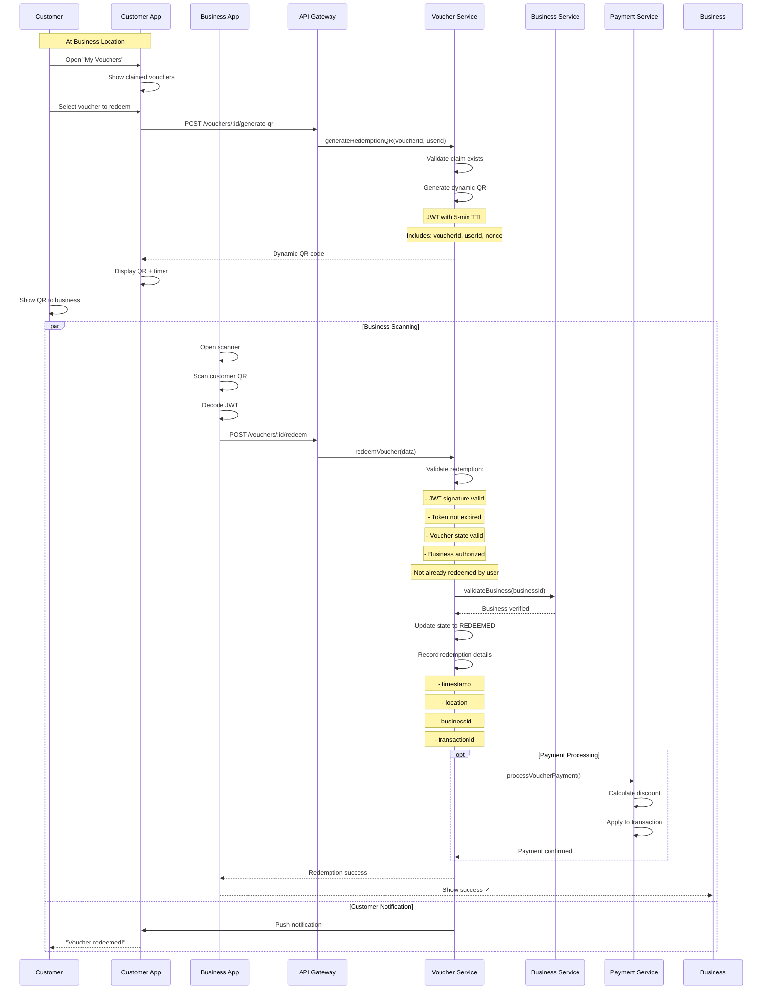
```mermaid
sequenceDiagram
    participant C as Customer
    participant CMA as Customer App
    participant BMA as Business App
    participant API as API Gateway
    participant VS as Voucher Service
    participant BS as Business Service
    participant PS as Payment Service

    Note over C,CMA: At Business Location

    C->>CMA: Open "My Vouchers"
    CMA->>CMA: Show claimed vouchers
    C->>CMA: Select voucher to redeem

    CMA->>API: POST /vouchers/:id/generate-qr
    API->>VS: generateRedemptionQR(voucherId, userId)

    VS->>VS: Validate claim exists
    VS->>VS: Generate dynamic QR
    Note over VS: JWT with 5-min TTL
    Note over VS: Includes: voucherId, userId, nonce

    VS-->>CMA: Dynamic QR code
    CMA->>CMA: Display QR + timer

    C->>C: Show QR to business

    par Business Scanning
        BMA->>BMA: Open scanner
        BMA->>BMA: Scan customer QR
        BMA->>BMA: Decode JWT

        BMA->>API: POST /vouchers/:id/redeem
        API->>VS: redeemVoucher(data)

        VS->>VS: Validate redemption:
        Note over VS: - JWT signature valid
        Note over VS: - Token not expired
        Note over VS: - Voucher state valid
        Note over VS: - Business authorized
        Note over VS: - Not already redeemed by user

        VS->>BS: validateBusiness(businessId)
        BS-->>VS: Business verified

        VS->>VS: Update state to REDEEMED
        VS->>VS: Record redemption details
        Note over VS: - timestamp
        Note over VS: - location
        Note over VS: - businessId
        Note over VS: - transactionId

        opt Payment Processing
            VS->>PS: processVoucherPayment()
            PS->>PS: Calculate discount
            PS->>PS: Apply to transaction
            PS-->>VS: Payment confirmed
        end

        VS-->>BMA: Redemption success
        BMA-->>Business: Show success ✓
    and Customer Notification
        VS->>CMA: Push notification
        CMA-->>C: "Voucher redeemed!"
    end
```

### 3.2 Physical Voucher Redemption

**Actors**: Customer, Business Owner
**Source**: Printed voucher book

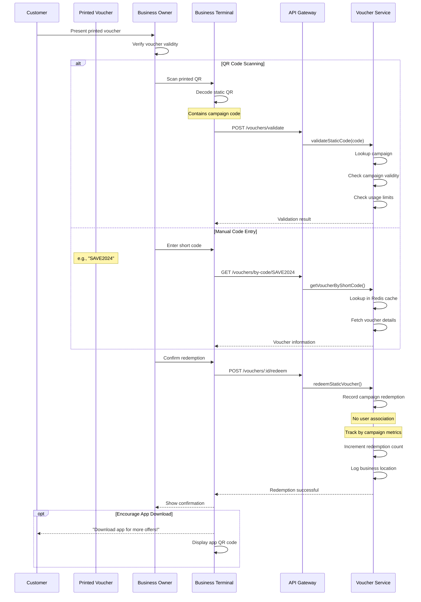
```mermaid
sequenceDiagram
    participant C as Customer
    participant PV as Printed Voucher
    participant BO as Business Owner
    participant BT as Business Terminal
    participant API as API Gateway
    participant VS as Voucher Service

    C->>BO: Present printed voucher
    BO->>BO: Verify voucher validity

    alt QR Code Scanning
        BO->>BT: Scan printed QR
        BT->>BT: Decode static QR
        Note over BT: Contains campaign code

        BT->>API: POST /vouchers/validate
        API->>VS: validateStaticCode(code)

        VS->>VS: Lookup campaign
        VS->>VS: Check campaign validity
        VS->>VS: Check usage limits

        VS-->>BT: Validation result

    else Manual Code Entry
        BO->>BT: Enter short code
        Note over PV: e.g., "SAVE2024"

        BT->>API: GET /vouchers/by-code/SAVE2024
        API->>VS: getVoucherByShortCode()

        VS->>VS: Lookup in Redis cache
        VS->>VS: Fetch voucher details
        VS-->>BT: Voucher information
    end

    BO->>BT: Confirm redemption
    BT->>API: POST /vouchers/:id/redeem
    API->>VS: redeemStaticVoucher()

    VS->>VS: Record campaign redemption
    Note over VS: No user association
    Note over VS: Track by campaign metrics

    VS->>VS: Increment redemption count
    VS->>VS: Log business location

    VS-->>BT: Redemption successful
    BT-->>BO: Show confirmation

    opt Encourage App Download
        BT-->>C: "Download app for more offers!"
        BT->>BT: Display app QR code
    end
```

### 3.3 Offline Redemption & Sync

**Actors**: Business Owner
**Scenario**: No internet connectivity at redemption time

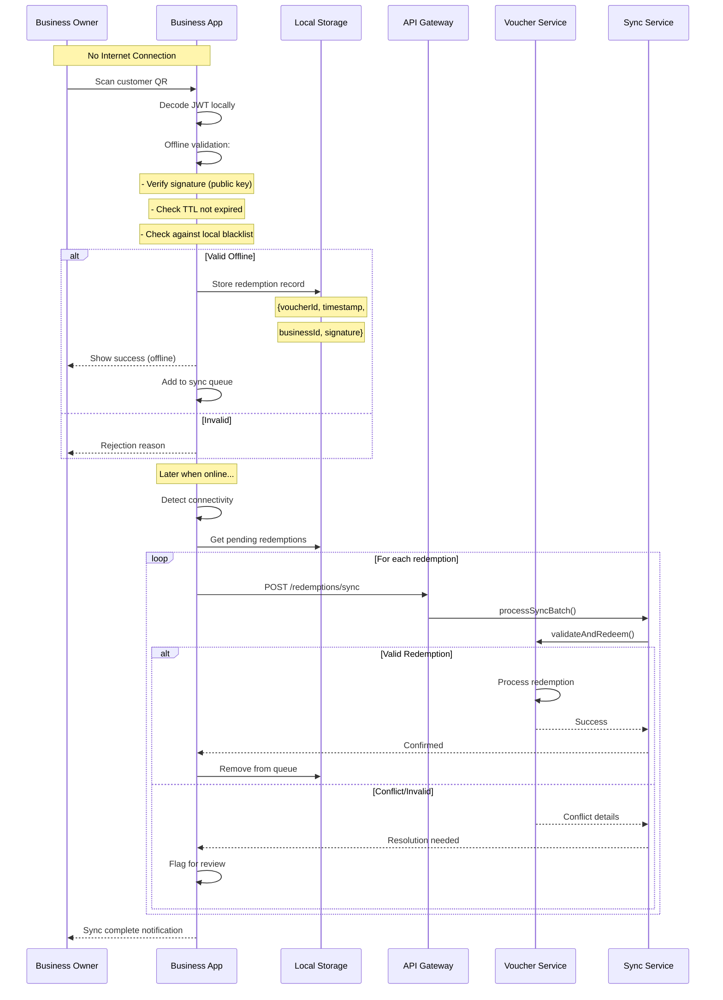
```mermaid
sequenceDiagram
    participant BO as Business Owner
    participant BMA as Business App
    participant LS as Local Storage
    participant API as API Gateway
    participant VS as Voucher Service
    participant SS as Sync Service

    Note over BO,BMA: No Internet Connection

    BO->>BMA: Scan customer QR
    BMA->>BMA: Decode JWT locally

    BMA->>BMA: Offline validation:
    Note over BMA: - Verify signature (public key)
    Note over BMA: - Check TTL not expired
    Note over BMA: - Check against local blacklist

    alt Valid Offline
        BMA->>LS: Store redemption record
        Note over LS: {voucherId, timestamp,
        Note over LS: businessId, signature}

        BMA-->>BO: Show success (offline)
        BMA->>BMA: Add to sync queue

    else Invalid
        BMA-->>BO: Rejection reason
    end

    Note over BMA: Later when online...

    BMA->>BMA: Detect connectivity
    BMA->>LS: Get pending redemptions

    loop For each redemption
        BMA->>API: POST /redemptions/sync
        API->>SS: processSyncBatch()

        SS->>VS: validateAndRedeem()

        alt Valid Redemption
            VS->>VS: Process redemption
            VS-->>SS: Success
            SS-->>BMA: Confirmed
            BMA->>LS: Remove from queue

        else Conflict/Invalid
            VS-->>SS: Conflict details
            SS-->>BMA: Resolution needed
            BMA->>BMA: Flag for review
        end
    end

    BMA-->>BO: Sync complete notification
```

## 4️⃣ VOUCHER VALIDATION FLOWS

### 4.1 Real-time Validation

**Purpose**: Verify voucher validity before redemption

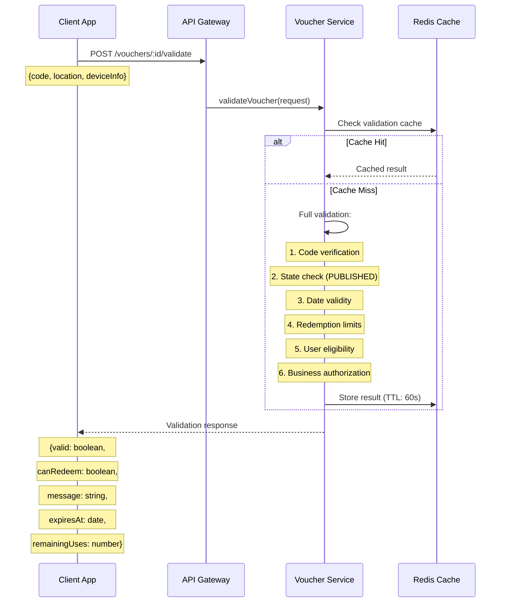
```mermaid
sequenceDiagram
    participant Client as Client App
    participant API as API Gateway
    participant VS as Voucher Service
    participant Cache as Redis Cache

    Client->>API: POST /vouchers/:id/validate
    Note over Client: {code, location, deviceInfo}

    API->>VS: validateVoucher(request)

    VS->>Cache: Check validation cache

    alt Cache Hit
        Cache-->>VS: Cached result
    else Cache Miss
        VS->>VS: Full validation:
        Note over VS: 1. Code verification
        Note over VS: 2. State check (PUBLISHED)
        Note over VS: 3. Date validity
        Note over VS: 4. Redemption limits
        Note over VS: 5. User eligibility
        Note over VS: 6. Business authorization

        VS->>Cache: Store result (TTL: 60s)
    end

    VS-->>Client: Validation response
    Note over Client: {valid: boolean,
    Note over Client: canRedeem: boolean,
    Note over Client: message: string,
    Note over Client: expiresAt: date,
    Note over Client: remainingUses: number}
```

### 4.2 Batch Validation

**Use Case**: Validate multiple vouchers at once

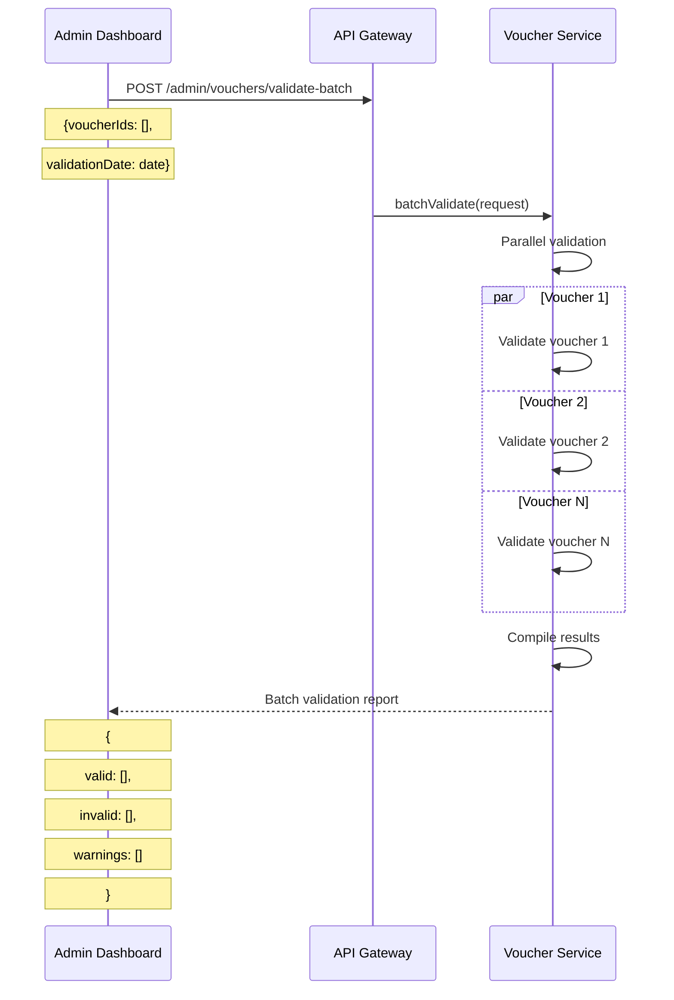
```mermaid
sequenceDiagram
    participant Admin as Admin Dashboard
    participant API as API Gateway
    participant VS as Voucher Service

    Admin->>API: POST /admin/vouchers/validate-batch
    Note over Admin: {voucherIds: [],
    Note over Admin: validationDate: date}

    API->>VS: batchValidate(request)

    VS->>VS: Parallel validation

    par Voucher 1
        VS->>VS: Validate voucher 1
    and Voucher 2
        VS->>VS: Validate voucher 2
    and Voucher N
        VS->>VS: Validate voucher N
    end

    VS->>VS: Compile results
    VS-->>Admin: Batch validation report
    Note over Admin: {
    Note over Admin:   valid: [],
    Note over Admin:   invalid: [],
    Note over Admin:   warnings: []
    Note over Admin: }
```

## 5️⃣ VOUCHER LIFECYCLE MANAGEMENT

### 5.1 State Transitions

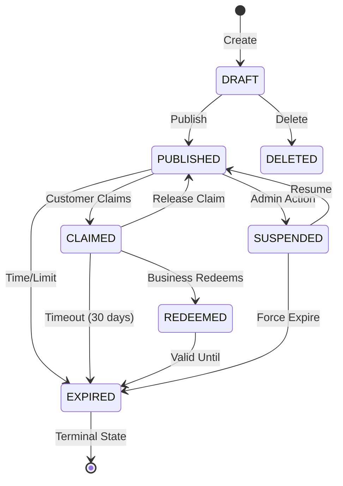
```mermaid
stateDiagram-v2
    [*] --> DRAFT: Create

    DRAFT --> PUBLISHED: Publish
    DRAFT --> DELETED: Delete

    PUBLISHED --> CLAIMED: Customer Claims
    PUBLISHED --> EXPIRED: Time/Limit
    PUBLISHED --> SUSPENDED: Admin Action

    CLAIMED --> REDEEMED: Business Redeems
    CLAIMED --> PUBLISHED: Release Claim
    CLAIMED --> EXPIRED: Timeout (30 days)

    REDEEMED --> EXPIRED: Valid Until

    SUSPENDED --> PUBLISHED: Resume
    SUSPENDED --> EXPIRED: Force Expire

    EXPIRED --> [*]: Terminal State
```

### 5.2 Automated State Management

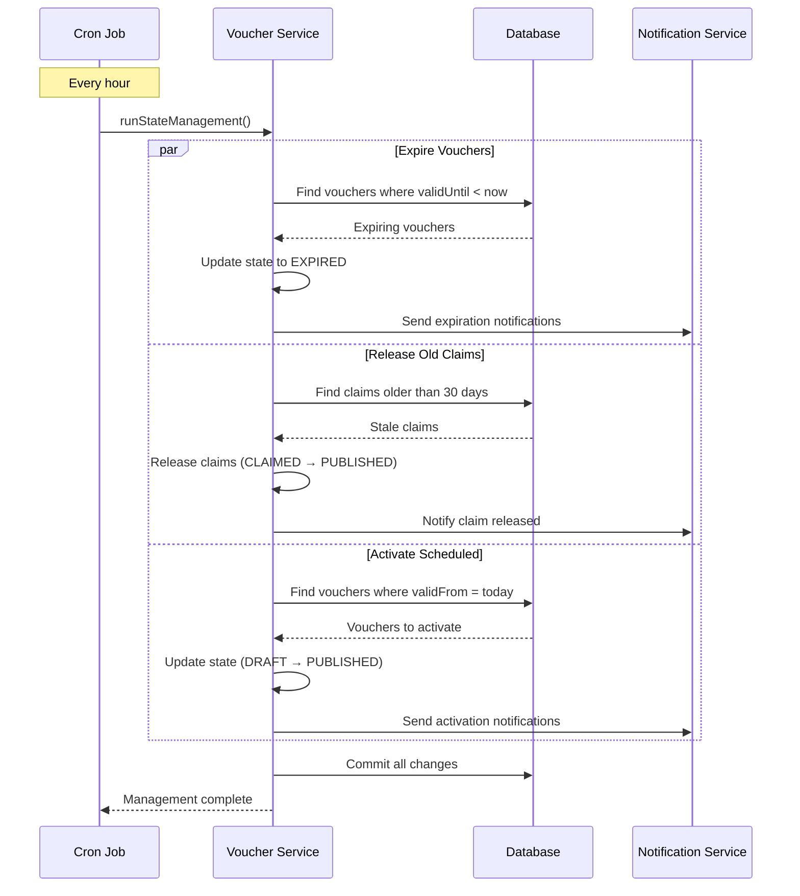
```mermaid
sequenceDiagram
    participant Cron as Cron Job
    participant VS as Voucher Service
    participant DB as Database
    participant NS as Notification Service

    Note over Cron: Every hour

    Cron->>VS: runStateManagement()

    par Expire Vouchers
        VS->>DB: Find vouchers where validUntil < now
        DB-->>VS: Expiring vouchers
        VS->>VS: Update state to EXPIRED
        VS->>NS: Send expiration notifications
    and Release Old Claims
        VS->>DB: Find claims older than 30 days
        DB-->>VS: Stale claims
        VS->>VS: Release claims (CLAIMED → PUBLISHED)
        VS->>NS: Notify claim released
    and Activate Scheduled
        VS->>DB: Find vouchers where validFrom = today
        DB-->>VS: Vouchers to activate
        VS->>VS: Update state (DRAFT → PUBLISHED)
        VS->>NS: Send activation notifications
    end

    VS->>DB: Commit all changes
    VS-->>Cron: Management complete
```

## 6️⃣ ANALYTICS & REPORTING FLOWS

### 6.1 Real-time Analytics Collection

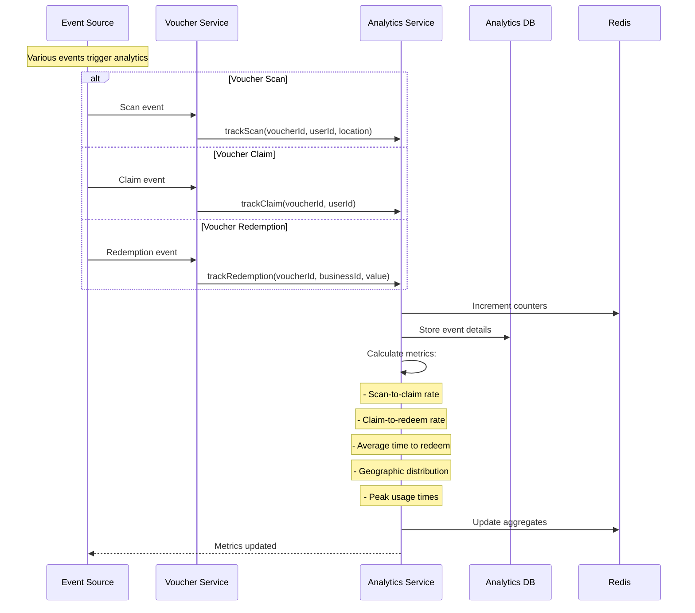
```mermaid
sequenceDiagram
    participant Event as Event Source
    participant VS as Voucher Service
    participant AS as Analytics Service
    participant DB as Analytics DB
    participant Cache as Redis

    Note over Event: Various events trigger analytics

    alt Voucher Scan
        Event->>VS: Scan event
        VS->>AS: trackScan(voucherId, userId, location)
    else Voucher Claim
        Event->>VS: Claim event
        VS->>AS: trackClaim(voucherId, userId)
    else Voucher Redemption
        Event->>VS: Redemption event
        VS->>AS: trackRedemption(voucherId, businessId, value)
    end

    AS->>Cache: Increment counters
    AS->>DB: Store event details

    AS->>AS: Calculate metrics:
    Note over AS: - Scan-to-claim rate
    Note over AS: - Claim-to-redeem rate
    Note over AS: - Average time to redeem
    Note over AS: - Geographic distribution
    Note over AS: - Peak usage times

    AS->>Cache: Update aggregates
    AS-->>Event: Metrics updated
```

### 6.2 Business ROI Reporting

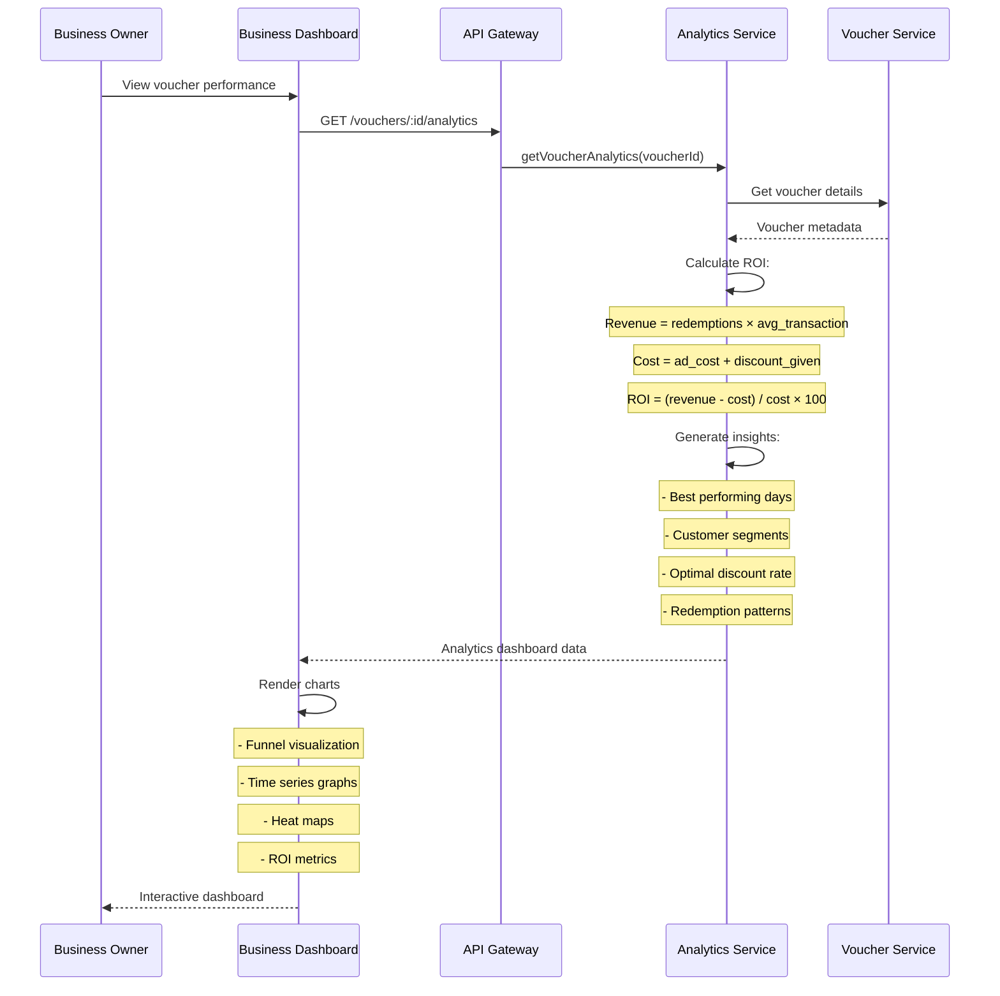
```mermaid
sequenceDiagram
    participant BO as Business Owner
    participant BD as Business Dashboard
    participant API as API Gateway
    participant AS as Analytics Service
    participant VS as Voucher Service

    BO->>BD: View voucher performance
    BD->>API: GET /vouchers/:id/analytics

    API->>AS: getVoucherAnalytics(voucherId)

    AS->>VS: Get voucher details
    VS-->>AS: Voucher metadata

    AS->>AS: Calculate ROI:
    Note over AS: Revenue = redemptions × avg_transaction
    Note over AS: Cost = ad_cost + discount_given
    Note over AS: ROI = (revenue - cost) / cost × 100

    AS->>AS: Generate insights:
    Note over AS: - Best performing days
    Note over AS: - Customer segments
    Note over AS: - Optimal discount rate
    Note over AS: - Redemption patterns

    AS-->>BD: Analytics dashboard data

    BD->>BD: Render charts
    Note over BD: - Funnel visualization
    Note over BD: - Time series graphs
    Note over BD: - Heat maps
    Note over BD: - ROI metrics

    BD-->>BO: Interactive dashboard
```

## 7️⃣ SECURITY & FRAUD PREVENTION

### 7.1 Security Measures

```typescript
// JWT Token Security
{
  algorithm: 'ES256',  // ECDSA signature
  issuer: 'voucherbook',
  audience: 'voucher-redemption',
  expiresIn: '5m',  // Short TTL for dynamic QR
  jwtid: uuid(),  // Unique token ID for tracking
}

// Rate Limiting
{
  redemptionLimit: '10 per hour per user',
  scanLimit: '100 per hour per IP',
  validationLimit: '50 per minute per business',
}

// Fraud Detection Rules
{
  duplicateRedemption: 'Block and flag',
  velocityCheck: 'Alert if > 5 redemptions in 10 minutes',
  geographicAnomaly: 'Flag if redemption > 50km from business',
  suspiciousPattern: 'ML-based pattern detection',
}
```

### 7.2 Audit Trail

All actions are logged with:

- Actor (userId/businessId)
- Action type
- Timestamp
- IP address
- Device fingerprint
- Location (if available)
- Result (success/failure)
- Correlation ID for tracing

## 8️⃣ INTEGRATION FLOWS

### 8.1 Payment Integration

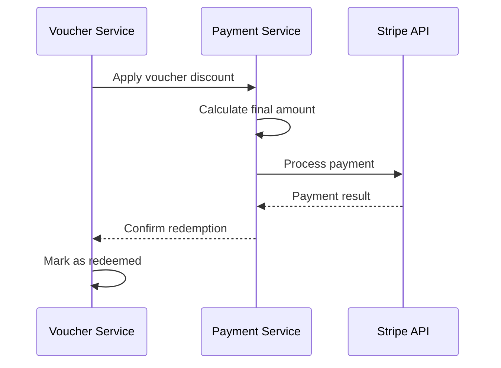
```mermaid
sequenceDiagram
    participant VS as Voucher Service
    participant PS as Payment Service
    participant Stripe as Stripe API

    VS->>PS: Apply voucher discount
    PS->>PS: Calculate final amount
    PS->>Stripe: Process payment
    Stripe-->>PS: Payment result
    PS-->>VS: Confirm redemption
    VS->>VS: Mark as redeemed
```

### 8.2 Communication Flow

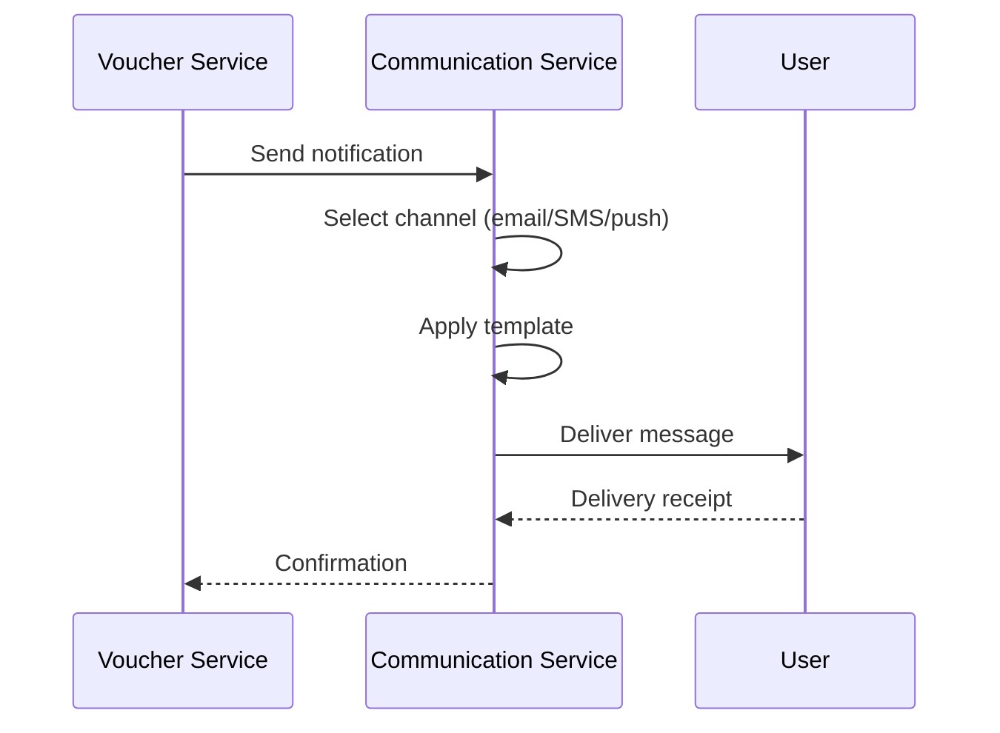
```mermaid
sequenceDiagram
    participant VS as Voucher Service
    participant CS as Communication Service
    participant U as User

    VS->>CS: Send notification
    CS->>CS: Select channel (email/SMS/push)
    CS->>CS: Apply template
    CS->>U: Deliver message
    U-->>CS: Delivery receipt
    CS-->>VS: Confirmation
```

## 9️⃣ ERROR HANDLING & RECOVERY

### Error Scenarios

1. **Network Failures**: Offline mode with queue-based sync
2. **Invalid Codes**: Clear error messages with recovery suggestions
3. **Expired Tokens**: Automatic refresh with user notification
4. **Concurrent Redemptions**: Optimistic locking with retry logic
5. **Service Outages**: Circuit breaker pattern with fallback

### Recovery Mechanisms

- **Automatic Retry**: Exponential backoff for transient failures
- **Manual Resolution**: Admin interface for conflict resolution
- **Compensation**: Automatic voucher credit for system failures
- **Rollback**: Transaction-based operations with rollback capability

## 📋 Summary of Key Flows

| Flow       | Actors              | Trigger          | Output               |
| ---------- | ------------------- | ---------------- | -------------------- |
| Creation   | Business/Admin      | Dashboard action | Voucher with codes   |
| Discovery  | Customer            | App browsing     | Voucher list         |
| Claiming   | Customer            | "Add to wallet"  | Personal voucher     |
| Redemption | Customer + Business | QR scan          | Discount applied     |
| Validation | System              | Pre-redemption   | Valid/Invalid status |
| Analytics  | Business/Admin      | Dashboard view   | Performance metrics  |
| Lifecycle  | System              | Time/events      | State transitions    |

## 🔒 Security Summary

- **Authentication**: JWT with role-based access
- **Authorization**: Permission-based actions
- **Encryption**: TLS for transport, encrypted storage
- **Validation**: Multi-layer validation (client/server/database)
- **Monitoring**: Real-time fraud detection
- **Audit**: Complete action logging

## 🚀 Performance Optimizations

- **Caching**: Redis for hot data (vouchers, validations)
- **Pagination**: Cursor-based for large datasets
- **Indexing**: Database indexes on frequent queries
- **CDN**: Image delivery via CloudFront
- **Lazy Loading**: Progressive data fetching
- **Batch Operations**: Bulk processing for efficiency

This comprehensive documentation covers all possible flows in the VoucherBook platform, ensuring complete understanding of the voucher ecosystem from creation through redemption and analytics.
