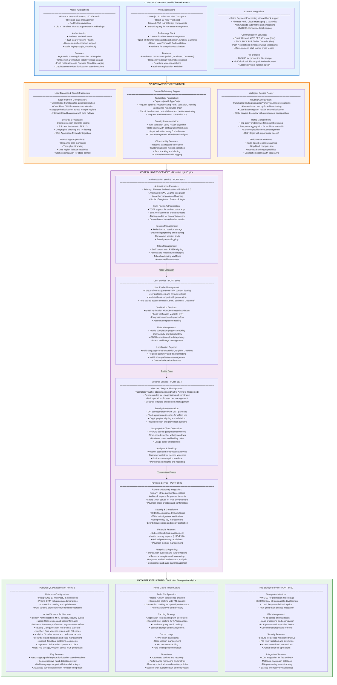

# VoucherBook Platform - Critical Service Communication Architecture

## Complete Service Ecosystem & Communication Matrix

```mermaid
graph TB
    subgraph ClientEcosystem["CLIENT ECOSYSTEM - Multi-Channel Access"]
        direction TB

        MobileClients["Mobile Applications<br/>━━━━━━━━━━━━━━━━━━━━━━━━━━━━━━━━━━━━━━━━━━━━━━━━━━━━<br/>• Flutter Cross-platform App - iOS/Android<br/>• Riverpod state management<br/>• Go Router navigation<br/>• Dio HTTP client with auto-generated API bindings<br/><br/>Authentication:<br/>• Firebase Authentication<br/>• JWT Bearer Tokens RS256<br/>• Biometric authentication support<br/>• Social login (Google, Facebook)<br/><br/>Features:<br/>• QR code scanning for voucher redemption<br/>• Offline-first architecture with Hive local storage<br/>• Push notifications via Firebase Cloud Messaging<br/>• Geolocation services for location-based vouchers"]

        WebClients["Web Applications<br/>━━━━━━━━━━━━━━━━━━━━━━━━━━━━━━━━━━━━━━━━━━━━━━━━━━━━<br/>• Next.js 15 Dashboard with Turbopack<br/>• React 19 with TypeScript<br/>• Tailwind CSS + Ant Design components<br/>• TanStack Query for API state management<br/><br/>Technology Stack:<br/>• Zustand for client state management<br/>• Next-intl for internationalization (Spanish, English, Guaraní)<br/>• React Hook Form with Zod validation<br/>• Recharts for analytics visualization<br/><br/>Features:<br/>• Role-based dashboards (Admin, Business, Customer)<br/>• Responsive design with mobile support<br/>• Real-time voucher analytics<br/>• Business registration workflow"]

        ExternalSystems["External Integrations<br/>━━━━━━━━━━━━━━━━━━━━━━━━━━━━━━━━━━━━━━━━━━━━━━━━━━━━<br/>• Stripe Payment Processing with webhook support<br/>• Firebase Auth, Cloud Messaging, Crashlytics<br/>• AWS Cognito (alternative authentication)<br/>• MinIO S3-compatible local storage<br/><br/>Communication Services:<br/>• Email: Resend, AWS SES, Console (dev)<br/>• SMS: AWS SNS, Twilio, Console (dev)<br/>• Push Notifications: Firebase Cloud Messaging<br/>• Development: MailHog for email testing<br/><br/>File Storage:<br/>• AWS S3 for production file storage<br/>• MinIO for local S3-compatible development<br/>• Local filesystem fallback option"]
    end

    subgraph GatewayInfrastructure["API GATEWAY INFRASTRUCTURE"]
        direction TB

        LoadBalancer["Load Balancer & Edge Infrastructure<br/>━━━━━━━━━━━━━━━━━━━━━━━━━━━━━━━━━━━━━━━━━━━━━━━━━━━━━━━━━<br/>Edge Platform Configuration:<br/>• Vercel Edge Functions for global distribution<br/>• CloudFlare CDN for content acceleration<br/>• Geographic distribution across multiple regions<br/>• Intelligent load balancing with auto failover<br/><br/>Security & Protection:<br/>• DDoS protection and rate limiting<br/>• SSL termination with TLS 1.3<br/>• Geographic blocking and IP filtering<br/>• Web Application Firewall integration<br/><br/>Monitoring & Operations:<br/>• Response time monitoring<br/>• Throughput tracking<br/>• Multi-region failover capability<br/>• Cache optimization for static content"]

        APIGateway["Core API Gateway Engine<br/>━━━━━━━━━━━━━━━━━━━━━━━━━━━━━━━━━━━━━━━━━━━━━━━━━━━━━━━━━<br/>Technology Foundation:<br/>• Express.js with TypeScript<br/>• Request pipeline: Preprocessing, Auth, Validation, Routing<br/>• Specialized middleware chain<br/>• Circuit breakers with auto-failover and health monitoring<br/>• Request enrichment with correlation IDs<br/><br/>Security Implementation:<br/>• JWT validation using RS256 algorithm<br/>• Rate limiting with configurable thresholds<br/>• Input validation using Zod schemas<br/>• CORS management with dynamic origins<br/><br/>Observability Features:<br/>• Request tracing and correlation<br/>• Custom business metrics collection<br/>• Error tracking and alerting<br/>• Comprehensive audit logging"]

        ServiceRouter["Intelligent Service Router<br/>━━━━━━━━━━━━━━━━━━━━━━━━━━━━━━━━━━━━━━━━━━━━━━━━━━━━━━━━━<br/>Routing Configuration:<br/>• Path-based routing using /api/v1/service/resource patterns<br/>• Header-based routing for API versioning<br/>• Load balancing with health-aware distribution<br/>• Static service discovery with environment configuration<br/><br/>Traffic Management:<br/>• http-proxy-middleware for request proxying<br/>• Response aggregation for multi-service calls<br/>• Service-specific timeout management<br/>• Retry logic with exponential backoff<br/><br/>Performance Features:<br/>• Redis-based response caching<br/>• Gzip/Brotli compression<br/>• Request batching capabilities<br/>• Connection pooling with keep-alive"]
    end

    subgraph CoreBusinessServices["CORE BUSINESS SERVICES - Domain Logic Engine"]
        direction TB

        AuthenticationHub["Authentication Service - PORT 5502<br/>━━━━━━━━━━━━━━━━━━━━━━━━━━━━━━━━━━━━━━━━━━━━━━━━━━━━━━━━━━━━━━━━━━━━<br/>Authentication Providers:<br/>• Primary: Firebase Authentication with OAuth 2.0<br/>• Alternative: AWS Cognito integration<br/>• Local: bcrypt password hashing<br/>• Social: Google and Facebook login<br/><br/>Multi-Factor Authentication:<br/>• TOTP support for authenticator apps<br/>• SMS verification for phone numbers<br/>• Backup codes for account recovery<br/>• Device-based trusted authentication<br/><br/>Session Management:<br/>• Redis-backed session storage<br/>• Device fingerprinting and tracking<br/>• Concurrent session limits<br/>• Security event logging<br/><br/>Token Management:<br/>• JWT tokens with RS256 signing<br/>• Access and refresh token lifecycle<br/>• Token blacklisting via Redis<br/>• Automated key rotation"]

        UserManagementEngine["User Service - PORT 5501<br/>━━━━━━━━━━━━━━━━━━━━━━━━━━━━━━━━━━━━━━━━━━━━━━━━━━━━━━━━━━━━━━━━━━━━<br/>User Profile Management:<br/>• Core profile data (personal info, contact details)<br/>• User preferences and privacy settings<br/>• Multi-address support with geolocation<br/>• Role-based access control (Admin, Business, Customer)<br/><br/>Verification Services:<br/>• Email verification with token-based validation<br/>• Phone verification via SMS OTP<br/>• Progressive onboarding workflow<br/>• Account completion tracking<br/><br/>Data Management:<br/>• Profile completion progress tracking<br/>• User activity and login history<br/>• GDPR compliance for data privacy<br/>• Avatar and image management<br/><br/>Localization Support:<br/>• Multi-language content (Spanish, English, Guaraní)<br/>• Regional currency and date formatting<br/>• Notification preference management<br/>• Cultural adaptation features"]

        VoucherLifecycleEngine["Voucher Service - PORT 5514<br/>━━━━━━━━━━━━━━━━━━━━━━━━━━━━━━━━━━━━━━━━━━━━━━━━━━━━━━━━━━━━━━━━━━━━<br/>Voucher Lifecycle Management:<br/>• Complete voucher state machine (Draft to Active to Redeemed)<br/>• Business rules for usage limits and constraints<br/>• Bulk operations for voucher management<br/>• Voucher template and content management<br/><br/>Security Implementation:<br/>• QR code generation with JWT payloads<br/>• Short alphanumeric codes for offline use<br/>• Cryptographic signing and validation<br/>• Fraud detection and prevention systems<br/><br/>Geographic & Time Constraints:<br/>• PostGIS-based geospatial restrictions<br/>• Time-based voucher validity windows<br/>• Business hours and holiday rules<br/>• Usage policy enforcement<br/><br/>Analytics & Tracking:<br/>• Voucher scan and redemption analytics<br/>• Customer wallet for claimed vouchers<br/>• Business redemption interface<br/>• Performance insights and reporting"]

        PaymentProcessingHub["Payment Service - PORT 5505<br/>━━━━━━━━━━━━━━━━━━━━━━━━━━━━━━━━━━━━━━━━━━━━━━━━━━━━━━━━━━━━━━━━━━━━<br/>Payment Gateway Integration:<br/>• Primary: Stripe payment processing<br/>• Webhook support for payment events<br/>• Stripe Mock Server for local development<br/>• Payment intent creation and confirmation<br/><br/>Security & Compliance:<br/>• PCI DSS compliance through Stripe<br/>• Webhook signature verification<br/>• Idempotency key management<br/>• Event deduplication and replay protection<br/><br/>Financial Features:<br/>• Subscription billing management<br/>• Multi-currency support (USD/PYG)<br/>• Refund processing capabilities<br/>• Payment method management<br/><br/>Analytics & Reporting:<br/>• Transaction success and failure tracking<br/>• Revenue analytics and forecasting<br/>• Payment method performance analysis<br/>• Compliance and audit trail management"]
    end

    subgraph DataInfrastructure["DATA INFRASTRUCTURE - Distributed Storage & Analytics"]
        direction TB

        DatabaseCluster["PostgreSQL Database with PostGIS<br/>━━━━━━━━━━━━━━━━━━━━━━━━━━━━━━━━━━━━━━━━━━━━━━━━━━━━━━━━━━━━━━━━━━━━<br/>Database Configuration:<br/>• PostgreSQL 17 with PostGIS extensions<br/>• Prisma ORM with automated migrations<br/>• Connection pooling and optimization<br/>• Multi-schema architecture for domain separation<br/><br/>Actual Schema Architecture:<br/>• identity: Authentication, MFA, devices, security events<br/>• users: User profiles and basic information<br/>• business: Business profiles and registration workflow<br/>• catalog: Categories with hierarchical structure<br/>• voucher: Core voucher system with QR codes<br/>• analytics: Voucher scans and performance data<br/>• security: Fraud detection and case management<br/>• support: Ticketing, problems, comments<br/>• payments: Stripe subscriptions and plans<br/>• files: File storage, voucher books, PDF generation<br/><br/>Key Features:<br/>• PostGIS geospatial support for location-based vouchers<br/>• Comprehensive fraud detection system<br/>• Multi-language support with translation keys<br/>• Advanced authentication with Firebase integration"]

        CacheInfrastructure["Redis Cache Infrastructure<br/>━━━━━━━━━━━━━━━━━━━━━━━━━━━━━━━━━━━━━━━━━━━━━━━━━━━━━━━━━━━━━━━━━━━━<br/>Redis Configuration:<br/>• Redis 7.2 with persistence enabled<br/>• Distributed caching with TTL support<br/>• Connection pooling for optimal performance<br/>• Automatic failover and recovery<br/><br/>Caching Strategy:<br/>• Application-level caching with decorators<br/>• Request-level caching for API responses<br/>• Database query result caching<br/>• Session storage and management<br/><br/>Cache Usage:<br/>• JWT token blacklisting<br/>• User session management<br/>• API response caching<br/>• Rate limiting implementation<br/><br/>Operations:<br/>• Automated backup and recovery<br/>• Performance monitoring and metrics<br/>• Memory optimization and eviction policies<br/>• Security with authentication and encryption"]

        StorageEcosystem["File Storage Service - PORT 5510<br/>━━━━━━━━━━━━━━━━━━━━━━━━━━━━━━━━━━━━━━━━━━━━━━━━━━━━━━━━━━━━━━━━━━━━<br/>Storage Architecture:<br/>• AWS S3 for production file storage<br/>• MinIO for local S3-compatible development<br/>• Local filesystem fallback option<br/>• PDF generation service integration<br/><br/>File Management:<br/>• File upload and validation<br/>• Image processing and optimization<br/>• PDF generation for voucher books<br/>• Document storage and retrieval<br/><br/>Security Features:<br/>• Secure file access with signed URLs<br/>• File type validation and size limits<br/>• Access control and permissions<br/>• Audit trail for file operations<br/><br/>Integration Services:<br/>• CDN integration for fast delivery<br/>• Metadata tracking in database<br/>• File processing status tracking<br/>• Backup and recovery capabilities"]
    end

    ClientEcosystem --> GatewayInfrastructure
    GatewayInfrastructure --> CoreBusinessServices
    CoreBusinessServices --> DataInfrastructure

    AuthenticationHub -.->|User Validation| UserManagementEngine
    UserManagementEngine -.->|Profile Data| VoucherLifecycleEngine
    VoucherLifecycleEngine -.->|Transaction Events| PaymentProcessingHub

    classDef clientStyle fill:#e3f2fd,stroke:#1976d2,stroke-width:2px,color:#000
    classDef gatewayStyle fill:#fff3e0,stroke:#f57c00,stroke-width:3px,color:#000
    classDef serviceStyle fill:#f3e5f5,stroke:#7b1fa2,stroke-width:2px,color:#000
    classDef dataStyle fill:#e8f5e8,stroke:#388e3c,stroke-width:2px,color:#000

    class ClientEcosystem clientStyle
    class GatewayInfrastructure gatewayStyle
    class CoreBusinessServices serviceStyle
    class DataInfrastructure dataStyle
```

## Critical Service-to-Service Communication Flow

```mermaid
sequenceDiagram
    participant Client as Mobile/Web Client
    participant Gateway as API Gateway
    participant Auth as Auth Service
    participant User as User Service
    participant Business as Business Service
    participant Voucher as Voucher Service
    participant Payment as Payment Service
    participant Notification as Notification Service
    participant Cache as Redis Cache
    participant DB as PostgreSQL

    Note over Client,DB: Complex Business Transaction - Voucher Purchase and Processing

    Client->>Gateway: POST /api/v1/vouchers/purchase
    Note right of Client: JWT Bearer Token + Request Body

    Gateway->>Auth: Validate JWT + Extract Claims
    Note right of Gateway: x-correlation-id + x-user-agent

    Auth->>Cache: Check Token Blacklist + Session
    Cache-->>Auth: Token Valid + User Context
    Auth-->>Gateway: User id, role, permissions

    par User Profile Validation
        Gateway->>User: GET /internal/users/userId/profile
        Note right of Gateway: x-api-key + x-service-name + x-user-context

        User->>Cache: Check User Cache
        alt Cache Hit
            Cache-->>User: User Profile Data
        else Cache Miss
            User->>DB: Query User Profile + Preferences
            DB-->>User: User Data + Address + Payment Methods
            User->>Cache: Store User Data TTL 30min
        end
        User-->>Gateway: User Profile + Validation Status
    and Business Validation
        Gateway->>Business: GET /internal/businesses/businessId/status
        Note right of Gateway: x-api-key + x-service-name

        Business->>DB: Validate Business Status + KYC
        DB-->>Business: Business Active + Verified + Payment Setup
        Business-->>Gateway: Business Validation + Stripe Account ID
    end

    Gateway->>Voucher: POST /internal/vouchers/voucherId/purchase
    Note right of Gateway: Complete Request Context with User Profile, Business Validation, Payment Method, Geographic Location

    Voucher->>DB: Begin Transaction

    par Voucher Validation and Reserve
        Voucher->>DB: Check Voucher Availability + Constraints
        Note right of Voucher: Stock Levels, Usage Limits, Geographic Rules, Time Restrictions
        Voucher->>DB: Reserve Voucher with Pessimistic Lock
    and Payment Processing
        Voucher->>Payment: POST /internal/payments/create-intent
        Note right of Voucher: x-api-key + x-correlation-id with Payment Context Amount Currency Business Account User Payment Method Platform Fee 5%

        Payment->>DB: Create Payment Record PENDING
        Payment->>Payment: Call Stripe API - Create Payment Intent
        Note right of Payment: Customer ID, Payment Method, Application Fee, Transfer Destination, Security Flow
        Payment-->>Voucher: Payment Intent + Client Secret
    end

    Voucher->>DB: Create Voucher Purchase Record
    Voucher->>DB: Commit Transaction

    Voucher-->>Gateway: Purchase Created id payment_intent status PENDING
    Gateway-->>Client: 201 Created + Payment Intent for Confirmation

    Note over Voucher,DB: Background Processing - Fire and Forget Pattern

    par Email Notification
        Voucher->>Notification: POST /internal/notifications/voucher-purchased
        Note right of Voucher: x-api-key with Notification Context User Email Preferences Voucher Details QR Code Payment Receipt Business Information

        Notification->>DB: Store Notification Record
        Notification->>Notification: Process Email Template
        Note right of Notification: Multi-language Support, Personalization, Brand Guidelines, Rich HTML + Plain Text
        Notification->>Notification: Queue for Delivery SendGrid
    and Analytics Update
        Voucher->>DB: Update Business Metrics
        Voucher->>Cache: Invalidate Related Cache Keys
        Note right of Voucher: Pattern-based Invalidation vouchers:business:id categories:id user:id:purchases
    and Payment Confirmation Webhook Setup
        Payment->>Payment: Setup Webhook Handler
        Note right of Payment: Idempotency Key, Event Types, Signature Validation, Retry Logic
    end

    Note over Payment,DB: Payment Webhook Processing Separate Flow

    Payment->>Payment: Receive payment.approved webhook
    Payment->>Payment: Verify Webhook Signature
    Payment->>DB: Update Payment Status COMPLETED

    Payment->>Voucher: POST /internal/vouchers/payment-confirmed
    Note right of Payment: x-api-key with Payment Confirmation Payment ID Amount Transaction ID Fee Breakdown Settlement Information

    Voucher->>DB: Update Voucher Status ACTIVE
    Voucher->>DB: Generate QR Code + Short Code

    par Success Notifications
        Voucher->>Notification: POST /internal/notifications/voucher-activated
        Notification->>Client: Push Notification + Email Confirmation
    and Cache Updates
        Voucher->>Cache: Update Voucher Cache
        Voucher->>Cache: Update User Purchase Cache
    and Business Analytics
        Voucher->>DB: Update Business Revenue + Statistics
        Business->>DB: Log Business Event SALE_COMPLETED
    end

    Note over Client,DB: Error Handling and Transaction Rollback

    alt Payment Failure
        Payment-->>Voucher: Payment Failed + Error Code
        Voucher->>DB: Release Voucher Reservation
        Voucher->>DB: Update Purchase Status FAILED
        Voucher->>Notification: Send Failure Notification
        Voucher-->>Gateway: 402 Payment Required + Error Details
        Gateway-->>Client: Payment Failure + Retry Instructions
    else Voucher Unavailable
        Voucher->>DB: Rollback Transaction
        Voucher-->>Gateway: 409 Conflict + Alternative Suggestions
        Gateway-->>Client: Voucher Unavailable + Recommendations
    else Service Timeout
        Gateway->>Gateway: Circuit Breaker Activation
        Gateway-->>Client: 503 Service Temporarily Unavailable
        Note right of Gateway: Retry-After Header, Error Tracking, Fallback Response
    end
```
