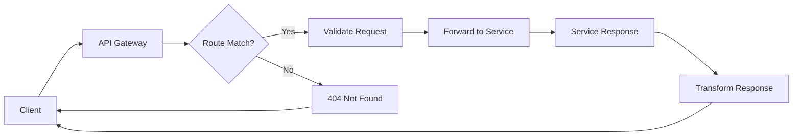

# API Gateway

Service orchestration and routing gateway for the Pika platform, providing centralized API management, documentation, and microservice coordination.

## 🚀 Quick Start

```bash
# Development
yarn nx run @pika/api-gateway:local

# Build
yarn nx run @pikaay:build

# Test
yarn vitest packages/api-gateway
```

## 📋 Overview

The API Gateway serves as the central entry point for the Pika platform:

- **Service Orchestration**: Routes requests to appropriate microservices
- **API Documentation**: Auto-generated OpenAPI documentation with Scalar UI
- **Authentication**: Centralized JWT validation and authorization
- **Rate Limiting**: Request throttling and abuse prevention
- **Request Validation**: Schema validation using Zod and OpenAPI specs
- **Health Monitoring**: Service health checks and status aggregation
- **CORS Management**: Cross-origin request handling

## 🏗️ Architecture

### Clean Architecture Layers

```
src/
├── api/                   # API layer
│   ├── routes/            # Route definitions
│   │   ├── docsRoutes.ts  # Documentation endpoints
│   │   └── setupProxyRoutes.ts # Service proxy setup
│   └── server.ts          # Express server configuration
├── config/                # Configuration
│   └── gateway.ts         # Gateway-specific config
├── docs/                  # Documentation assets
├── health/                # Health monitoring
│   ├── healthCheckHandler.ts # Health check logic
│   └── registerServiceHealthChecks.ts # Service registration
├── lib/                   # Utilities
│   ├── addDefaultSecurity.ts # Security headers
│   ├── createDocument.ts  # OpenAPI document generation
│   ├── createOperation.ts # Operation builders
│   ├── createXSipaHeaders.ts # Custom headers
│   └── httpMethods.ts     # HTTP method utilities
├── middleware/            # Custom middleware
│   ├── routeValidation.ts # Route-level validation
│   ├── validationRegistry.ts # Validation registry
│   └── zodValidationMiddleware.ts # Zod validation
└── types/                 # TypeScript definitions
    └── gateway.ts         # Gateway-specific types
```

### Key Features

- **Dynamic Service Discovery**: Automatic microservice registration
- **OpenAPI Aggregation**: Unified API documentation from all services
- **Request/Response Logging**: Comprehensive audit trails
- **Circuit Breaker**: Service failure handling
- **Load Balancing**: Traffic distribution across service instances

## 🔌 API Endpoints

### Documentation

| Method | Endpoint             | Description                               |
| ------ | -------------------- | ----------------------------------------- |
| GET    | `/docs`              | Interactive API documentation (Scalar UI) |
| GET    | `/docs/openapi.json` | OpenAPI specification                     |
| GET    | `/docs/redoc`        | ReDoc documentation                       |

### Health & Monitoring

| Method | Endpoint           | Description             |
| ------ | ------------------ | ----------------------- |
| GET    | `/health`          | Gateway health status   |
| GET    | `/health/services` | All services health     |
| GET    | `/health/:service` | Specific service health |
| GET    | `/metrics`         | Prometheus metrics      |

### Service Proxying

| Method | Endpoint          | Description            |
| ------ | ----------------- | ---------------------- |
| ALL    | `/api/auth/*`     | Authentication service |
| ALL    | `/api/users/*`    | User service           |
| ALL    | `/api/gyms/*`     | Gym service            |
| ALL    | `/api/sessions/*` | Session service        |
| ALL    | `/api/payments/*` | Payment service        |
| ALL    | `/api/support/*`  | Support service        |

## 🔧 Configuration

### Environment Variables

```bash
# Gateway Configuration
API_GATEWAY_PORT=5500
API_GATEWAY_HOST=0.0.0.0
API_GATEWAY_SERVICE_NAME=api-gateway

# Service URLs
AUTH_SERVICE_URL=http://localhost:5502
USER_SERVICE_URL=http://localhost:5501
GYM_SERVICE_URL=http://localhost:5503
SESSION_SERVICE_URL=http://localhost:5504
PAYMENT_SERVICE_URL=http://localhost:5505
COMMUNICATION_SERVICE_URL=http://localhost:5507
SUPPORT_SERVICE_URL=http://localhost:5508
SOCIAL_SERVICE_URL=http://localhost:5509
STORAGE_SERVICE_URL=http://localhost:5510
SUBSCRIPTION_SERVICE_URL=http://localhost:5506

# API Documentation
DOCS_TITLE=Pika Platform API
DOCS_VERSION=1.0.0
DOCS_DESCRIPTION=Fitness platform microservices API

# Security
CORS_ORIGINS=http://localhost:3000,https://app.pika.com
RATE_LIMIT_WINDOW_MS=900000
RATE_LIMIT_MAX_REQUESTS=1000

# Health Checks
HEALTH_CHECK_INTERVAL=30000
HEALTH_CHECK_TIMEOUT=5000
```

## 🧪 Testing

```bash
# Run all tests
yarn vitest packages/api-gateway

# Integration tests
yarn vitest packages/api-gateway/src/test/integration

# Test service routing
yarn vitest packages/api-gateway --grep "routing"
```

## 🔄 Service Integration

### Service Registration

Services automatically register with the gateway through health check endpoints:

```typescript
// Service health check response
{
  "service": "user-service",
  "status": "healthy",
  "version": "1.0.0",
  "endpoints": [
    { "path": "/users", "methods": ["GET", "POST"] },
    { "path": "/users/:id", "methods": ["GET", "PUT", "DELETE"] }
  ],
  "dependencies": {
    "database": "healthy",
    "redis": "healthy"
  }
}
```

### Request Flow



## 📊 Monitoring & Observability

### Health Aggregation

```typescript
// GET /health response
{
  "status": "healthy",
  "timestamp": "2024-01-01T00:00:00Z",
  "services": {
    "auth": { "status": "healthy", "responseTime": "45ms" },
    "user": { "status": "healthy", "responseTime": "32ms" },
    "gym": { "status": "degraded", "responseTime": "150ms" },
    "session": { "status": "unhealthy", "error": "Connection timeout" }
  },
  "gateway": {
    "uptime": "2h 45m",
    "memory": "256MB",
    "cpu": "15%"
  }
}
```

### Metrics Collection

- **Request Rate**: Requests per second
- **Response Time**: Latency percentiles
- **Error Rate**: 4xx/5xx responses
- **Service Health**: Availability status
- **Traffic Distribution**: Load per service

## 🛡️ Security Features

### Authentication Flow

1. **JWT Validation**: Verify token signature and expiration
2. **User Context**: Extract user information from token
3. **Service Authorization**: Check service-specific permissions
4. **Request Forwarding**: Add user context to downstream requests

### Rate Limiting

```typescript
// Per-user rate limiting
{
  windowMs: 15 * 60 * 1000, // 15 minutes
  max: 1000, // requests per window
  standardHeaders: true,
  keyGenerator: (req) => req.user?.id || req.ip
}
```

## 🚨 Error Handling

### Gateway Error Responses

```typescript
// Service unavailable
{
  "error": "Service Unavailable",
  "code": "SERVICE_UNAVAILABLE",
  "service": "user-service",
  "message": "User service is currently unavailable",
  "retryAfter": 30
}

// Validation error
{
  "error": "Request Validation Failed",
  "code": "VALIDATION_ERROR",
  "details": [
    {
      "path": "/users",
      "message": "Request body is required"
    }
  ]
}
```

## 🔄 Future Enhancements

- [ ] Advanced caching strategies
- [ ] Request/response transformation
- [ ] A/B testing capabilities
- [ ] Advanced analytics dashboard
- [ ] WebSocket proxying
- [ ] Service mesh integration
- [ ] Custom plugin system
