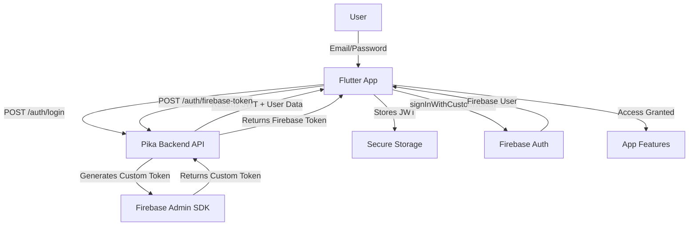

# Authentication Flow Documentation

## Overview

The Pika Flutter app implements a sophisticated hybrid authentication system that combines:

- **JWT tokens** from the Pika backend for API authentication
- **Firebase Custom Tokens** for real-time features (chat, notifications)

This approach ensures secure access to both backend services and Firebase features while maintaining a single source of truth for user authentication.

## 🔑 Authentication Architecture



## 📱 Implementation Details

### 1. Initial Login Flow

```dart
// lib/features/auth/domain/usecases/login_usecase.dart

class LoginUseCase {
  final AuthRepository _authRepository;
  final FirebaseAuthService _firebaseAuthService;

  LoginUseCase(this._authRepository, this._firebaseAuthService);

  Future<AuthResult> execute({
    required String email,
    required String password,
  }) async {
    try {
      // Step 1: Authenticate with backend
      final authResponse = await _authRepository.login(
        email: email,
        password: password,
      );

      // Step 2: Store JWT token securely
      await SecureStorage.setToken(authResponse.token);

      // Step 3: Exchange JWT for Firebase token
      final firebaseToken = await _authRepository.getFirebaseToken(
        jwtToken: authResponse.token,
        purpose: 'real-time',
      );

      // Step 4: Sign in to Firebase
      await _firebaseAuthService.signInWithCustomToken(
        firebaseToken.customToken,
      );

      // Step 5: Initialize user services
      await _initializeUserServices(authResponse.user);

      return AuthResult.success(
        user: authResponse.user,
        token: authResponse.token,
      );
    } catch (e) {
      return AuthResult.failure(
        error: _mapError(e),
      );
    }
  }

  Future<void> _initializeUserServices(User user) async {
    // Save FCM token
    await NotificationService.instance.saveFCMToken();

    // Subscribe to user topics
    await NotificationService.instance.subscribeToTopic('user_${user.id}');

    // Initialize chat service
    await ChatService.instance.initialize(userId: user.id);

    // Set up presence tracking
    await PresenceService.instance.goOnline();
  }
}
```

### 2. Registration Flow

```dart
// lib/features/auth/domain/usecases/register_usecase.dart

class RegisterUseCase {
  final AuthRepository _authRepository;

  Future<AuthResult> execute({
    required String email,
    required String password,
    required String firstName,
    required String lastName,
    required String role,
    String? phone,
  }) async {
    try {
      // Validate input
      _validateRegistrationData(
        email: email,
        password: password,
        firstName: firstName,
        lastName: lastName,
      );

      // Register with backend
      final authResponse = await _authRepository.register(
        email: email,
        password: password,
        firstName: firstName,
        lastName: lastName,
        role: role,
        phone: phone,
      );

      // Follow same flow as login after successful registration
      await SecureStorage.setToken(authResponse.token);

      // Get Firebase token
      final firebaseToken = await _authRepository.getFirebaseToken(
        jwtToken: authResponse.token,
        purpose: 'real-time',
      );

      // Sign in to Firebase
      await FirebaseAuth.instance.signInWithCustomToken(
        firebaseToken.customToken,
      );

      return AuthResult.success(
        user: authResponse.user,
        token: authResponse.token,
      );
    } catch (e) {
      return AuthResult.failure(error: _mapError(e));
    }
  }

  void _validateRegistrationData({
    required String email,
    required String password,
    required String firstName,
    required String lastName,
  }) {
    if (!EmailValidator.validate(email)) {
      throw ValidationException('Invalid email address');
    }

    if (password.length < 8) {
      throw ValidationException('Password must be at least 8 characters');
    }

    if (firstName.isEmpty || lastName.isEmpty) {
      throw ValidationException('First and last name are required');
    }
  }
}
```

### 3. Token Management

```dart
// lib/features/auth/data/services/token_manager.dart

class TokenManager {
  static const String _jwtKey = 'jwt_token';
  static const String _refreshKey = 'refresh_token';
  static const String _expiryKey = 'token_expiry';

  final FlutterSecureStorage _secureStorage;
  Timer? _refreshTimer;

  TokenManager(this._secureStorage);

  // Store tokens
  Future<void> saveTokens({
    required String accessToken,
    String? refreshToken,
    required DateTime expiresAt,
  }) async {
    await _secureStorage.write(key: _jwtKey, value: accessToken);

    if (refreshToken != null) {
      await _secureStorage.write(key: _refreshKey, value: refreshToken);
    }

    await _secureStorage.write(
      key: _expiryKey,
      value: expiresAt.toIso8601String(),
    );

    // Schedule token refresh
    _scheduleTokenRefresh(expiresAt);
  }

  // Get current token
  Future<String?> getAccessToken() async {
    final token = await _secureStorage.read(key: _jwtKey);

    if (token != null) {
      // Check if expired
      final expiryStr = await _secureStorage.read(key: _expiryKey);
      if (expiryStr != null) {
        final expiry = DateTime.parse(expiryStr);
        if (DateTime.now().isAfter(expiry)) {
          // Token expired, try to refresh
          await refreshToken();
          return await _secureStorage.read(key: _jwtKey);
        }
      }
    }

    return token;
  }

  // Refresh token
  Future<void> refreshToken() async {
    final refreshToken = await _secureStorage.read(key: _refreshKey);
    if (refreshToken == null) {
      throw UnauthorizedException('No refresh token available');
    }

    try {
      final response = await _authApi.refreshToken(refreshToken);

      await saveTokens(
        accessToken: response.accessToken,
        refreshToken: response.refreshToken,
        expiresAt: response.expiresAt,
      );

      // Also refresh Firebase token
      await _refreshFirebaseToken(response.accessToken);
    } catch (e) {
      // Refresh failed, clear tokens and redirect to login
      await clearTokens();
      throw UnauthorizedException('Token refresh failed');
    }
  }

  // Schedule automatic token refresh
  void _scheduleTokenRefresh(DateTime expiresAt) {
    _refreshTimer?.cancel();

    // Refresh 5 minutes before expiry
    final refreshTime = expiresAt.subtract(const Duration(minutes: 5));
    final duration = refreshTime.difference(DateTime.now());

    if (duration.isNegative) {
      // Token already needs refresh
      refreshToken();
    } else {
      _refreshTimer = Timer(duration, () {
        refreshToken();
      });
    }
  }

  // Clear all tokens
  Future<void> clearTokens() async {
    _refreshTimer?.cancel();
    await _secureStorage.deleteAll();
  }
}
```

### 4. Firebase Token Exchange

```dart
// lib/features/auth/data/repositories/firebase_auth_repository.dart

class FirebaseAuthRepository {
  final Dio _dio;
  final FirebaseAuth _firebaseAuth;

  FirebaseAuthRepository(this._dio, this._firebaseAuth);

  Future<FirebaseTokenResponse> exchangeToken({
    required String jwtToken,
    required String purpose,
  }) async {
    try {
      final response = await _dio.post(
        '/auth/firebase-token',
        data: {
          'purpose': purpose,
          'expiresIn': 3600, // 1 hour
        },
        options: Options(
          headers: {
            'Authorization': 'Bearer $jwtToken',
          },
        ),
      );

      return FirebaseTokenResponse.fromJson(response.data);
    } on DioException catch (e) {
      if (e.response?.statusCode == 401) {
        throw UnauthorizedException('Invalid JWT token');
      }
      throw ServerException('Failed to get Firebase token');
    }
  }

  Future<void> signInWithCustomToken(String customToken) async {
    try {
      final credential = await _firebaseAuth.signInWithCustomToken(
        customToken,
      );

      print('Firebase Auth Success: ${credential.user?.uid}');
    } on FirebaseAuthException catch (e) {
      switch (e.code) {
        case 'invalid-custom-token':
          throw FirebaseException('Invalid custom token');
        case 'custom-token-mismatch':
          throw FirebaseException('Token mismatch');
        default:
          throw FirebaseException(e.message ?? 'Firebase auth failed');
      }
    }
  }
}
```

### 5. Auth State Management with Riverpod

```dart
// lib/features/auth/presentation/providers/auth_provider.dart

@riverpod
class AuthNotifier extends _$AuthNotifier {
  late final AuthRepository _authRepository;
  late final TokenManager _tokenManager;
  StreamSubscription? _firebaseAuthSubscription;

  @override
  Future<AuthState> build() async {
    _authRepository = ref.read(authRepositoryProvider);
    _tokenManager = ref.read(tokenManagerProvider);

    // Listen to Firebase auth changes
    _listenToFirebaseAuth();

    // Check if user is already logged in
    return _checkAuthStatus();
  }

  Future<AuthState> _checkAuthStatus() async {
    try {
      final token = await _tokenManager.getAccessToken();
      if (token == null) {
        return const AuthState.unauthenticated();
      }

      // Validate token with backend
      final user = await _authRepository.getCurrentUser(token);

      // Ensure Firebase is also authenticated
      if (FirebaseAuth.instance.currentUser == null) {
        await _refreshFirebaseAuth(token);
      }

      return AuthState.authenticated(user: user, token: token);
    } catch (e) {
      return const AuthState.unauthenticated();
    }
  }

  void _listenToFirebaseAuth() {
    _firebaseAuthSubscription = FirebaseAuth.instance
        .authStateChanges()
        .listen((firebaseUser) {
      if (firebaseUser == null && state.value is AuthStateAuthenticated) {
        // Firebase logged out but we have JWT - refresh Firebase auth
        _refreshFirebaseAuth(state.value!.token);
      }
    });
  }

  Future<void> login({
    required String email,
    required String password,
  }) async {
    state = const AsyncValue.loading();

    state = await AsyncValue.guard(() async {
      final result = await _authRepository.login(
        email: email,
        password: password,
      );

      await _tokenManager.saveTokens(
        accessToken: result.token,
        refreshToken: result.refreshToken,
        expiresAt: result.expiresAt,
      );

      // Exchange for Firebase token
      await _exchangeForFirebaseToken(result.token);

      return AuthState.authenticated(
        user: result.user,
        token: result.token,
      );
    });
  }

  Future<void> logout() async {
    state = const AsyncValue.loading();

    try {
      // Sign out from Firebase
      await FirebaseAuth.instance.signOut();

      // Clear local tokens
      await _tokenManager.clearTokens();

      // Clear user data
      await ref.read(userDataProvider.notifier).clear();

      state = const AsyncValue.data(AuthState.unauthenticated());
    } catch (e) {
      state = AsyncValue.error(e, StackTrace.current);
    }
  }

  Future<void> _exchangeForFirebaseToken(String jwtToken) async {
    try {
      final firebaseToken = await _authRepository.getFirebaseToken(
        jwtToken: jwtToken,
        purpose: 'real-time',
      );

      await FirebaseAuth.instance.signInWithCustomToken(
        firebaseToken.customToken,
      );
    } catch (e) {
      // Log error but don't fail auth - Firebase is optional
      print('Firebase auth failed: $e');
    }
  }

  @override
  void dispose() {
    _firebaseAuthSubscription?.cancel();
    super.dispose();
  }
}

// Auth state definition
@freezed
class AuthState with _$AuthState {
  const factory AuthState.initial() = _Initial;
  const factory AuthState.authenticated({
    required User user,
    required String token,
  }) = AuthStateAuthenticated;
  const factory AuthState.unauthenticated() = _Unauthenticated;
}
```

### 6. Protected Route Implementation

```dart
// lib/core/routing/auth_guard.dart

class AuthGuard {
  static String? guard(BuildContext context, GoRouterState state) {
    final authState = ProviderScope.containerOf(context)
        .read(authNotifierProvider);

    final isAuthenticated = authState.value?.maybeWhen(
      authenticated: (_, __) => true,
      orElse: () => false,
    ) ?? false;

    final isAuthRoute = state.matchedLocation.startsWith('/auth');

    if (!isAuthenticated && !isAuthRoute) {
      // Save intended destination
      final redirect = state.matchedLocation;
      return '/auth/login?redirect=$redirect';
    }

    if (isAuthenticated && isAuthRoute) {
      return '/home';
    }

    return null;
  }
}

// Usage in router
final router = GoRouter(
  redirect: AuthGuard.guard,
  routes: [
    // ... routes
  ],
);
```

## 🔒 Security Considerations

### 1. Token Storage

```dart
// Secure storage implementation
class SecureTokenStorage {
  static const _storage = FlutterSecureStorage(
    aOptions: AndroidOptions(
      encryptedSharedPreferences: true,
    ),
    iOptions: IOSOptions(
      accessibility: KeychainAccessibility.first_unlock_this_device,
    ),
  );

  static Future<void> saveToken(String token) async {
    await _storage.write(key: 'jwt_token', value: token);
  }

  static Future<String?> getToken() async {
    return await _storage.read(key: 'jwt_token');
  }

  static Future<void> deleteToken() async {
    await _storage.delete(key: 'jwt_token');
  }
}
```

### 2. Biometric Authentication

```dart
// Optional biometric protection
class BiometricAuth {
  static final _localAuth = LocalAuthentication();

  static Future<bool> authenticate() async {
    try {
      final isAvailable = await _localAuth.canCheckBiometrics;
      if (!isAvailable) return true; // Skip if not available

      final isAuthenticated = await _localAuth.authenticate(
        localizedReason: 'Authenticate to access your account',
        options: const AuthenticationOptions(
          biometricOnly: false,
          stickyAuth: true,
        ),
      );

      return isAuthenticated;
    } catch (e) {
      return false;
    }
  }
}
```

### 3. Certificate Pinning (Optional)

```dart
// For enhanced security in production
class CertificatePinning {
  static Dio createSecureClient() {
    final dio = Dio();

    (dio.httpClientAdapter as IOHttpClientAdapter).createHttpClient = () {
      final client = HttpClient();

      client.badCertificateCallback = (cert, host, port) {
        // Verify certificate fingerprint
        final fingerprint = sha256.convert(cert.der).toString();
        return _allowedFingerprints.contains(fingerprint);
      };

      return client;
    };

    return dio;
  }

  static const _allowedFingerprints = [
    // Add your server certificate fingerprints
  ];
}
```

## 🔄 Session Management

### 1. Auto-Logout on Inactivity

```dart
class SessionManager {
  static const _inactivityTimeout = Duration(minutes: 30);
  Timer? _inactivityTimer;

  void startInactivityTimer() {
    _resetInactivityTimer();
  }

  void _resetInactivityTimer() {
    _inactivityTimer?.cancel();

    _inactivityTimer = Timer(_inactivityTimeout, () {
      // Auto logout
      _performAutoLogout();
    });
  }

  void onUserActivity() {
    _resetInactivityTimer();
  }

  void _performAutoLogout() {
    // Show warning dialog
    showDialog(
      context: navigatorKey.currentContext!,
      builder: (context) => AlertDialog(
        title: const Text('Session Expired'),
        content: const Text('You have been logged out due to inactivity.'),
        actions: [
          TextButton(
            onPressed: () {
              Navigator.of(context).pop();
              context.go('/auth/login');
            },
            child: const Text('OK'),
          ),
        ],
      ),
    );

    // Logout
    ref.read(authNotifierProvider.notifier).logout();
  }
}
```

### 2. Multi-Device Session Management

```dart
class DeviceSessionManager {
  static Future<void> registerDevice() async {
    final deviceInfo = await DeviceInfoPlugin().deviceInfo;
    final fcmToken = await FirebaseMessaging.instance.getToken();

    await api.post('/auth/devices', data: {
      'deviceId': deviceInfo.data['deviceId'],
      'deviceName': deviceInfo.data['model'],
      'platform': Platform.operatingSystem,
      'fcmToken': fcmToken,
    });
  }

  static Future<List<Device>> getActiveSessions() async {
    final response = await api.get('/auth/sessions');
    return (response.data as List)
        .map((d) => Device.fromJson(d))
        .toList();
  }

  static Future<void> revokeSession(String sessionId) async {
    await api.delete('/auth/sessions/$sessionId');
  }
}
```

## 🚨 Error Handling

### Auth Error Types

```dart
enum AuthErrorType {
  invalidCredentials,
  userNotFound,
  emailAlreadyExists,
  weakPassword,
  networkError,
  serverError,
  tokenExpired,
  unauthorized,
  unknown,
}

class AuthErrorHandler {
  static AuthErrorType getErrorType(dynamic error) {
    if (error is DioException) {
      switch (error.response?.statusCode) {
        case 401:
          return AuthErrorType.invalidCredentials;
        case 404:
          return AuthErrorType.userNotFound;
        case 409:
          return AuthErrorType.emailAlreadyExists;
        case 422:
          return AuthErrorType.weakPassword;
        case 500:
          return AuthErrorType.serverError;
      }

      if (error.type == DioExceptionType.connectionTimeout ||
          error.type == DioExceptionType.receiveTimeout) {
        return AuthErrorType.networkError;
      }
    }

    return AuthErrorType.unknown;
  }

  static String getErrorMessage(AuthErrorType type) {
    switch (type) {
      case AuthErrorType.invalidCredentials:
        return 'Invalid email or password';
      case AuthErrorType.userNotFound:
        return 'No account found with this email';
      case AuthErrorType.emailAlreadyExists:
        return 'An account already exists with this email';
      case AuthErrorType.weakPassword:
        return 'Password is too weak';
      case AuthErrorType.networkError:
        return 'Network error. Please check your connection';
      case AuthErrorType.serverError:
        return 'Server error. Please try again later';
      case AuthErrorType.tokenExpired:
        return 'Session expired. Please login again';
      case AuthErrorType.unauthorized:
        return 'Unauthorized access';
      case AuthErrorType.unknown:
        return 'An unexpected error occurred';
    }
  }
}
```

## 📊 Analytics & Monitoring

```dart
class AuthAnalytics {
  static final _analytics = FirebaseAnalytics.instance;

  static Future<void> logLogin(String method) async {
    await _analytics.logLogin(loginMethod: method);
  }

  static Future<void> logSignUp(String method) async {
    await _analytics.logSignUp(signUpMethod: method);
  }

  static Future<void> logAuthError(AuthErrorType errorType) async {
    await _analytics.logEvent(
      name: 'auth_error',
      parameters: {
        'error_type': errorType.name,
        'timestamp': DateTime.now().toIso8601String(),
      },
    );
  }
}
```

## 🧪 Testing

### Unit Tests

```dart
// test/features/auth/domain/usecases/login_usecase_test.dart

void main() {
  group('LoginUseCase', () {
    late LoginUseCase loginUseCase;
    late MockAuthRepository mockAuthRepository;
    late MockFirebaseAuthService mockFirebaseAuthService;

    setUp(() {
      mockAuthRepository = MockAuthRepository();
      mockFirebaseAuthService = MockFirebaseAuthService();
      loginUseCase = LoginUseCase(
        mockAuthRepository,
        mockFirebaseAuthService,
      );
    });

    test('should return user when login is successful', () async {
      // Arrange
      const email = 'test@example.com';
      const password = 'password123';
      const token = 'jwt_token';
      const firebaseToken = 'firebase_token';

      when(mockAuthRepository.login(
        email: email,
        password: password,
      )).thenAnswer((_) async => AuthResponse(
        token: token,
        user: testUser,
      ));

      when(mockAuthRepository.getFirebaseToken(
        jwtToken: token,
        purpose: 'real-time',
      )).thenAnswer((_) async => FirebaseTokenResponse(
        customToken: firebaseToken,
      ));

      when(mockFirebaseAuthService.signInWithCustomToken(
        firebaseToken,
      )).thenAnswer((_) async {});

      // Act
      final result = await loginUseCase.execute(
        email: email,
        password: password,
      );

      // Assert
      expect(result.isSuccess, true);
      expect(result.user, testUser);
      verify(mockAuthRepository.login(
        email: email,
        password: password,
      )).called(1);
    });
  });
}
```

## 🎯 Best Practices

1. **Always validate tokens** before making API calls
2. **Implement token refresh** to avoid session interruptions
3. **Use biometric authentication** for sensitive operations
4. **Monitor auth failures** for security alerts
5. **Implement rate limiting** for login attempts
6. **Use secure storage** for all sensitive data
7. **Handle auth errors gracefully** with user-friendly messages
8. **Test auth flows thoroughly** including edge cases
9. **Log auth events** for debugging and analytics
10. **Keep Firebase and JWT auth in sync**

## 🔗 Related Documentation

- [Firebase Authentication Guide](./FIREBASE_INTEGRATION.md)
- [API Integration Guide](./API_INTEGRATION.md)
- [Security Best Practices](./SECURITY.md)
